# Luồng hoạt động của NTranslate trên macOS

Tài liệu mô tả chức năng và luồng nghiệp vụ của NTranslate trên macOS theo góc nhìn người dùng. Nội dung phản ánh hành vi hiện có trong source macOS.

## Mục lục

1. [Tổng quan](#1-tổng-quan)
2. [Khởi động và chạy nền](#2-khởi-động-và-chạy-nền)
3. [Mở và đóng cửa sổ dịch](#3-mở-và-đóng-cửa-sổ-dịch)
4. [Lấy nội dung cần dịch](#4-lấy-nội-dung-cần-dịch)
5. [Dịch văn bản hoặc hình ảnh](#5-dịch-văn-bản-hoặc-hình-ảnh)
6. [Chọn và đổi chiều ngôn ngữ](#6-chọn-và-đổi-chiều-ngôn-ngữ)
7. [Học từ hoặc câu](#7-học-từ-hoặc-câu)
8. [Nghe phát âm](#8-nghe-phát-âm)
9. [Sao chép kết quả](#9-sao-chép-kết-quả)
10. [Xem và quản lý lịch sử](#10-xem-và-quản-lý-lịch-sử)
11. [Thay đổi cài đặt](#11-thay-đổi-cài-đặt)
12. [Cấp quyền Accessibility](#12-cấp-quyền-accessibility)
13. [Kiểm tra và cài cập nhật](#13-kiểm-tra-và-cài-cập-nhật)
14. [Thoát ứng dụng](#14-thoát-ứng-dụng)

## 1. Tổng quan

NTranslate là ứng dụng menu bar. Ứng dụng chạy nền, nhận nội dung từ vùng chọn hoặc clipboard, cho phép người dùng nhập trực tiếp, rồi gửi nội dung đến dịch vụ dịch. Kết quả có thể được nghe, sao chép và mở lại từ lịch sử.

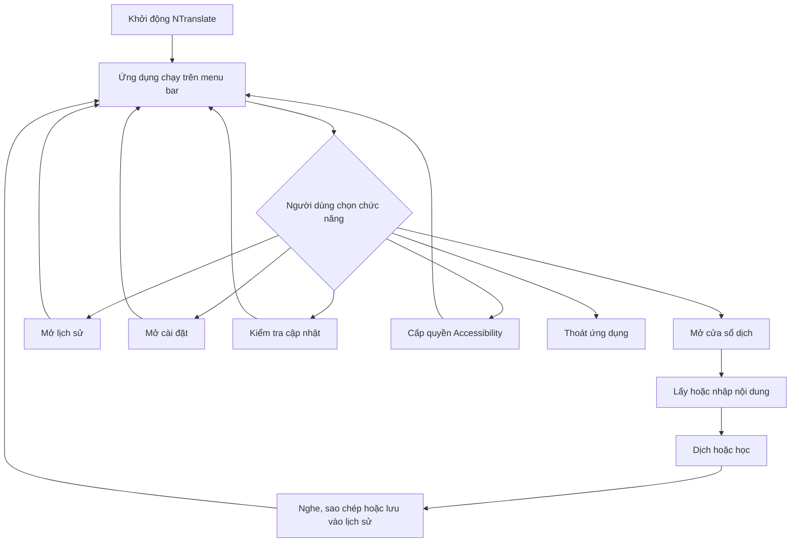

## 2. Khởi động và chạy nền

1. Người dùng mở NTranslate.
2. Ứng dụng khởi tạo biểu tượng trên menu bar và chạy như tiện ích nền, không mở cửa sổ chính cố định.
3. Ứng dụng đọc cấu hình, API key, lịch sử và đăng ký phím tắt toàn cục.
4. Nếu đây là lần chạy đầu và chưa có file cấu hình, ứng dụng tạo cấu hình mặc định.
5. Nếu cấu hình, API key, lịch sử hoặc quyền cần thiết có vấn đề, ứng dụng giữ trạng thái lỗi để hiển thị khi người dùng mở cửa sổ dịch hoặc chức năng liên quan.
6. Ứng dụng sẵn sàng nhận thao tác từ biểu tượng menu bar và phím tắt.

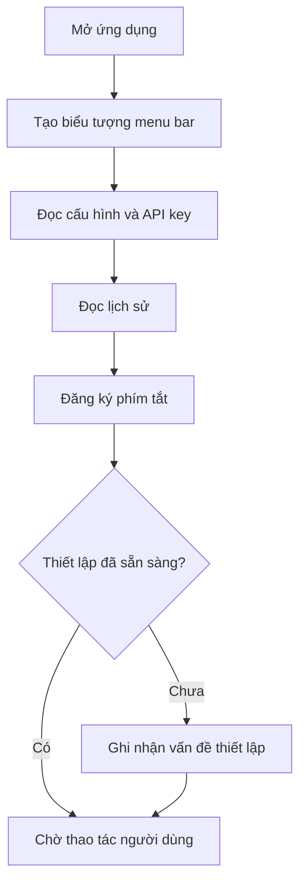

## 3. Mở và đóng cửa sổ dịch

Người dùng có hai cách mở cửa sổ dịch:

- nhấp biểu tượng NTranslate trên menu bar;
- nhấn phím tắt toàn cục đã cấu hình.

Khi mở từ menu bar, cửa sổ xuất hiện gần biểu tượng. Khi mở bằng phím tắt, ứng dụng ưu tiên lấy nội dung đang được chọn rồi hiển thị cửa sổ gần vị trí thao tác.

Nếu cửa sổ đang mở, nhấp lại biểu tượng menu bar sẽ đóng cửa sổ. Cửa sổ cũng có thể tự đóng khi mất trạng thái hoạt động, trừ khi người dùng đã ghim cửa sổ. Khi được ghim, cửa sổ tiếp tục hiển thị để người dùng nhập, đối chiếu hoặc thao tác nhiều lần.

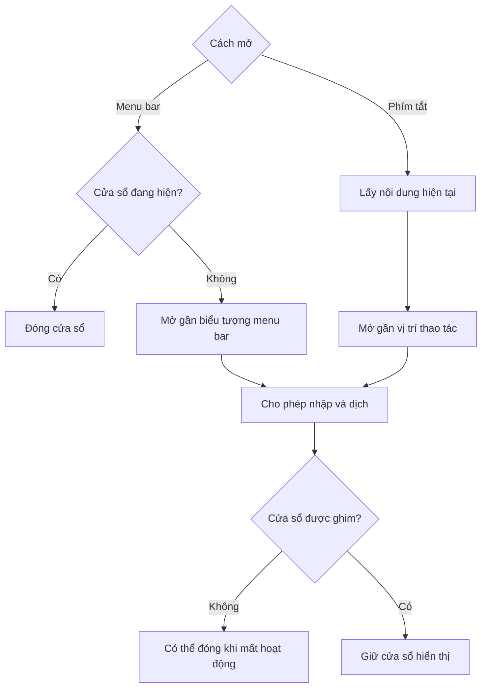

## 4. Lấy nội dung cần dịch

Khi người dùng gọi NTranslate bằng phím tắt, ứng dụng tìm nội dung theo thứ tự ưu tiên:

1. Đọc văn bản đang được chọn thông qua quyền Accessibility.
2. Nếu không lấy được vùng chọn và tùy chọn mô phỏng sao chép đang bật, ứng dụng phát lệnh sao chép rồi đọc nội dung mới từ clipboard. Nội dung clipboard trước đó được khôi phục sau thao tác.
3. Nếu vẫn chưa có nội dung, ứng dụng đọc clipboard hiện tại.
4. Clipboard có thể chứa văn bản hoặc hình ảnh PNG/TIFF hợp lệ.
5. Nếu không tìm thấy nội dung dùng được, cửa sổ vẫn mở và hướng dẫn người dùng chọn văn bản hoặc nhập trực tiếp.

Hình ảnh được kiểm tra kích thước và chuẩn hóa trước khi dịch. Hình ảnh rỗng, sai định dạng hoặc quá lớn sẽ bị từ chối thay vì gửi đi.

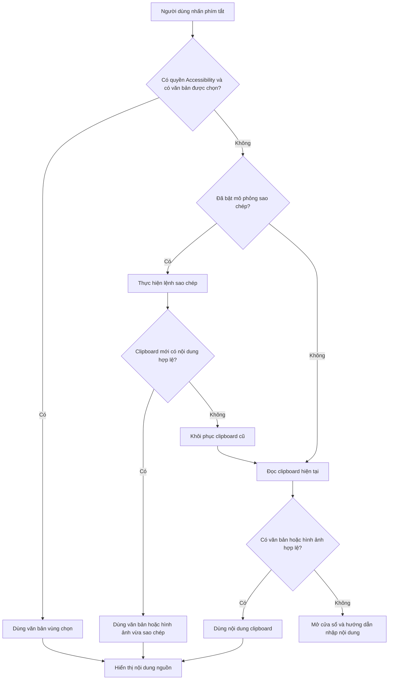

## 5. Dịch văn bản hoặc hình ảnh

### Dịch văn bản

1. Người dùng lấy văn bản từ vùng chọn/clipboard hoặc nhập trực tiếp.
2. Người dùng chọn ngôn ngữ nguồn và ngôn ngữ đích, hoặc để ứng dụng tự nhận diện ngôn ngữ nguồn.
3. Người dùng bấm **Translate**. Luồng từ phím tắt có thể bắt đầu dịch ngay sau khi lấy được nội dung.
4. Ứng dụng từ chối nội dung rỗng hoặc vượt giới hạn độ dài đã cấu hình.
5. Ứng dụng gửi yêu cầu dịch đến dịch vụ đã cấu hình.
6. Trong lúc chờ, giao diện báo đang dịch và ngăn thao tác gây xung đột.
7. Khi thành công, kết quả mới được hiển thị và ghi vào lịch sử.
8. Nếu tùy chọn tự sao chép bật, kết quả hợp lệ được đưa vào clipboard.
9. Khi thất bại, ứng dụng hiển thị lỗi; nội dung nguồn vẫn còn để người dùng sửa hoặc thử lại.

Nếu ngôn ngữ nguồn và ngôn ngữ đích giống nhau, yêu cầu được xử lý như kiểm tra và sửa ngữ pháp thay vì dịch sang ngôn ngữ khác.

### Dịch hình ảnh

1. Ứng dụng nhận hình ảnh hợp lệ từ clipboard hoặc thao tác mô phỏng sao chép.
2. Người dùng chọn ngôn ngữ đích.
3. Ứng dụng gửi hình ảnh để nhận dạng và dịch toàn bộ chữ đọc được.
4. Kết quả văn bản được hiển thị và có thể sao chép, nhưng hình ảnh không có luồng phát âm nguồn như văn bản.

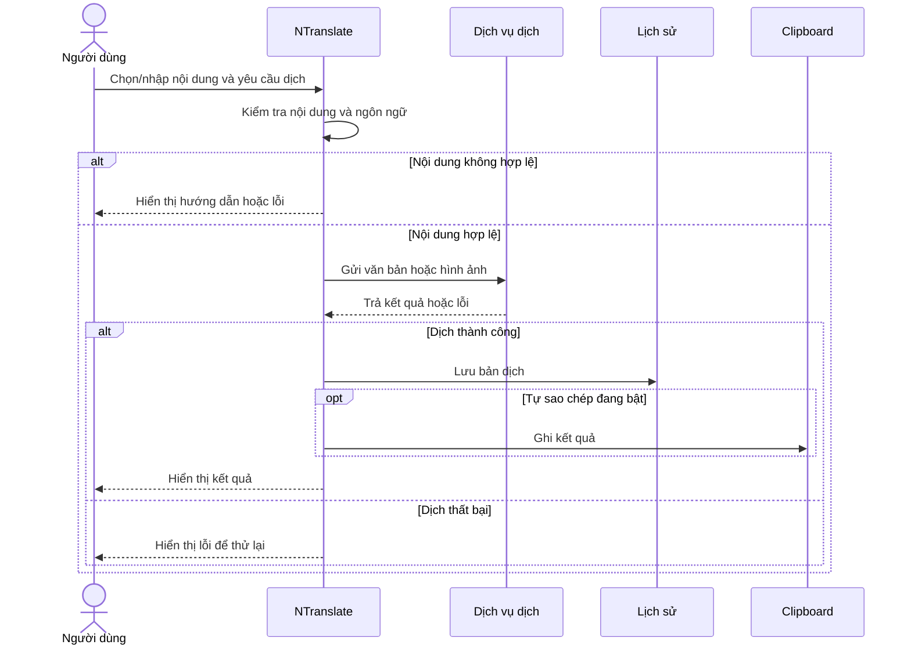

## 6. Chọn và đổi chiều ngôn ngữ

- Người dùng chọn ngôn ngữ nguồn và ngôn ngữ đích ngay trên cửa sổ dịch.
- Ngôn ngữ nguồn có thể ở chế độ tự nhận diện.
- Ứng dụng có thể cập nhật lựa chọn ngôn ngữ nguồn dựa trên văn bản nhận được.
- Danh sách ngôn ngữ đích ưu tiên các ngôn ngữ dùng gần đây.
- Nút đổi chiều hoán đổi ngôn ngữ nguồn và đích khi cặp hiện tại cho phép.
- Sau khi đổi chiều, nội dung kết quả hiện có có thể trở thành nội dung nguồn cho lượt xử lý tiếp theo, giúp dịch ngược mà không cần sao chép thủ công.
- Khi hai ngôn ngữ giống nhau, chức năng **Translate** trở thành luồng kiểm tra ngữ pháp.

## 7. Học từ hoặc câu

Ngoài bản dịch ngắn, người dùng có thể bấm **Learn** để nhận nội dung học tập chi tiết hơn:

1. Người dùng nhập hoặc lấy văn bản nguồn.
2. Ứng dụng xác định đây là một từ hay một câu/cụm nhiều từ.
3. Ứng dụng gửi yêu cầu học phù hợp với loại nội dung và cặp ngôn ngữ.
4. Kết quả giải thích được hiển thị trong vùng kết quả.
5. Nếu không có nội dung, nội dung quá dài hoặc dịch vụ lỗi, ứng dụng hiển thị thông báo tương ứng.

Với kết quả văn bản phù hợp, người dùng cũng có thể mở tìm kiếm hình ảnh bằng truy vấn ngắn do ứng dụng tạo, nhằm hỗ trợ ghi nhớ nghĩa qua hình ảnh.

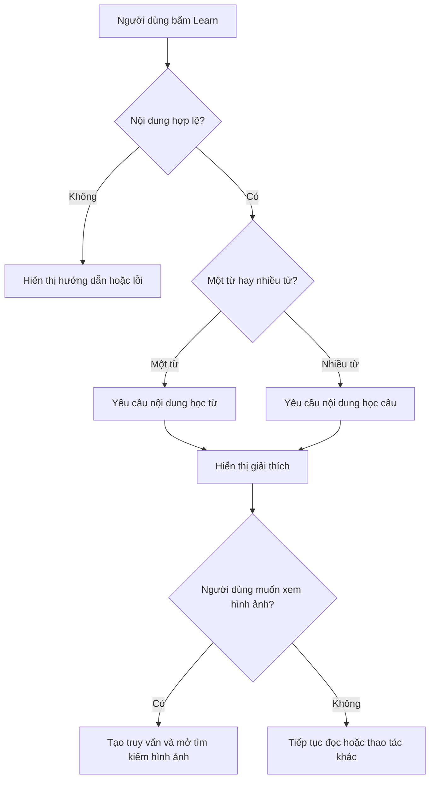

## 8. Nghe phát âm

Người dùng có thể nghe nội dung nguồn hoặc kết quả dịch nếu có văn bản phù hợp.

1. Người dùng bấm nút loa của nội dung nguồn hoặc kết quả.
2. Nếu âm thanh phù hợp đã có trong bộ nhớ hoặc lịch sử, ứng dụng phát ngay.
3. Nếu chưa có, ứng dụng gửi văn bản đến dịch vụ giọng nói và hiển thị trạng thái đang tải.
4. Khi tải xong, ứng dụng phát âm thanh và gắn âm thanh vào bản ghi lịch sử tương ứng nếu có.
5. Cùng nút loa chuyển chức năng theo trạng thái: phát, đang tải, tạm dừng hoặc tiếp tục.
6. Người dùng có thể đổi tốc độ phát; tốc độ mới áp dụng cho âm thanh đang phát.
7. Khi nội dung, ngôn ngữ hoặc bản dịch thay đổi, yêu cầu âm thanh cũ bị hủy để tránh phát sai nội dung.
8. Nếu tải hoặc phát thất bại, ứng dụng báo lỗi và cho phép thử lại.

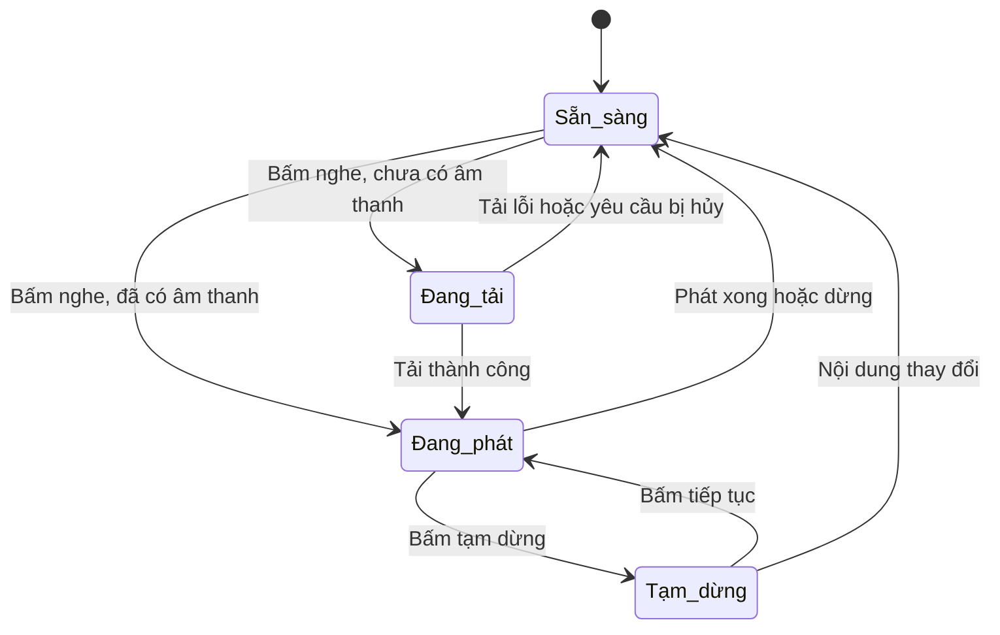

## 9. Sao chép kết quả

Người dùng có thể sao chép bản dịch theo hai cách:

- bấm nút sao chép để ghi kết quả hiện tại vào clipboard;
- bật tự sao chép trong cài đặt để ứng dụng tự ghi mỗi kết quả dịch thành công.

Ứng dụng chỉ sao chép kết quả thực. Thông báo đang xử lý, hướng dẫn, lỗi hoặc nội dung rỗng không được coi là kết quả để sao chép. Sau khi sao chép, ứng dụng hiển thị trạng thái xác nhận ngắn.

## 10. Xem và quản lý lịch sử

Mỗi bản dịch văn bản thành công được lưu với thời gian, nội dung nguồn, kết quả, cặp ngôn ngữ, trạng thái đã lưu và đường dẫn âm thanh nếu có.

Trong cửa sổ lịch sử, người dùng có thể:

- xem các bản dịch mới nhất trước;
- tìm kiếm theo nội dung;
- chuyển giữa toàn bộ lịch sử và các mục đã đánh dấu;
- lọc theo hôm nay, 24 giờ, tuần, tháng hoặc toàn bộ thời gian;
- đánh dấu hoặc bỏ đánh dấu một bản ghi;
- nghe lại âm thanh nguồn/kết quả đã lưu;
- xóa từng bản ghi;
- xóa toàn bộ bản ghi đang hiện sau khi xác nhận;
- nhấp đúp một bản ghi để mở lại trong cửa sổ dịch.

Khi mở lại bản ghi, nội dung nguồn, kết quả và cặp ngôn ngữ được khôi phục để người dùng xem, nghe hoặc tiếp tục thao tác. Xóa bản ghi cũng xóa các file âm thanh gắn với bản ghi đó. Nếu lịch sử không đọc hoặc ghi được, ứng dụng báo lỗi và khóa thao tác ghi để tránh làm mất dữ liệu hiện có.

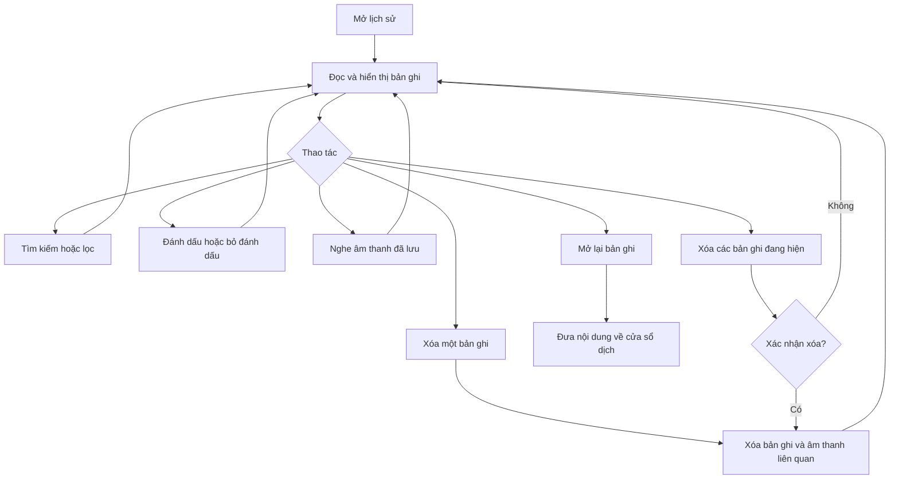

## 11. Thay đổi cài đặt

Người dùng mở **Settings** từ menu ứng dụng để chỉnh các nhóm thiết lập chính:

- API key và địa chỉ dịch vụ;
- model và chỉ dẫn dùng cho dịch, kiểm tra ngữ pháp và học;
- danh sách/ngôn ngữ mặc định;
- model phát âm cho nguồn và kết quả;
- thư mục lưu lịch sử;
- phím tắt toàn cục;
- kích thước cửa sổ, tự sao chép và mô phỏng sao chép;
- giới hạn nội dung và tùy chọn tải trước âm thanh.

Luồng lưu:

1. Người dùng chỉnh giá trị và bấm lưu.
2. Ứng dụng kiểm tra các trường bắt buộc và định dạng giá trị.
3. Nếu không hợp lệ, cửa sổ cài đặt giữ nguyên và hiển thị danh sách vấn đề.
4. Nếu hợp lệ, API key được lưu trong Keychain; cấu hình còn lại được ghi vào file cấu hình.
5. Nếu ghi cấu hình thất bại, ứng dụng cố khôi phục API key trước đó để hai nguồn thiết lập không bị lệch nhau.
6. Sau khi lưu thành công, ứng dụng nạp lại cấu hình, lịch sử, dịch vụ và phím tắt để thiết lập mới có hiệu lực.

Người dùng có thể chọn thư mục lịch sử bằng hộp thoại chọn thư mục. Việc đổi thư mục quyết định nơi ứng dụng đọc và ghi lịch sử ở lần nạp cấu hình tiếp theo.

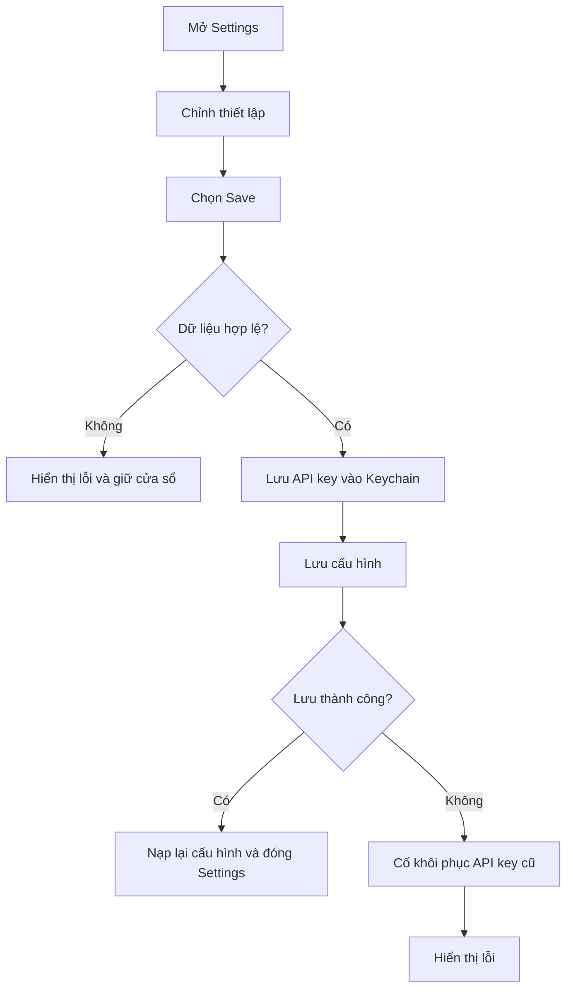

## 12. Cấp quyền Accessibility

Quyền Accessibility giúp ứng dụng đọc trực tiếp văn bản đang được chọn và hỗ trợ mô phỏng phím **Command+C**.

1. Ứng dụng kiểm tra trạng thái quyền khi khởi động và khi mở menu.
2. Nếu chưa có quyền, menu hiển thị mục yêu cầu cấp quyền.
3. Người dùng chọn mục này để mở lời nhắc hệ thống.
4. Người dùng cấp quyền cho NTranslate trong cài đặt macOS.
5. Sau khi có quyền, mục yêu cầu cấp quyền được ẩn và ứng dụng có thể ưu tiên đọc vùng chọn.
6. Nếu chưa cấp quyền, người dùng vẫn có thể nhập trực tiếp hoặc dùng nội dung sẵn có trong clipboard; khả năng đọc vùng chọn có thể bị hạn chế.

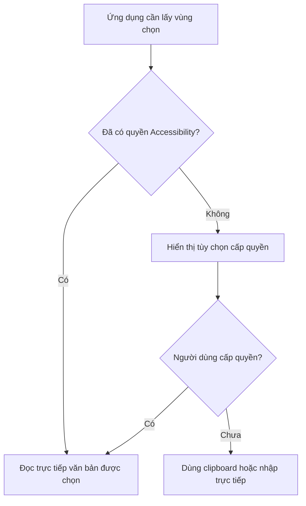

## 13. Kiểm tra và cài cập nhật

Ứng dụng hỗ trợ kiểm tra phiên bản phát hành mới từ GitHub.

1. Người dùng chọn **Check for Updates**. Ứng dụng cũng có thể thực hiện kiểm tra nền im lặng khi được kích hoạt bởi luồng khởi động.
2. Ứng dụng đọc bản phát hành mới nhất và so sánh số phiên bản với bản đang chạy.
3. Nếu không có bản mới, kiểm tra thủ công hiển thị thông báo ứng dụng đã mới nhất; kiểm tra im lặng không làm phiền người dùng.
4. Nếu có bản mới, ứng dụng hiển thị phiên bản và ghi chú phát hành.
5. Người dùng chọn cập nhật và khởi động lại hoặc để sau.
6. Khi đồng ý, ứng dụng tải file DMG vào thư mục tạm.
7. Ứng dụng chuẩn bị tiến trình cài đặt, tự thoát, thay bản ứng dụng hiện tại bằng bản trong DMG, dọn file tạm và mở lại NTranslate.
8. Nếu kiểm tra, tải hoặc cài đặt thất bại, kiểm tra thủ công hiển thị lỗi.

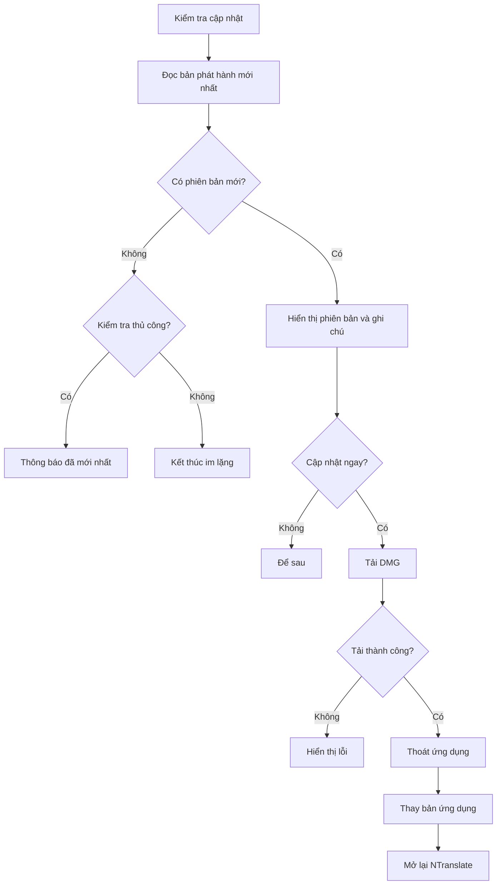

## 14. Thoát ứng dụng

1. Người dùng chọn **Quit** từ menu.
2. Ứng dụng yêu cầu macOS kết thúc tiến trình.
3. Trước khi đóng hoàn toàn, ứng dụng gỡ đăng ký phím tắt và các bộ xử lý liên quan.
4. Ứng dụng đánh dấu lần tắt này là bình thường để lần khởi động sau không nhầm với sự cố.
5. Biểu tượng menu bar biến mất và các cửa sổ đang mở được đóng.

Việc đóng riêng cửa sổ dịch không thoát ứng dụng; NTranslate vẫn chạy trên menu bar cho đến khi người dùng chọn **Quit** hoặc tiến trình kết thúc trong luồng cập nhật.
