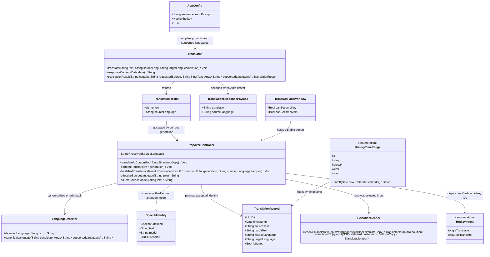

# Resolve NTranslate Open Issues #12–#17

## Requirements

Implement six coordinated NTranslate improvements that make source-language handling and TTS consistent, expose complete history, enrich long-sentence learning, add a dedicated copy-and-translate shortcut, and preserve native Liquid Glass appearance while retaining keyboard accessibility.

- Make explicit source-language selection authoritative for source TTS.
- For `Auto detect` text translations, request source-language metadata from the LLM and use one accepted source-language identity across pane labels, history, speech prefetch, and source TTS.
- Keep translation usable when a provider still returns legacy plain text; reject malformed JSON-like content instead of exposing metadata syntax as translated text.
- Add `All` as an explicit History time range while preserving `Today` as default and retaining existing search, Saved, playback, and delete-visible behavior.
- Enrich multi-token Learn output with IPA pronunciation and concise memory guidance for useful phrases and notable words, without generating an exhaustive dictionary entry for every token.
- Register fixed `Control+Option+D` as a dedicated copy-and-translate shortcut alongside the existing configurable shortcut; successful capture opens popup and starts translation immediately.
- Remove unwanted popup shell focus outline/border and keep one continuous Liquid Glass corner radius without disabling key-window behavior, text editing, keyboard navigation, or accessibility.
- Limit changes to existing Swift/AppKit architecture. Do not add dependencies, persistence formats, service layers, or speculative abstractions.

## Entities



Conservative entity rules:

- Add only `TranslationResult` and private/Codable `TranslationResponsePayload` as small value types needed to separate translation text from source-language metadata.
- Keep `TranslationRecord`, `SpeechIdentity`, `AppConfig.Hotkey`, `AppConfig.UI`, and `TranslatableInputResolution` storage shapes unchanged.
- Represent hotkey intent with unique IDs or a small enum local to `PopoverController`; do not create a hotkey manager protocol or new subsystem.
- Extend `HistoryTimeRange`; do not create a second history model or repository.
- Keep Learn output as plain text controlled by existing `sentenceLearnPrompt`; do not create phrase/word entities or a custom renderer.

## Approach

1. Language result and TTS consistency:
   - Change normal text translation completion from `Result<String, Error>` to `Result<TranslationResult, Error>` while leaving Learn, image translation, image search, and speech response contracts unchanged.
   - When requested source is `Auto detect`, append a non-configurable response-contract suffix to the rendered translation system prompt. Require exactly one JSON object with `translation` and `sourceLanguage` string fields.
   - Decode inner `message.content`, trim optional surrounding Markdown code fences only for JSON decoding, validate non-empty translation, and canonicalize `sourceLanguage` against `config.languages` excluding `Auto detect`.
   - If provider returns legacy non-JSON plain text, preserve it as translation and derive source language with `LanguageDetector.detectedLanguage(inputText)`.
   - If content appears JSON-like but cannot be decoded or has empty translation, fail with `Translator.ResponseError.invalidSchema`; never copy or persist raw malformed JSON.
   - For manual source selection, keep existing plain-text provider contract and return selected source language directly. Explicit selection always overrides text heuristics.
   - Store accepted source language in request-scoped popup state only after generation validation. Reuse it for source pane label, `TranslationRecord.sourceLanguage`, source speech prefetch, and source TTS.

2. History access:
   - Extend current `HistoryTimeRange` and segmented control with `All`.
   - Preserve `Today` as initial selected range. `All` maps to no cutoff; query and Saved filtering remain conjunctive.
   - Keep current delete snapshot and confirmation count. No pagination or storage migration unless measured history size later proves current in-memory filtering insufficient.

3. Learn mode:
   - Update `AppConfig.defaultSentenceLearnPrompt` only. Preserve custom configured prompts and existing single-token `defaultLearnPrompt`.
   - Require whole-sentence natural meaning, important grammar, useful chunks, IPA for each selected chunk, concise meaning-in-context, one memory cue, and one natural variation.
   - Limit chunk selection to 3–8 useful phrases/notable words and omit trivial function words unless essential to grammar. This caps output while satisfying phrase/word learning intent.

4. Copy-and-translate shortcut:
   - Keep current configurable hotkey as intent `toggleTranslation`/normal translate-at-cursor behavior.
   - Add fixed Carbon hotkey `Control+Option+D` with a distinct `EventHotKeyID.id` for `copyAndTranslate`.
   - Route dedicated intent to `translateAtCursor(forceSimulatedCopy: true)`. Route existing hotkey to `translateAtCursor(forceSimulatedCopy: false)`, where configured `ui.simulateCopy` still applies.
   - Successful selection resolution opens popup and starts translation through existing `performTranslate` flow. Failure shows empty-selection/error panel and must not translate stale clipboard content.
   - Unregister both hotkey references before re-registration and during app termination. Report registration failure without preventing the other shortcut from working.

5. Liquid Glass popup:
   - Keep `TranslatePanelWindow.canBecomeKey` and `canBecomeMain` enabled.
   - Keep shell, container, scroll views, and text views at `focusRingType = .none` where already set; identify and remove only layer border/outline responsible for shell focus chrome.
   - Use `ChromeLayout.glassCornerRadius` as single shell radius, currently `22`, set continuous curve and clipping at the shell/content boundary. Avoid adding custom stroke, glow, or visual-effect imitation.
   - Verify unfocused, focused, text-editing, and keyboard-navigation states in running macOS 26 app because appearance cannot be accepted from unit tests alone.

6. Error handling and resilience:
   - Continue existing `Result`/`NSError`/`PopoverFeedback` patterns; this native app has no `GlobalExceptionHandler` or server controller layer.
   - Preserve generation checks so stale translation results cannot update current text, source identity, history, or TTS.
   - Preserve current pasteboard snapshot/restore behavior and atomic history persistence.
   - Surface concise user-visible status for malformed structured responses, copy failure, and hotkey registration failure without exposing API keys or full provider payloads.

## Structure

### Inheritance Relationships

1. `TranslatePanelWindow` continues extending `NSWindow` solely to permit key/main status for borderless popup.
2. `PopoverController` continues conforming to existing AppKit delegates and owns UI orchestration, Carbon hotkey callbacks, translation generation state, and speech state.
3. `HistoryWindowController` continues extending `NSWindowController` and conforming to table/search/audio delegates.
4. No new interfaces, base classes, exception hierarchy, controller/service/repository layers, or dependency-injection framework.

### Dependencies

1. `PopoverController.performTranslate(generation:)` calls `Translator.translate(...)` for text and accepts only current-generation `TranslationResult`.
2. `Translator` uses `AppConfig` for endpoint, prompts, model, and supported source-language names.
3. `Translator.translationResult(...)` calls `LanguageDetector.canonicalLanguage(...)` and local detection fallback.
4. `PopoverController.effectiveSourceLanguage(for:)` resolves explicit selection first, then accepted LLM identity, then local detector.
5. `PopoverController.sourceSpeechIdentity(...)` calls `SpeechModelResolver.model(for:config:)` with effective source language.
6. `PopoverController.finishTextTranslation(...)` writes translation text to UI and persists one `TranslationRecord` carrying effective source language.
7. `HistoryWindowController` maps segmented-control selection to `HistoryTimeRange` and filters `TranslationHistoryStore.records` in memory.
8. Carbon hotkey callback maps unique IDs to popup intents; copy-and-translate calls existing `SelectionReader` with forced simulation.
9. Liquid Glass shell remains owned by `PopoverController.buildPopover()` and existing layout helpers.

### Existing Native Architecture

1. Application/UI orchestration: `PopoverController`, `HistoryWindowController`, `SettingsWindowController`.
2. External API boundary: `Translator` using `URLSession` and OpenAI-compatible response envelope.
3. Domain utilities: `LanguageDetector`, `SpeechModelResolver`, `SelectionReader`, `SpeechPlaybackState`.
4. Persistence: `TranslationHistoryStore` using atomically written JSON and relative audio paths.
5. Configuration/security: `AppConfig` plus `APIKeyStore`; API key remains in macOS Keychain.
6. Verification: Swift Testing suites under `Tests/translateTests`, followed by running-app QA and project-required `./install-app.sh` after source/resource changes.

## Operations

### 1. Add Translation Result Contract — `Translator.swift`

1. Create `TranslationResult: Equatable, Sendable`:
   - `text: String` — copyable/persistable translation only.
   - `sourceLanguage: String` — canonical configured source-language name.
2. Create private `TranslationResponsePayload: Decodable`:
   - `translation: String`.
   - `sourceLanguage: String`.
3. Extend `Translator.ResponseError` with cases needed to distinguish malformed structured content and empty translation while preserving current failures.
4. Add:
   - `static func translationResult(from content: String, requestedSource: String, inputText: String, supportedLanguages: [String]) throws -> TranslationResult`
   - Logic:
     - Trim whitespace.
     - If `requestedSource != LanguageDetector.autoDetect`, require non-empty content and return it with canonical requested source.
     - For Auto detect, strip one optional outer ````json`/``` fence before decode.
     - Decode `TranslationResponsePayload` when content is JSON.
     - Trim and reject empty `translation`.
     - Canonicalize metadata case-insensitively against configured languages excluding `Auto detect`.
     - If metadata is unsupported, use local detector fallback rather than inventing a language.
     - If content is non-JSON legacy text, return text plus local detector fallback.
     - If content starts like JSON but decoding fails, throw `invalidSchema`; do not treat JSON syntax as translation text.
5. Change text translation signature to:
   - `func translate(_ text: String, sourceLang: String, targetLang: String, completion: @escaping @Sendable (Result<TranslationResult, Error>) -> Void)`.
6. Keep generic provider-envelope extraction reusable:
   - `static func responseContent(from data: Data) throws -> String` remains responsible only for `choices[0].message.content` and non-empty content.
7. Keep `learn`, `imageSearchQuery`, `translateImage`, and `speak` signatures unchanged.
8. Completion criteria:
   - Manual-source translation still accepts existing plain output.
   - Auto-detect structured JSON returns clean text and canonical source language.
   - Legacy plain output remains usable.
   - Malformed JSON-like output cannot reach copy/history UI.

### 2. Request Structured Auto-Detect Output — `Translator.swift` and `AppConfig.swift`

1. Add one static Auto-detect response-contract suffix in `Translator`:
   - Require exactly `{"translation":"<translated text>","sourceLanguage":"<detected source language>"}`.
   - Require no Markdown fence, intro, or extra keys.
   - Require `sourceLanguage` to use one configured source-language display name.
2. Append suffix only for normal text translation where `sourceLang == LanguageDetector.autoDetect`.
3. Do not mutate user-configured `systemPrompt` on disk and do not apply suffix to grammar, Learn, image, image-search, or speech modes.
4. Preserve existing markdown translation capability inside JSON string; decoded `translation` remains passed to current attributed display renderer.
5. Update `AppConfig.defaultSentenceLearnPrompt`:
   - Preserve current full-sentence sections.
   - Add `Pronunciation and memory chunks` section.
   - Require 3–8 useful phrases/notable words when available.
   - Format each item with chunk, IPA, contextual meaning, and one short memory cue.
   - Exclude exhaustive per-token analysis and trivial words unless grammatically important.
6. Completion criteria:
   - Existing custom prompt remains untouched after config decoding.
   - Fresh/default config receives enriched sentence prompt.
   - Single-word Learn still uses `defaultLearnPrompt`.

### 3. Canonicalize Source Language — `LanguageDetector.swift`

1. Add:
   - `static func canonicalLanguage(_ candidate: String, supportedLanguages: [String]) -> String?`.
2. Logic:
   - Trim candidate.
   - Match configured names case-insensitively.
   - Exclude `Auto detect` as detected output.
   - Return exact configured spelling for stable UI, history, and speech resolution.
   - Return `nil` for blank or unsupported values.
3. Do not replace existing `detectedLanguage`, `resolvedPair`, `swappedPair`, or target fallback behavior.
4. Completion criteria:
   - `english` maps to configured `English`.
   - `Auto detect`, blank, and unknown values return `nil`.

### 4. Propagate Request-Scoped Language Identity — `PopoverController.swift`

1. Add private state:
   - `private var resolvedSourceLanguage: String?`.
2. Add:
   - `private func effectiveSourceLanguage(for text: String) -> String`.
3. Resolution order:
   - If `selectedSourceLanguage()` is explicit, return that exact selected language.
   - Else return current accepted `resolvedSourceLanguage` when present.
   - Else return `LanguageDetector.detectedLanguage(text)`.
4. Reset `resolvedSourceLanguage` when:
   - Source input changes.
   - Source language selection changes or languages swap.
   - A translation request is invalidated/replaced.
   - Pending image replaces text.
   - A history record opens; then set it to record source language if record source is explicit.
5. Change text completion flow to accept `Result<TranslationResult, Error>`.
6. In `finishTextTranslation(...)`:
   - Preserve current generation acceptance before any mutation.
   - On success, set `resolvedSourceLanguage` from result only when current source selection is Auto detect; explicit source remains authority.
   - Render only `result.text`.
   - Persist `TranslationRecord.sourceLanguage` using `effectiveSourceLanguage(for:)` and existing target language.
   - Refresh source pane label and speech buttons after accepted identity changes.
   - Preserve current history append errors, auto-copy, record ID, and speech attachment behavior.
7. Change `updatePaneLanguageLabels()`:
   - Auto source with accepted identity shows its code.
   - Before accepted result, retain local detector preview.
8. Change `sourceSpeechModel(for:)`:
   - Remove direct Vietnamese/text special case.
   - Resolve `SpeechModelResolver.model(for: effectiveSourceLanguage(for: text), config: config)`.
9. Preserve `SpeechIdentity.model` as cache identity so changing selected/resolved language invalidates mismatched playback naturally.
10. Prefetch constraint:
    - Do not prefetch Auto-detect source speech before LLM identity is accepted; trigger it after successful translation if `autoPrefetchSpeech` is enabled.
    - Manual source selection may prefetch before translation using selected language.
11. Completion criteria:
    - Selecting English always chooses English source speech model, regardless of Vietnamese-looking text.
    - Auto detect successful metadata drives pane label, history, prefetch, and TTS consistently.
    - Stale responses change none of these.

### 5. Add All History Range — `HistoryWindowController.swift`

1. Extend `HistoryTimeRange`:
   - Add `.all` before `.today` for clear UI mapping.
   - Change `cutoff(from:calendar:)` to return `Date?`; `.all` returns `nil`, existing ranges return current cutoffs.
2. Update `filter(records:query:savedOnly:timeRange:now:calendar:)`:
   - Apply timestamp cutoff only when selected range returns a cutoff.
   - Preserve query matching and Saved predicate.
3. Change time control labels to `['All', 'Today', '24h', 'Week', 'Month']`.
4. Preserve Today default by selecting its new segment index.
5. Map all five indices explicitly; avoid relying on a default branch for normal values.
6. Preserve delete-visible snapshot/confirmation behavior and ensure confirmation count reflects complete filtered set under All.
7. Completion criteria:
   - All returns old and new records.
   - All + Saved returns all saved records.
   - All + query searches all retained records.
   - Today remains selected on first open.

### 6. Add Dedicated Copy-and-Translate Hotkey — `PopoverController.swift`

1. Track two Carbon references:
   - Existing configurable hotkey reference.
   - Dedicated copy-and-translate reference.
2. Define stable unique IDs under existing `TRNS` signature:
   - Configurable translation intent uses current ID `1`.
   - Fixed copy-and-translate intent uses ID `2`.
3. Update `installHotKeyEventHandler()`:
   - Switch on hotkey ID.
   - Dispatch ID `1` to existing normal action.
   - Dispatch ID `2` to `copyAndTranslateHotKeyPressed()` on main actor/thread.
   - Ignore unknown IDs.
4. Add:
   - `@objc private func copyAndTranslateHotKeyPressed()` calling `translateAtCursor(forceSimulatedCopy: true)`.
5. Change:
   - `func translateAtCursor(forceSimulatedCopy: Bool = false)`.
   - Resolve input using `simulateCopy: forceSimulatedCopy || config.ui.simulateCopy`.
6. Update registration:
   - Unregister both old refs first.
   - Register configurable shortcut as today.
   - Register fixed `Control+Option+D` using `kVK_ANSI_D`/existing `HotkeyKeyCode` plus Carbon `controlKey | optionKey` modifiers.
   - Detect when configured hotkey equals fixed combination; register only copy-and-translate for that combination and report concise conflict status instead of attempting duplicate registrations.
   - Handle each registration status independently so one failure does not disable the other.
7. Update `applicationWillTerminate` to unregister both references and remove existing event handler.
8. Preserve selection behavior:
   - Existing Accessibility-selected text remains first choice only for normal action.
   - Forced action must synthesize Copy before accepting input, rather than short-circuiting to Accessibility selection, because issue requires Edit → Copy/`Command+C` semantics.
   - Clipboard snapshot must be restored through existing `defer` path.
   - Failed copy must return no input and show empty-selection/error state; never fall through to stale general pasteboard content.
9. If needed, extend `SelectionReader.resolveTranslatableInputWithDiagnostics` with an explicit force-copy mode rather than changing default boolean semantics for existing callers.
10. Completion criteria:
    - `Control+Option+D` copies selected text, restores prior clipboard, opens popup, and starts translation.
    - Existing configurable shortcut retains current behavior.
    - Duplicate combination and registration failures remain visible and non-crashing.

### 7. Normalize Liquid Glass Focus Chrome — `PopoverController.swift`

1. Keep borderless `TranslatePanelWindow` key/main overrides unchanged.
2. In `buildPopover()` and shell styling:
   - Keep `panel.backgroundColor = .clear`, `panel.isOpaque = false`, and native shadow.
   - Ensure outer `glassContainer`, `shellGlass`, and `chromeHost` use `focusRingType = .none`.
   - Ensure shell/content layers have `borderWidth = 0` and no `borderColor` or focus-only custom shadow.
   - Apply `ChromeLayout.glassCornerRadius` to shell clipping boundary with `.continuous` corner curve.
   - Avoid applying a second mismatched outer corner radius that creates a visible border seam.
3. Keep child keyboard focus behavior:
   - Editable source text view remains first responder-capable.
   - Do not globally disable control focus or accessibility focus.
   - Do not remove native focus indicators from controls where indicator is needed to locate keyboard focus; requirement targets unwanted popup shell outline/border.
4. Add a small testable style policy/value only if needed to assert shared radius and zero border; do not extract a general theme system.
5. Running-app QA matrix on macOS 26:
   - Popup inactive and active.
   - Source text view focused and editing.
   - Language menu/button focused through keyboard.
   - Pinned and unpinned popup.
   - Retina display at default and resized popup dimensions.
6. Completion criteria:
   - No shell outline/border appears merely because popup becomes key.
   - Corners remain continuous, clipped, and visually aligned with native Liquid Glass.
   - Text entry, Escape, Command+Return, keyboard traversal, and accessibility labels still work.

### 8. Add Focused Automated Tests — `Tests/translateTests/translateTests.swift`

1. Translation contract tests:
   - Structured Auto-detect JSON decodes translation and canonical source.
   - Case-insensitive source metadata canonicalizes.
   - Unsupported metadata falls back to local detector.
   - Legacy plain content remains accepted.
   - Malformed JSON-like content and empty translation fail.
   - Manual source uses selected source without requiring JSON.
2. Language authority tests:
   - Explicit English resolves English speech model for Vietnamese-looking text.
   - Auto source uses accepted metadata when available and heuristic only before/fallback.
   - Generation policy rejects stale source metadata.
3. Learn prompt tests:
   - Multi-token text uses sentence prompt.
   - Default sentence prompt requests IPA, memory cues, and bounded useful chunks.
   - Single-token path remains unchanged.
4. Hotkey policy tests:
   - IDs map to distinct intents.
   - Configured `Control+Option+D` conflict is detected.
   - Forced-copy flag overrides `config.ui.simulateCopy == false`.
5. Reuse existing Swift Testing suite and pure helper/policy tests. Do not automate Carbon global registration in unit tests.

### 9. Add History Tests — `Tests/translateTests/TranslationHistoryStoreTests.swift`

1. Add records older than month and current records.
2. Verify `.all` returns both.
3. Verify `.all` composes with Saved and query filters.
4. Verify each existing range cutoff remains unchanged.
5. Verify History window labels include All and initial selection remains Today.
6. Verify delete snapshot count under All equals visible filtered records, without executing destructive UI action.

### 10. Verify Build and Running App

1. Run focused tests, then full `swift test`.
2. Run `./install-app.sh` because source changes affect `NTranslate.app`; report version/build from output.
3. Manually verify:
   - #12 explicit English source TTS.
   - #13 Auto detect metadata consistency and legacy provider fallback.
   - #14 All History combinations.
   - #15 long-sentence Learn output readability.
   - #16 `Control+Option+D` in at least one native app and one browser/editor, including clipboard restoration.
   - #17 focus and radius QA matrix.
4. Do not claim #16 or #17 complete from unit tests alone.

## Norms

1. Swift style:
   - Match current concise Swift/AppKit style and existing `@MainActor` ownership.
   - Prefer small value types and static pure helpers over protocols or managers with one implementation.
   - Keep UI mutation on main actor; keep URLSession completion bridged through current `Task { @MainActor ... }` pattern.
2. API contracts:
   - Separate OpenAI-compatible envelope extraction from inner translation payload parsing.
   - Never let source metadata enter displayed/copied translation text.
   - Canonical language values must use exact configured display names.
3. State management:
   - One accepted request generation owns translation text and resolved source language.
   - Reset derived language state whenever source input/selection invalidates its meaning.
   - Keep speech model inside `SpeechIdentity`; no parallel speech cache key.
4. Error handling:
   - Use existing `Result`, typed `Translator.ResponseError`, `NSError`, and concise `PopoverFeedback`/status messages.
   - Do not introduce server-style `GlobalExceptionHandler`, `ResponseEntity`, annotations, or custom exception hierarchy.
   - Do not expose API keys, Authorization headers, clipboard snapshots, or full provider response bodies in user-facing errors.
5. Persistence:
   - Preserve `TranslationRecord` Codable compatibility and atomic history writes.
   - No migration for these issues.
6. Configuration:
   - Preserve decoded custom prompts and hotkey settings.
   - Fixed copy shortcut remains code-defined because requirement names exact combination; do not add unused configuration fields.
7. Testing:
   - Put pure policy/parser tests in existing Swift Testing files.
   - Keep one focused test per business branch; avoid a new framework or fixture layer.
   - Use deterministic dates/calendars for time-range tests.
8. Comments:
   - Comment only non-obvious precedence, fallback, Carbon ID, or native visual decisions.
   - Remove/update comments made stale by changed flow; do not reformat unrelated code.

## Safeguards

1. Functional constraints:
   - Explicit source selection always wins over LLM metadata and local detection.
   - LLM metadata is authoritative only for accepted current-generation Auto-detect text translation.
   - Learn, image translation, image search, grammar, and speech endpoint behavior remain compatible.
   - Today remains History default; All is opt-in.
   - Dedicated shortcut auto-starts translation after successful forced copy.
2. Structured-response constraints:
   - Required keys: `translation`, `sourceLanguage`; both strings.
   - Translation must be non-empty after trimming.
   - Source language must canonicalize against configured source languages excluding `Auto detect`; otherwise deterministic local fallback applies.
   - Malformed JSON-like content must never appear as translated output.
3. Concurrency constraints:
   - Stale request generations must not mutate result text, resolved language, current record, history, TTS prefetch, or speech buttons.
   - Input/language changes invalidate pending translation and speech identity.
4. TTS constraints:
   - Manual English source uses configured default English/multilingual source model even when text looks Vietnamese.
   - Result TTS continues following selected target language.
   - Auto source speech prefetch waits for accepted source metadata.
5. Clipboard/security constraints:
   - Preserve all pasteboard item types and restore them after simulated copy.
   - Copy failure or timeout must not consume stale clipboard content.
   - Accessibility/Input Monitoring denial produces clear non-destructive feedback.
   - API key remains in Keychain and never enters logs or prompt files.
6. Hotkey constraints:
   - Configurable and fixed shortcuts use unique IDs and references.
   - Duplicate combination is handled deterministically, without double callback.
   - Registration/unregistration occurs on reload and termination without leaked Carbon references.
7. History constraints:
   - All applies no date cutoff but still honors Saved and query filters.
   - Delete-visible always snapshots exact visible IDs and shows exact count before irreversible deletion.
   - Existing malformed-history write lock and path-containment protections remain untouched.
8. Learn constraints:
   - Multi-token default output includes whole-sentence meaning plus 3–8 useful chunks when available.
   - Each chunk includes IPA, contextual meaning, and one concise memory cue.
   - Do not require output for every token; do not exceed existing `maxTranslateLength` input boundary.
9. UI/accessibility constraints:
   - Popup remains key-capable and editable.
   - Remove shell focus outline only; retain meaningful keyboard focus and accessibility labels for controls.
   - Keep native Liquid Glass component and shared continuous radius; no custom fake-glass layer.
10. Performance constraints:
    - Structured parsing is linear in response size and adds no network call.
    - All History continues current in-memory filtering; no pagination until measured data shows need.
    - Shortcut copy wait remains bounded and must not block indefinitely.
11. Compatibility constraints:
    - Build target remains macOS 26 with Swift Package Manager and no new dependencies.
    - Existing custom provider returning legacy plain translation remains supported.
    - Existing config and history JSON decode without migration.
12. Verification constraints:
    - `swift test` must pass.
    - `./install-app.sh` must succeed and report installed version/build.
    - #16 requires real shortcut/clipboard QA; #17 requires real focused-popup visual and keyboard QA on macOS 26.
