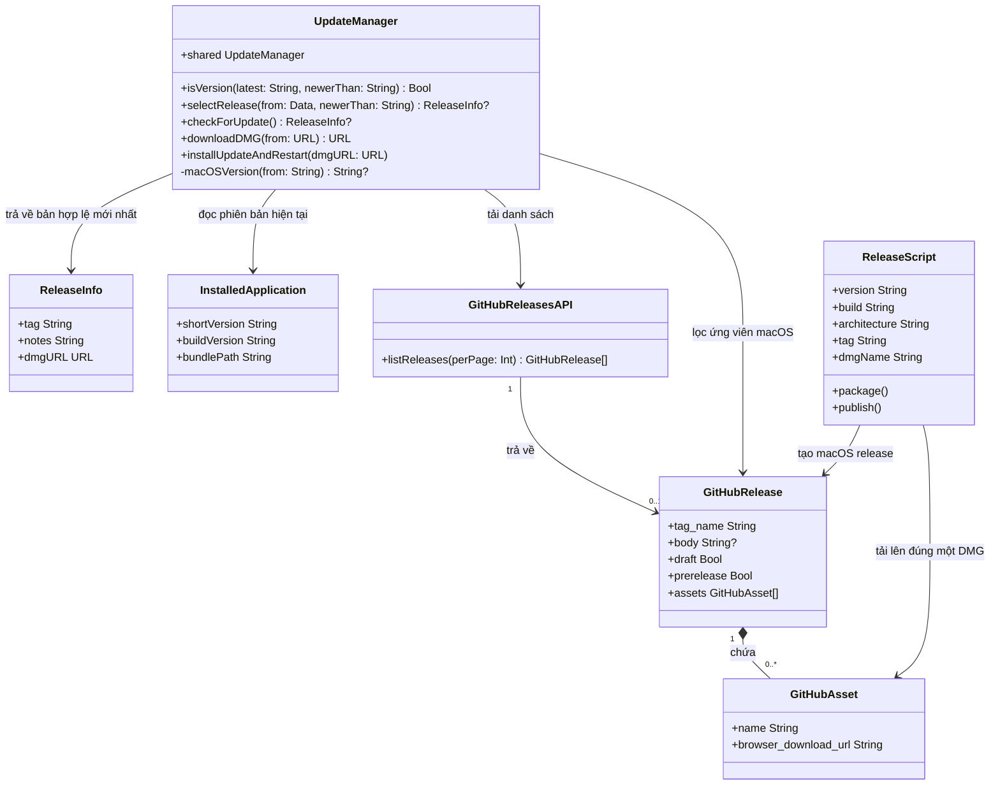

# Tách biệt kiểm tra và phát hành bản cập nhật macOS theo nền tảng

## Requirements

- Tách luồng kiểm tra cập nhật macOS khỏi các GitHub Release dành cho Windows trong cùng repository `ninhnguyen375/NTranslate`.
- Chỉ cung cấp cho người dùng macOS bản phát hành ổn định, mới hơn bản đang cài, có tag và DMG khớp chính xác.
- Phát hành các bản macOS mới bằng namespace tag `macos-v<major>.<minor>.<patch>` mà không thay đổi quy trình ký, đóng gói hoặc cài đặt DMG hiện có.
- Duy trì tương thích với UI kiểm tra cập nhật hiện tại và không nhập lịch sử triển khai từ nhánh Windows vào dòng phát triển macOS.

## Entities

- Giữ nguyên `ReleaseInfo`, `GitHubRelease`, `GitHubAsset` và `UpdateManager`; chỉ mở rộng thuộc tính hoặc phương thức cần cho lọc release.
- Không tạo repository, protocol, DTO wrapper hoặc tầng trừu tượng mới. Foundation `URLSession`, `JSONDecoder`, regex và cấu trúc hiện có đủ đáp ứng yêu cầu.
- `InstalledApplication` và `GitHubReleasesAPI` trong sơ đồ biểu diễn nguồn dữ liệu hiện có, không yêu cầu tạo type mới.

## Approach

1. Lựa chọn release theo nền tảng:
   - Thay endpoint `/releases/latest` bằng `/releases?per_page=100`, vì release mới nhất toàn repository có thể là Windows.
   - Decode mảng `[GitHubRelease]`, loại draft, prerelease và mọi tag không khớp chính xác `macos-v<major>.<minor>.<patch>`.
   - Chỉ nhận SemVer ba thành phần không có số 0 đứng đầu, không chấp nhận sai hoa/thường, tag `v*`, `windows-v*`, metadata hoặc prerelease suffix.
   - Chỉ nhận release mới hơn `CFBundleShortVersionString`, rồi chọn version cao nhất thay vì phụ thuộc thứ tự API.

2. Xác thực artifact:
   - Với version lấy từ tag, yêu cầu đúng một asset khớp `NTranslate-<version>-(arm64|x86_64|universal).dmg`.
   - Bỏ qua toàn bộ release nếu thiếu DMG, có nhiều DMG cùng khớp, URL không hợp lệ hoặc version trong tên DMG khác tag.
   - Giữ nguyên `ReleaseInfo` để UI, download và install không cần đổi giao diện.

3. Phát hành macOS độc lập:
   - Đổi tag do `release-dmg.sh` tạo từ `v${VERSION}` thành `macos-v${VERSION}`.
   - Giữ nguyên tên DMG, kiến trúc được phát hiện, kiểm tra chữ ký, nội dung DMG và cơ chế GitHub CLI hiện tại.
   - Cho phép logic cập nhật dòng `Latest:` nhận link cũ `v*` hoặc mới `macos-v*`, nhưng mọi release mới phải ghi link `macos-v*`.
   - Không đổi link công khai hiện tại sang tag chưa tồn tại; chỉ đồng bộ README trong luồng tạo release hợp lệ.

4. Kiểm thử và kiểm soát rủi ro:
   - Dùng Swift Testing cho lựa chọn release và script shell nhỏ cho quy ước tag.
   - Kiểm tra cả trường hợp hợp lệ, loại trừ theo nền tảng, format, trạng thái release, version và asset.
   - Xác minh build, metadata app đã cài và chữ ký trước khi cho phép publish.
   - Không dùng `GlobalExceptionHandler`; đây là ứng dụng AppKit, lỗi tiếp tục truyền bằng Swift `throws` và được UI hiện tại xử lý trong `performUpdateCheck(silent:)`.

## Structure

### Quan hệ type và giao diện

1. `UpdateManager` tiếp tục là `final class` dùng singleton `shared`; không tạo interface một triển khai.
2. `GitHubRelease` và `GitHubAsset` tiếp tục là nested `Decodable` type trong `UpdateManager`.
3. `GitHubRelease` bổ sung `draft: Bool` và `prerelease: Bool` để lọc trạng thái phát hành.
4. `ReleaseInfo` tiếp tục là `Sendable` value type và là giao diện dữ liệu giữa updater với `PopoverController`.
5. Không thêm inheritance, exception hierarchy hoặc service layer mới.

### Dependencies

1. `PopoverController.performUpdateCheck(silent:)` gọi `UpdateManager.shared.checkForUpdate()` và tiếp tục nhận `ReleaseInfo?`.
2. `UpdateManager.checkForUpdate()` dùng `URLSession` lấy GitHub Releases collection, đọc version từ `Bundle.main`, rồi gọi `selectRelease(from:newerThan:)`.
3. `UpdateManager.selectRelease(from:newerThan:)` dùng `JSONDecoder`, `macOSVersion(from:)`, `isVersion(_:newerThan:)` và kiểm tra regex tên DMG.
4. `release-dmg.sh` tiếp tục gọi `install-app.sh`, đọc metadata app trong `/Applications/NTranslate.app`, tạo DMG bằng `hdiutil`, rồi tùy chọn tạo GitHub Release bằng `gh`.
5. `Tests/translateTests/UpdateManagerTests.swift` kiểm tra logic Swift; `Tests/release-dmg-tags.sh` kiểm tra tĩnh quy ước tag của script.

### Phân lớp trách nhiệm

1. UI layer — `PopoverController`: kích hoạt kiểm tra, hiển thị trạng thái, tải và cài bản đã được `UpdateManager` xác nhận.
2. Update selection layer — `UpdateManager`: tải, decode, xác thực nền tảng/version/artifact và chọn release.
3. Platform services — Foundation/AppKit: HTTP, JSON, Bundle, file tạm, process và restart app.
4. Release automation — `release-dmg.sh`: build/install, ký, đóng gói, cập nhật README và publish tag macOS.
5. Verification — Swift tests, shell check, `install-app.sh`, `PlistBuddy`, `codesign` và GitHub CLI.

## Operations

### 1. Cập nhật kiểm thử lựa chọn release — `Tests/translateTests/UpdateManagerTests.swift`

1. Thay test parse một object từ `/releases/latest` bằng fixture mảng release tương ứng endpoint collection.
2. Thêm test `selectsNewestMacOSReleaseAndIgnoresOtherPlatforms()`:
   - Input gồm `windows-v9.0.0`, `macos-v1.2.3` và `macos-v1.2.4` theo thứ tự không được coi là điều kiện lựa chọn.
   - Gọi `UpdateManager.selectRelease(from:newerThan: "1.2.2")`.
   - Xác nhận kết quả là `macos-v1.2.4` và asset `NTranslate-1.2.4-arm64.dmg`.
3. Thêm các test loại trừ độc lập hoặc table-driven cho:
   - `v9.0.0`, `windows-v9.0.0`, `Macos-v9.0.0`.
   - `macos-v9.0`, `macos-v09.0.0` và tag SemVer sai định dạng.
   - `draft == true`, `prerelease == true`.
   - version bằng hoặc cũ hơn version hiện tại.
   - thiếu DMG, nhiều hơn một DMG khớp, kiến trúc ngoài `arm64|x86_64|universal`.
   - version trong tên DMG khác version của tag.
   - `browser_download_url` không tạo được `URL` hợp lệ.
4. Giữ test `isVersion(_:newerThan:)` nếu vẫn cần trực tiếp cho logic so sánh.
5. Chạy `swift test --filter UpdateManagerTests` trước phần triển khai và xác nhận thất bại do thiếu `selectRelease(from:newerThan:)`.

### 2. Triển khai lựa chọn release macOS — `Sources/translate/UpdateManager.swift`

1. Mở rộng `GitHubRelease`:
   - `draft: Bool`.
   - `prerelease: Bool`.
2. Thêm `private static func macOSVersion(from tag: String) -> String?`:
   - Yêu cầu prefix chính xác, phân biệt hoa/thường: `macos-v`.
   - Lấy phần version sau prefix.
   - Chỉ trả về version khớp `^(0|[1-9]\d*)\.(0|[1-9]\d*)\.(0|[1-9]\d*)$`.
3. Thêm `public static func selectRelease(from data: Data, newerThan currentVersion: String) throws -> ReleaseInfo?`:
   - Decode `data` thành `[GitHubRelease]`; lỗi JSON tiếp tục được throw.
   - Duyệt mọi release, không dựa vào thứ tự trả về.
   - Bỏ qua draft, prerelease và tag không cho ra macOS version hợp lệ.
   - Bỏ qua version không mới hơn `currentVersion`.
   - Tạo pattern tên asset bằng version đã escape: `^NTranslate-<version>-(arm64|x86_64|universal)\.dmg$`.
   - Lọc asset theo tên chính xác; chỉ tiếp tục khi số lượng bằng `1`.
   - Chỉ tạo candidate khi `browser_download_url` là URL hợp lệ.
   - So sánh candidate với kết quả tốt nhất hiện tại và giữ version cao hơn.
   - Trả `ReleaseInfo(tag: release.tag_name, notes: release.body ?? "", dmgURL: url)` hoặc `nil` nếu không có candidate.
4. Không thay đổi `downloadDMG(from:)`, `installUpdateAndRestart(dmgURL:)` hoặc contract `ReleaseInfo`.
5. Không giữ `parseRelease(from:)` nếu không còn caller sau thay đổi; xóa đúng method và test cũ đã trở thành orphan, không refactor phần khác.

### 3. Chuyển kiểm tra mạng sang GitHub Releases collection — `Sources/translate/UpdateManager.swift`

1. Trong `checkForUpdate()` đổi URL thành:
   `https://api.github.com/repos/ninhnguyen375/NTranslate/releases?per_page=100`.
2. Giữ các header `Accept` và `User-Agent` hiện có.
3. Giữ hành vi status HTTP khác `200` trả `nil`, tránh thay đổi UX ngoài phạm vi.
4. Đọc `CFBundleShortVersionString` như hiện tại.
5. Trả trực tiếp `try UpdateManager.selectRelease(from: data, newerThan: currentVersion)`.
6. Không sửa `PopoverController`; contract và cách hiển thị lỗi hiện tại vẫn phù hợp.
7. Chạy:
   - `swift test --filter UpdateManagerTests`.
   - `swift test`.
   Cả hai phải pass trước khi sửa release script.

### 4. Thêm kiểm tra tĩnh quy ước tag — `Tests/release-dmg-tags.sh`

1. Tạo shell script executable dùng `set -euo pipefail`.
2. Đọc `release-dmg.sh` và xác nhận có đúng `TAG="macos-v${VERSION}"`.
3. Xác nhận không còn assignment `TAG="v${VERSION}"`.
4. Có thể xác nhận `DMG_NAME="NTranslate-${VERSION}-${ARCH}.dmg"` vẫn được giữ nguyên; không kiểm tra chi tiết không liên quan.
5. Chạy script trước thay đổi và xác nhận thất bại, sau thay đổi phải pass.

### 5. Cập nhật phát hành macOS — `release-dmg.sh`

1. Đổi duy nhất namespace tag:
   - Từ `TAG="v${VERSION}"`.
   - Thành `TAG="macos-v${VERSION}"`.
2. Giữ nguyên `DMG_NAME="NTranslate-${VERSION}-${ARCH}.dmg"`.
3. Cập nhật biểu thức thay dòng `Latest:` để nhận cả URL/tag cũ `v<version>` và mới `macos-v<version>`, nhưng luôn ghi `${TAG}` mới.
4. Không sửa link `Latest:` độc lập trước khi release tương ứng tồn tại; script chỉ cập nhật trong luồng package/release đang có.
5. Không thay đổi signing, notarization, kiến trúc, nội dung DMG, release notes hoặc biến môi trường hiện tại.
6. Chạy:
   - `zsh -n release-dmg.sh`.
   - `./Tests/release-dmg-tags.sh`.

### 6. Xác minh app macOS đã cài

1. Vì source và release script ảnh hưởng `NTranslate.app`, chạy đúng một lần `./install-app.sh` sau khi toàn bộ thay đổi hoàn tất.
2. Ghi lại chính xác version và build từ output.
3. Xác minh metadata đã cài:
   - `/usr/libexec/PlistBuddy -c 'Print :CFBundleShortVersionString' /Applications/NTranslate.app/Contents/Info.plist`.
   - `/usr/libexec/PlistBuddy -c 'Print :CFBundleVersion' /Applications/NTranslate.app/Contents/Info.plist`.
4. Xác minh chữ ký bằng `codesign -vv /Applications/NTranslate.app`.
5. Đảm bảo metadata khớp output của `install-app.sh` và chữ ký hợp lệ.
6. Kiểm tra thủ công bằng fixture hoặc repository thử nghiệm:
   - `windows-v*` mới hơn vẫn bị bỏ qua.
   - tag cũ `v*` bị bỏ qua.
   - `macos-v*` thiếu hoặc sai DMG bị bỏ qua.
   - `macos-v*` hợp lệ và mới hơn được đề nghị cập nhật.
7. Không tạo production release chỉ để kiểm thử selection.

### 7. Chuẩn bị tích hợp và phát hành

1. Chạy `git diff --check` và kiểm tra `git status --short`.
2. Chỉ stage các file thuộc yêu cầu:
   - `Sources/translate/UpdateManager.swift`.
   - `Tests/translateTests/UpdateManagerTests.swift`.
   - `release-dmg.sh`.
   - `Tests/release-dmg-tags.sh`.
   - `README.md` nếu thực sự được script cập nhật trong release hợp lệ.
3. Không stage hoặc sửa các thay đổi không liên quan đang có trong working tree.
4. Chỉ commit, push và publish khi người dùng cấp quyền rõ ràng cho từng hành động outward-facing cần thiết.
5. Trước publish, chạy lại full test và install gate nếu code hoặc artifact thay đổi sau lần xác minh gần nhất.
6. Khi được phép publish, release phải có:
   - Tag `macos-v<version>`.
   - Đúng một asset `NTranslate-<version>-<arch>.dmg`.
7. Xác minh bằng `gh release view "macos-v<version>" --repo ninhnguyen375/NTranslate --json tagName,url,assets`.
8. Báo release URL, version, build, tên DMG, kết quả Swift tests, install/signature verification và các dirty path còn lại.

## Norms

1. Swift style:
   - Giữ naming, access level, indentation và cấu trúc hiện có trong `UpdateManager.swift`.
   - Dùng `Foundation` có sẵn; không thêm dependency.
   - Ưu tiên value type và helper `private static` thay vì abstraction mới.
2. Version handling:
   - Tag platform phải được parse nghiêm ngặt trước khi so sánh numeric version.
   - Không dùng so sánh chuỗi lexicographic cho SemVer.
   - Không diễn giải tag sai định dạng thành version hợp lệ bằng `compactMap` hoặc bỏ qua component lỗi.
3. Error handling:
   - JSON decode và lỗi mạng tiếp tục đi theo Swift `throws` hiện có.
   - Release không hợp lệ là candidate bị bỏ qua, không phải lỗi toàn bộ danh sách.
   - Không đưa URL, token hoặc nội dung nội bộ nhạy cảm vào lỗi mới.
4. Testing:
   - Mỗi business rule loại trừ phải có assertion chạy được.
   - Fixture nhỏ, nằm trong test, không gọi mạng thật.
   - Shell check chỉ kiểm tra contract tag cần bảo vệ, không snapshot toàn script.
5. Shell:
   - Giữ `zsh`, `set -euo pipefail` và quoting hiện có.
   - Không thêm tool hoặc dependency mới.
6. Thay đổi:
   - Diff tối thiểu, không chỉnh format hoặc refactor code lân cận.
   - Xóa duy nhất orphan do chính thay đổi tạo ra.
7. Tài liệu:
   - Tên tag, endpoint và mẫu artifact phải đồng nhất giữa source, test, script và README.
   - Comment chỉ giải thích ràng buộc không hiển nhiên; không lặp lại code.

## Safeguards

1. Chỉ chấp nhận tag lowercase đúng dạng `macos-v<major>.<minor>.<patch>`; mọi dạng khác phải bị bỏ qua.
2. `major`, `minor`, `patch` phải là số nguyên không âm và không có số 0 đứng đầu, trừ giá trị `0`.
3. Luôn bỏ qua `windows-v*`, tag cũ `v*`, draft, prerelease, version bằng và version cũ hơn.
4. Không phụ thuộc thứ tự GitHub API; luôn chọn macOS version hợp lệ cao nhất trong tối đa `100` release được tải.
5. Mỗi release candidate phải có đúng một DMG khớp `NTranslate-<version>-(arm64|x86_64|universal).dmg`.
6. Version trong tên DMG phải bằng chính xác version lấy từ tag.
7. URL asset phải parse thành `URL`; candidate có URL sai phải bị bỏ qua mà không làm mất candidate hợp lệ khác.
8. Không thay đổi contract `checkForUpdate() async throws -> ReleaseInfo?`, `downloadDMG(from:)` hoặc `installUpdateAndRestart(dmgURL:)`.
9. Không thay đổi hành vi im lặng khi auto-check lỗi và hành vi hiển thị lỗi khi manual check.
10. Không đổi cơ chế ký, notarization, mount, thay app hoặc restart.
11. Không merge hoặc cherry-pick lịch sử nhánh `windows-app`; chỉ triển khai trên dòng `main` macOS.
12. Không thêm dependency, service layer, protocol một triển khai hoặc wrapper entity không cần thiết.
13. `swift test --filter UpdateManagerTests`, `swift test`, `zsh -n release-dmg.sh` và `./Tests/release-dmg-tags.sh` phải pass.
14. Sau thay đổi source/release script, `./install-app.sh` phải hoàn tất; version/build đã cài phải khớp output và `codesign -vv` phải pass.
15. Không publish production release để test; dùng fixture hoặc repository thử nghiệm cho kiểm tra isolation.
16. Không commit, push, tạo tag hoặc GitHub Release khi chưa có xác nhận rõ ràng của người dùng.
17. Khi publish, release macOS phải có tag `macos-v<version>` và đúng một DMG phù hợp; không sửa hoặc yêu cầu asset Windows.
18. Không stage, ghi đè hoặc xóa thay đổi không liên quan đang tồn tại trong working tree.
