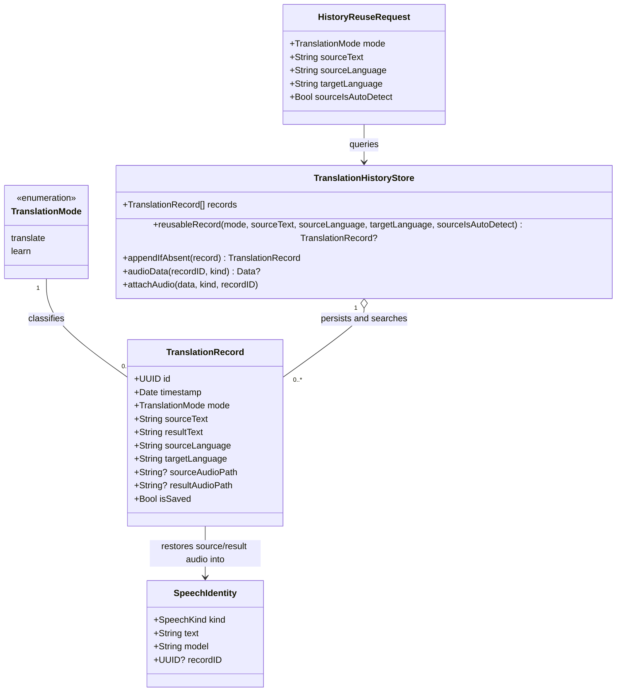

# Tái sử dụng kết quả Translate, Learn và audio từ history

## Requirements

Tái sử dụng kết quả text và audio đã lưu theo mode, source text và cặp ngôn ngữ để mở popup, Translate và Learn nhanh hơn, không gọi lại LLM/TTS khi dữ liệu phù hợp đã tồn tại, đồng thời giữ Translate và Learn thành hai bản ghi history độc lập.

Phạm vi:
- Áp dụng cho text translation khi mở popup, bấm Translate và bấm Learn.
- Không áp dụng cho image translation hoặc image search.
- Dùng history hiện có làm cache bền vững; không tạo kho cache thứ hai.
- Cache hit không tạo thêm dòng history và không thay đổi timestamp của bản ghi.
- Cache miss giữ luồng LLM, TTS, persistence và generation guard hiện có.

## Entities

Entity rules:
- `TranslationMode` là enum `String`, `Codable`, `Equatable`, `Sendable`; chỉ có `.translate` và `.learn`.
- `TranslationRecord.mode` mặc định `.translate` khi decode file history cũ không có field `mode`.
- Không tạo persistent `HistoryReuseRequest` type nếu tham số trực tiếp đủ rõ; diagram chỉ mô tả dữ liệu lookup.
- Business identity gồm `mode`, source text sau khi trim đầu/cuối, source language và target language.
- Text matching giữ nguyên hoa/thường, khoảng trắng bên trong, xuống dòng và Unicode; chỉ bỏ whitespace/newline đầu/cuối giống input hiện được gửi đi.
- Với source được chọn rõ, source language phải match chính xác.
- Với `Auto detect`, lookup dùng `mode + trimmed source text + target language`; source language lấy từ record cache hit. Cách này tránh gọi LLM chỉ để biết source language và vẫn không tái sử dụng chéo target/mode.
- Nếu có nhiều record cũ cùng identity, chọn record mới nhất theo thứ tự `records`; không merge, xóa hoặc sửa duplicate cũ.

## Approach

1. Persistent history reuse:
   - Mở rộng `TranslationRecord` bằng `mode`, giữ JSON cũ tương thích bằng decode mặc định `.translate`.
   - Đặt lookup và insert-if-absent trong `TranslationHistoryStore`, vốn chạy trên `MainActor`, để một nơi sở hữu quy tắc identity.
   - Dùng quét tuyến tính trên `records` đã nạp; không thêm index hoặc dependency khi chưa có số đo cho thấy history gây chậm.

2. Popup integration:
   - Sau validation input và resolve language pair, tra history trước khi prefetch source speech hoặc gọi `Translator`.
   - Cache hit áp dụng record vào popup: result text, resolved source language, current record ID, pane labels, history state và audio cache.
   - Cache miss dùng luồng hiện tại. Translate tiếp tục parse `TranslationResult`; Learn lưu plain result thành record `.learn`.
   - Dùng một helper trong `PopoverController` cho phần apply cache hit và một helper cho phần persist/apply result chung; không tạo service/interface mới.

3. Audio reuse:
   - Đọc source/result audio từ `TranslationHistoryStore` cho record hit.
   - Chỉ đưa bytes vào `speechCache` khi `SpeechAudioPolicy.isValid` trả true.
   - Tạo `SpeechIdentity` bằng text hiện tại, speech model hiện tại và record ID; audio lịch sử được chấp nhận theo record text/kind dù cấu hình voice đã đổi, vì mục tiêu nghiệp vụ ưu tiên tái sử dụng audio có sẵn.
   - Sau khi hydrate audio, gọi prefetch hiện có. Audio đã hydrate tạo memory-cache hit; audio thiếu hoặc hỏng chỉ gọi TTS nếu `autoPrefetchSpeech` bật hoặc người dùng bấm Speak.

4. History behavior:
   - Translate và Learn cùng source text/cặp ngôn ngữ tạo tối đa một record cho mỗi mode.
   - Cache hit không append, không nhân bản audio, không cập nhật timestamp và không thay đổi Saved.
   - History row hiển thị mode trong metadata để hai dòng Translate/Learn phân biệt được.
   - Record cũ không có mode hiển thị và hoạt động như Translate.

5. Failure and concurrency behavior:
   - Giữ `requestGeneration`, `prefetchGeneration`, `SpeechPlaybackState` và stale-result guards hiện có.
   - Cache hit hoàn tất request generation hiện tại trước khi thoát; stale async completion không được append hoặc cập nhật UI.
   - History load error tạo cache miss và cho phép LLM tiếp tục, nhưng store vẫn từ chối mutation để không ghi đè file hỏng; popup hiển thị status hiện có.
   - Audio missing, unreadable hoặc invalid không làm hỏng text cache hit; coi riêng audio đó là miss.

## Structure

### Type Relationships

1. `TranslationMode` phân loại `TranslationRecord`; không tạo protocol hoặc base class.
2. `TranslationRecord` tiếp tục là value type `Codable`, `Equatable`, `Identifiable`, `Sendable`.
3. `TranslationHistoryStore` tiếp tục sở hữu persistence, validation, lookup, uniqueness và audio file access.
4. `PopoverController` tiếp tục điều phối UI, Translator, history store, speech cache và generation lifecycle.
5. `HistoryWindowController` chỉ render thêm mode; không sở hữu logic reuse.

### Dependencies

1. `PopoverController.performTranslate` gọi `TranslationHistoryStore.reusableRecord` trước `Translator.translate`.
2. `PopoverController.runLearn` gọi cùng lookup với mode `.learn` trước `Translator.learn`.
3. Completion Translate/Learn gọi `TranslationHistoryStore.appendIfAbsent` để bảo vệ uniqueness tại điểm ghi.
4. Cache-hit helper gọi `TranslationHistoryStore.audioData`, `SpeechAudioPolicy.isValid`, rồi nạp `speechCache`.
5. `HistoryWindowController` đọc `TranslationRecord.mode` để hiển thị metadata.
6. `Translator` không phụ thuộc history và không cần thay đổi API.

### Existing Architecture

1. Model/store: `TranslationHistoryStore.swift` chứa enum mode, record schema, JSON compatibility, lookup và atomic persistence.
2. Application/UI orchestration: `PopoverController.swift` quyết định hit/miss, apply result, gọi LLM/TTS và giữ async safeguards.
3. History presentation: `HistoryWindowController.swift` hiển thị mode cùng timestamp/language.
4. Tests: `TranslationHistoryStoreTests.swift` kiểm chứng schema, identity, duplicate selection và audio; `translateTests.swift` kiểm chứng policy/helper thuần nếu helper được đặt trong `PopoverIntegrationPolicy`.
5. Không thêm repository, DAO, cache service, exception hierarchy hoặc dependency injection framework; kiến trúc AppKit hiện tại không dùng các lớp đó.

## Operations

### 1. Update History Model — `TranslationMode` và `TranslationRecord`

1. File: `Sources/translate/TranslationHistoryStore.swift`.
2. Thêm:
   - `enum TranslationMode: String, Codable, Equatable, Sendable { case translate, learn }`.
   - `mode: TranslationMode` vào `TranslationRecord`.
3. Backward compatibility:
   - Cung cấp initializer dùng trong code/tests với `mode: TranslationMode = .translate` để call site cũ tiếp tục compile.
   - Cung cấp custom `init(from:)` hoặc tương đương tối thiểu để decode `mode` bằng `.translate` khi key không tồn tại.
   - Encode luôn field `mode` cho record mới và lần persist tiếp theo.
4. Không đổi ý nghĩa ID, timestamp, Saved hoặc audio paths.
5. Verification:
   - JSON cũ không có `mode` load thành `.translate`.
   - JSON mới round-trip cả `.translate` và `.learn`.
   - Invalid enum value vẫn khóa mutation như malformed history hiện tại; không silently rewrite dữ liệu không hiểu được.

### 2. Update History Store — Lookup và Insert Uniqueness

1. File: `Sources/translate/TranslationHistoryStore.swift`.
2. Thêm method:
   - `func reusableRecord(mode: TranslationMode, sourceText: String, sourceLanguage: String, targetLanguage: String, sourceIsAutoDetect: Bool) -> TranslationRecord?`
   - Logic:
     - Trim whitespace/newline đầu/cuối của input và record source text.
     - Match `mode`, exact case-sensitive trimmed text và exact target language.
     - Nếu `sourceIsAutoDetect == false`, match exact source language.
     - Nếu `sourceIsAutoDetect == true`, không yêu cầu source language match; record source language trở thành resolved identity khi hit.
     - Trả record đầu tiên vì `records` luôn newest-first.
     - Không trả record rỗng hoặc record không hợp lệ; validation lúc load/append vẫn là guard chính.
3. Thêm method:
   - `@discardableResult func appendIfAbsent(_ record: TranslationRecord) throws -> TranslationRecord`
   - Logic:
     - Gọi `ensureWritable` và validation như `append`.
     - Tìm exact identity persisted: mode, trimmed source text, exact source language, exact target language.
     - Nếu tồn tại, trả record newest-first hiện có, không persist và không thay đổi timestamp/Saved/audio.
     - Nếu chưa tồn tại, append/persist/sort như hành vi hiện tại và trả record mới.
   - Giữ `append(_:)` cho call site/test hiện có; hoặc cho `append` gọi logic persistence dùng chung, không đổi semantics ngoài phạm vi yêu cầu.
4. Không cleanup duplicate cũ. Không xóa audio. Không thêm index.
5. Tests:
   - Hai mode cùng text/language trả hai record khác nhau.
   - Cùng mode/text/source/target trả record mới nhất và insert-if-absent không tăng count.
   - Khác target hoặc source explicit là miss.
   - Auto detect hit newest record cùng mode/text/target dù stored source language khác `Auto detect`.
   - Matching chỉ trim đầu/cuối; khác case hoặc whitespace bên trong là miss.

### 3. Add Popup Reuse Helpers

1. File: `Sources/translate/PopoverController.swift`.
2. Thêm helper lookup dùng chung cho Translate/Learn:
   - Nhận `mode`, trimmed source text và resolved pair.
   - Xác định `sourceIsAutoDetect` từ source selection dùng cho request, không từ record.
   - Gọi `historyStore.reusableRecord`.
3. Thêm helper apply record:
   - Kiểm tra generation hiện tại và `pendingImage == nil` trước khi thay UI.
   - Đặt `resolvedSourceLanguage = record.sourceLanguage` khi source selection là Auto detect.
   - Đặt result text, `currentRecordID`, pane labels và save button state từ record.
   - Hydrate source/result audio riêng biệt bằng `historyStore.audioData`.
   - Với source: identity dùng input source text, `sourceSpeechModel(for:)`, record ID.
   - Với result: identity dùng result text, target speech model hiện tại, record ID.
   - Chỉ ghi `speechCache` nếu `SpeechAudioPolicy.isValid(data)`; missing/read/validation error chỉ bỏ audio tương ứng và giữ result.
   - Reload/reflow/scroll/update busy state theo cùng kết quả thành công hiện tại.
   - Chạy source/result prefetch hiện có sau hydrate; memory cache ngăn TTS call khi audio hợp lệ đã có.
   - Giữ auto-copy cho Translate cache hit giống Translate network success; Learn cache hit không tự copy nếu Learn hiện không có hành vi đó.
4. Thêm helper persist thành công dùng chung ở mức tối thiểu:
   - Tạo `TranslationRecord` với mode, source/result text, source/target language và audio path nil.
   - Gọi `appendIfAbsent`; dùng record trả về làm `currentRecordID` để xử lý trường hợp record đã xuất hiện trước completion.
   - Attach pending source speech chỉ vào record trả về khi phù hợp.
   - Không tạo abstraction service hoặc generic pipeline mới.
5. Error handling:
   - Lookup không throw và history load lỗi chỉ cho kết quả nil.
   - Audio read error hiển thị status ngắn nếu cần nhưng không biến cache hit text thành failure.
   - Persist error giữ result hiển thị, đặt `currentRecordID = nil`, dùng status `History failed:` hiện có.

### 4. Integrate Translate Cache Hit

1. File: `Sources/translate/PopoverController.swift`.
2. Trong `performTranslate(generation:)`, giữ nguyên thứ tự validation:
   - Invalidate current record.
   - Begin/retain generation.
   - Handle missing translator, image input, empty text và max length như hiện tại.
   - Resolve pair và cập nhật language selection.
3. Trước source prefetch và `translator.translate`:
   - Lookup mode `.translate`.
   - Nếu hit, apply record, finish request generation và return.
   - Không gọi LLM.
   - Không append history.
   - Không gọi TTS nếu source/result audio hợp lệ đã được hydrate; audio thiếu tuân theo prefetch/on-demand hiện có.
4. Cache miss:
   - Giữ request `translator.translate` và stale generation guard.
   - Trong `finishTextTranslation`, persist mode `.translate` bằng `appendIfAbsent`.
   - Nếu insert trả record cũ, apply hoặc dùng ID/audio của record cũ thay vì tạo duplicate.
5. Auto detect:
   - Lookup wildcard source như quy tắc store.
   - Cache hit phục hồi `resolvedSourceLanguage` từ record.
   - Cache miss tiếp tục dùng source language từ `TranslationResult` và lưu resolved language thực.
6. Verification:
   - Mở popup lần hai cho cùng text/target trả kết quả ngay từ history.
   - `Translator.translate` và `Translator.speak` không được gọi khi audio cần thiết đã tồn tại hợp lệ.
   - Đổi target hoặc explicit source tạo miss đúng.

### 5. Integrate Learn Persistence và Cache Hit

1. File: `Sources/translate/PopoverController.swift`.
2. Trong `runLearn`:
   - Giữ image, empty, max-length, speech invalidation và generation guards hiện tại.
   - Resolve pair/update language selection.
   - Lookup mode `.learn` trước khi đặt loading state hoặc gọi `translator.learn`.
3. Cache hit:
   - Apply record bằng helper chung.
   - Finish generation và return.
   - Không gọi LLM, không append history.
   - Hydrate và tái sử dụng cả source/result audio theo cùng quy tắc Translate.
4. Cache miss success:
   - Resolve source language cho history: explicit source giữ nguyên; Auto detect dùng `effectiveSourceLanguage`/detector hiện có vì Learn response không chứa language metadata.
   - Tạo record mode `.learn`, append bằng `appendIfAbsent`, đặt `currentRecordID` và reload History.
   - Prefetch source/result speech theo config hiện có để audio Learn có cùng vòng đời với Translate.
5. Cache miss failure:
   - Không lưu history.
   - Invalidate current record và hiển thị error như hiện tại.
6. Không đổi prompt Learn hoặc `Translator.learn` API.

### 6. Update History Presentation

1. File: `Sources/translate/HistoryWindowController.swift`.
2. Thêm mode label vào metadata hiện có, ví dụ `Translate · <timestamp> · <source> → <target>` hoặc `Learn · ...`.
3. Bổ sung mode vào accessibility context để hai dòng cùng text/ngôn ngữ phân biệt được.
4. Không thêm filter, segment, cột hoặc màn hình mới.
5. `openHistoryRecord` tiếp tục nạp source/result/language/current record; mode không tự kích hoạt network action.

### 7. Add Focused Tests

1. File chính: `Tests/translateTests/TranslationHistoryStoreTests.swift`.
2. Test cases bắt buộc:
   - Legacy JSON defaults to Translate.
   - Translate/Learn round-trip mode.
   - Lookup exact identity và mode isolation.
   - Auto-detect lookup semantics.
   - `appendIfAbsent` không tăng count, không đổi timestamp/Saved và trả record hiện có.
   - Newest duplicate wins nhưng duplicate cũ không bị xóa.
   - Audio của record hit đọc lại đúng; missing audio trả nil và không ảnh hưởng record hit.
   - History row/accessibility metadata chứa mode.
3. Nếu popup helper có thể tách thành policy thuần mà không kéo UI state, thêm test nhỏ trong `Tests/translateTests/translateTests.swift`; không tạo mock framework hoặc network test harness mới.
4. Chạy:
   - `swift test`
   - `./install-app.sh` sau khi toàn bộ test pass, vì source app thay đổi.
5. Báo version/build từ output `install-app.sh`.

## Norms

1. Swift/AppKit conventions:
   - Dùng Swift 6.3 concurrency rules hiện có.
   - State và history mutation giữ trên `@MainActor`.
   - Completion từ `Translator` quay về `Task { @MainActor in ... }` như code hiện tại.
2. Data modeling:
   - Dùng enum/value type hiện có; không tạo protocol, repository wrapper, cache manager hoặc DTO runtime mới.
   - Enum Codable dùng raw string ổn định `translate`/`learn`.
   - Custom decoding chỉ default `.translate` khi key `mode` hoàn toàn không tồn tại; key tồn tại với `null`, unknown value hoặc sai type phải throw và khóa mutation như malformed history.
3. Matching:
   - Một helper trim dùng `trimmingCharacters(in: .whitespacesAndNewlines)`.
   - So sánh text case-sensitive và không collapse whitespace bên trong.
   - Language dùng canonical strings hiện có, không thêm language ID system mới.
4. Error handling:
   - Giữ `TranslationHistoryStore.StoreError` và status UI hiện có.
   - Không thêm exception hierarchy, global handler hoặc logging framework không phù hợp app desktop hiện tại.
   - Không ghi đè file history khi load/validation lỗi.
5. Persistence:
   - Tiếp tục JSON encode ISO-8601, pretty printed, sorted keys và atomic write.
   - Audio path tiếp tục relative, contained trong audio directory và atomic metadata behavior hiện có.
6. Comments:
   - Chỉ comment cho backward compatibility hoặc quyết định Auto detect không hiển nhiên.
   - Không thêm documentation/scaffolding cho extension tương lai.
7. Tests:
   - Dùng Swift Testing hiện có.
   - Một test cho mỗi invariant chính; không thêm dependency hoặc fixture framework.
   - Dùng temporary directory và cleanup pattern sẵn có.

## Safeguards

1. Functional constraints:
   - Cache identity bắt buộc phân biệt `.translate` và `.learn`.
   - Explicit source, target, trimmed exact text và mode phải match trước cache hit.
   - Auto detect chỉ wildcard source; mode, text và target vẫn phải match.
   - Cache hit không gọi LLM, không append record và không thay đổi timestamp/Saved.
   - Translate và Learn cùng input/cặp ngôn ngữ phải tồn tại tối đa hai record, một record mỗi mode.
2. Audio constraints:
   - Audio source/result được hydrate độc lập.
   - Chỉ cache bytes vượt qua `SpeechAudioPolicy.isValid`.
   - Missing, unreadable hoặc invalid audio không làm mất text cache hit.
   - TTS chỉ chạy cho audio miss khi auto-prefetch bật hoặc người dùng yêu cầu playback.
3. Concurrency constraints:
   - Mọi UI/result/history update phải kiểm tra request generation hiện tại.
   - Stale Translate/Learn completion không được append record, attach audio hoặc đổi popup.
   - `appendIfAbsent` lookup và persist chạy cùng actor, không tách qua background queue.
4. Data compatibility constraints:
   - Mọi record cũ thiếu `mode` phải load như `.translate`.
   - Unknown mode hoặc malformed record giữ behavior khóa mutation hiện có.
   - Không migration phá hủy, deduplicate hoặc xóa audio cũ trong feature này.
5. Performance constraints:
   - Cache hit phải hoàn tất bằng dữ liệu đã load trong memory và file audio local; không network round-trip.
   - Chỉ một pass tuyến tính qua history cho mỗi action; không lặp nested scan theo record.
   - Không thêm index cho đến khi benchmark thực tế chứng minh linear lookup làm chậm popup.
6. Integration constraints:
   - Không đổi endpoint, request/response contract của LLM hoặc TTS.
   - Không đổi behavior image translation, image search, selection reader, hotkey hoặc clipboard ngoài auto-copy Translate cache hit tương đương success hiện tại.
   - Không thêm dependency.
7. UI/accessibility constraints:
   - History row phải hiển thị và đọc được mode Translate/Learn.
   - Không thêm control/filter mới.
   - Cache hit phải cập nhật pane language labels, Save state, Speak buttons, layout và scroll giống network success.
8. Security and file constraints:
   - Giữ audio path traversal/symlink containment checks hiện có.
   - Không đưa API key, request content hoặc absolute audio path vào log/status/history schema mới.
   - Atomic write và malformed-history lock không được suy yếu.
9. Verification constraints:
   - `swift test` phải pass.
   - Test phải chứng minh cache identity, legacy decode, mode isolation, no-duplicate insert và audio fallback.
   - Sau test pass, `./install-app.sh` phải hoàn tất; báo chính xác version/build từ output.
