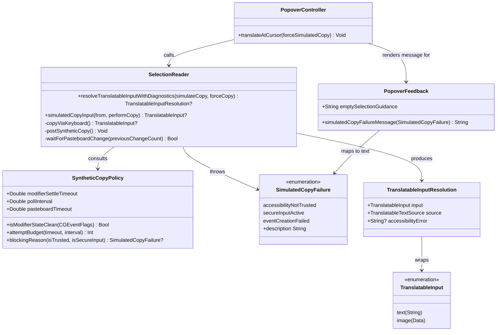

# Fix Ctrl+Option+D simulated copy so it behaves like a real Cmd+C

## Requirements

Restore the copy-and-translate hotkey so that pressing `Control+Option+D` over a selection in any app captures that selection exactly as a manual **Edit ▸ Copy** would, without requiring the user to perform the copy themselves.

Essence: the synthetic `Cmd+C` NTranslate injects is currently contaminated by the still-held `Control`+`Option` modifiers of the triggering hotkey, so the target app receives `Cmd+Ctrl+Option+C` and does not treat it as Copy. Deliver a synthetic keystroke that the target app cannot distinguish from a real `Cmd+C`, give slow apps enough time to respond, and replace the misleading "No text selected" outcome with an accurate reason when injection is impossible.

Boundaries:
- Scope is the synthetic-copy mechanism (`SelectionReader.copyViaKeyboard`) and the feedback it produces. The hotkey chord stays `Control+Option+D`; hotkey registration, Accessibility selection reading, translation, and popover presentation are unchanged.
- The user's clipboard must remain byte-identical after every invocation, including failures — this is an existing guarantee that must not regress.
- Secure input contexts (password fields) are explicitly out of reach; the requirement there is an honest message, not a workaround.

## Entities

Conservative notes:
- No new entity replaces anything that exists. `TranslatableInput`, `TranslatableInputResolution`, `TranslatableTextSource`, and `simulatedCopyInput(from:performCopy:)` stay exactly as they are — the closure seam they provide is what keeps clipboard restoration tested.
- `SyntheticCopyPolicy` exists only to move the untestable timing/flag decisions out of the `CGEvent` code so they can be unit-tested. It holds no state.
- `SimulatedCopyFailure` is a new error enum, not a new result type; it flows through the existing `throws` path of `resolveTranslatableInputWithDiagnostics`.

## Approach

1. **Synthetic keystroke fidelity** (root cause):
   - Build the `CGEvent` pair from a `CGEventSource(stateID: .privateState)` instead of `.combinedSessionState`. A private-state source does not merge the live hardware modifier state into posted events, so `flags = .maskCommand` is what the target app observes rather than `Cmd+Ctrl+Option+C`.
   - Before injecting, wait a bounded window for the physical `Control`/`Option` of the triggering chord to be released, polling `CGEventSource.flagsState(.combinedSessionState)`. This is the belt to the private-source's braces: it also protects apps that consult the hardware state directly.
   - Do **not** inject synthetic modifier key-up events to force-clear the chord. That mutates global modifier state for every running app and risks stuck modifiers if the restore path is skipped — an unacceptable trade against a bounded wait.
   - Keep posting to `.cghidEventTap`; it is the tap that reaches all apps and the existing `postCommandV` uses the same tap successfully.

2. **Timing budget**:
   - Raise the pasteboard wait from ~200 ms (20 × 10 ms) to a bounded ~800 ms, keeping the 10 ms poll interval. Office, Electron, JetBrains, and remote-desktop sessions exceed 200 ms; a false "No text selected" is worse than a short wait.
   - Replace the nested `RunLoop.current.run(until:)` polling with `Thread.sleep(forTimeInterval:)` between `changeCount` reads. The nested run loop re-enters AppKit while the Carbon hotkey handler unwinds — the documented cause of two prior crashes in this file (`fc6a691`, `9b499fa`). Sleeping does not pump the event queue, so no re-entrancy, and the pasteboard server updates `changeCount` independently of this process's run loop.
   - Keep both timings as named constants on `SyntheticCopyPolicy` so they can be tuned without touching injection code — these are physical-world parameters that vary by machine and app.

3. **Preconditions and honest failure**:
   - Check `AXIsProcessTrusted()` and `IsSecureEventInputEnabled()` before injecting. Both make injection silently impossible today, and both currently surface as "No text selected".
   - Throw a typed `SimulatedCopyFailure` for these, plus for `CGEventSource`/`CGEvent` construction returning `nil`. The existing `catch` in `translateAtCursor` already routes thrown errors to a visible panel; extend it with a specific message per case.
   - A *successful* injection that produces no clipboard change stays a `nil` return, not an error — that is the legitimate "nothing was selected" case and must keep showing `emptySelectionGuidance`.

4. **Clipboard safety** (unchanged, must not regress):
   - All injection stays inside the `performCopy` closure passed to `simulatedCopyInput`, so the `defer`-based snapshot/restore keeps running on every exit path, including thrown errors. Preconditions are checked *inside* the closure for this reason — throwing before entering `simulatedCopyInput` would also be safe, but keeping one entry point avoids two divergent paths.

5. **Testability**:
   - `CGEvent` injection cannot be exercised by `swift test`. Push every decision that *can* be tested — flag cleanliness, attempt budget, blocking reason — into pure `SyntheticCopyPolicy` functions, and cover those. The remaining injection code is then a thin, reviewable shim, validated by a manual test matrix.

## Structure

### Inheritance Relationships
1. `SimulatedCopyFailure` conforms to `Error` and `CustomStringConvertible`, matching the existing `ImageInputError` / `SelectionReadFailure` pattern in `SelectionReader.swift`.
2. `SyntheticCopyPolicy` is an `enum` namespace with only `static` members, matching the existing `PopoverIntegrationPolicy` and `HotkeyKeyCode` pattern.
3. No new classes, protocols, or inheritance chains are introduced.

### Dependencies
1. `PopoverController.translateAtCursor(forceSimulatedCopy:)` calls `SelectionReader.resolveTranslatableInputWithDiagnostics(simulateCopy:forceCopy:)`.
2. `resolveTranslatableInputWithDiagnostics` calls `copyViaKeyboard()`.
3. `copyViaKeyboard()` calls `simulatedCopyInput(from:performCopy:)` and, inside the closure, `SyntheticCopyPolicy` + `CoreGraphics` event APIs.
4. `SyntheticCopyPolicy` depends on nothing but `CoreGraphics` types (`CGEventFlags`) — no AppKit, no I/O.
5. `PopoverController` calls `PopoverFeedback.simulatedCopyFailureMessage(_:)` when it catches a `SimulatedCopyFailure`.

### Layered Architecture
1. **Hotkey layer** (`PopoverController.registerHotKey`, `installHotKeyEventHandler`, `copyAndTranslateHotKeyPressed`): unchanged — receives the Carbon event and dispatches to main.
2. **Orchestration layer** (`PopoverController.translateAtCursor`): captures `previousApp`, invokes resolution, maps outcomes to panel/status. Changed only to render typed copy failures.
3. **Resolution layer** (`SelectionReader.resolveTranslatableInputWithDiagnostics`): unchanged source-selection logic; now propagates typed failures.
4. **Injection layer** (`SelectionReader.copyViaKeyboard`, `postSyntheticCopy`, `waitForPasteboardChange`): rewritten — preconditions, clean-modifier injection, bounded wait.
5. **Policy layer** (`SyntheticCopyPolicy`): new, pure, unit-tested timing and flag decisions.
6. **Clipboard-safety layer** (`SelectionReader.simulatedCopyInput`): unchanged — owns snapshot/restore via `defer`.
7. **Feedback layer** (`PopoverFeedback`): extended with failure-to-message mapping.

## Operations

### Create Policy Namespace — `SyntheticCopyPolicy` (in `Sources/translate/SelectionReader.swift`)
1. Responsibility: hold every pure decision behind the synthetic copy so the untestable `CGEvent` code carries no logic.
2. Attributes (static constants):
   - `modifierSettleTimeout: TimeInterval` — `0.35` — max wait for the user to release the triggering chord.
   - `pasteboardTimeout: TimeInterval` — `0.8` — max wait for the target app to write the pasteboard.
   - `pollInterval: TimeInterval` — `0.01` — poll granularity for both waits.
   - `blockingModifiers: CGEventFlags` — `[.maskControl, .maskAlternate, .maskCommand, .maskShift]`.
3. Methods:
   - `isModifierStateClean(_ flags: CGEventFlags) -> Bool`
     - Logic: return `flags.intersection(blockingModifiers).isEmpty`.
     - Edge case: caps lock, numeric pad, function, and help flags are deliberately ignored — they do not alter a Copy shortcut.
   - `attemptBudget(timeout: TimeInterval, interval: TimeInterval) -> Int`
     - Logic: guard `interval > 0` else return `1`; return `max(1, Int((timeout / interval).rounded(.up)))`.
     - Edge case: a zero or negative timeout still yields one attempt, so the caller always checks at least once.
   - `blockingReason(isTrusted: Bool, isSecureInput: Bool) -> SimulatedCopyFailure?`
     - Logic: if `!isTrusted` return `.accessibilityNotTrusted`; if `isSecureInput` return `.secureInputActive`; otherwise `nil`.
     - Order matters: a missing permission is the actionable one and takes precedence in the message.
4. Annotations: none (plain Swift `enum`).
5. Constraints: no side effects, no global reads — all inputs are parameters so tests can drive them.

### Create Error Type — `SimulatedCopyFailure` (in `Sources/translate/SelectionReader.swift`)
1. Inheritance: `enum SimulatedCopyFailure: Error, CustomStringConvertible, Equatable`.
2. Cases:
   - `accessibilityNotTrusted` — `CGEvent.post` is silently dropped without Accessibility permission.
   - `secureInputActive` — another process holds secure event input; injection is blocked by the OS.
   - `eventCreationFailed` — `CGEventSource` or `CGEvent` initialisation returned `nil`.
3. `description`:
   - `.accessibilityNotTrusted` → `"Grant Accessibility permission so NTranslate can copy the selection."`
   - `.secureInputActive` → `"Secure input is active (password field). Copy is blocked by macOS."`
   - `.eventCreationFailed` → `"Could not create the synthetic copy keystroke."`
   - Note: the `.accessibilityNotTrusted` string intentionally starts with `Grant Accessibility` so the existing `PopoverFeedback.resultStyle(for:)` classifies it as `.error` without modification.
4. Usage: thrown from inside the `performCopy` closure of `copyViaKeyboard`, so clipboard restoration still runs via `simulatedCopyInput`'s `defer`.

### Update Method — `SelectionReader.copyViaKeyboard()`
1. Responsibility: inject a clean `Cmd+C` into the frontmost app and report whether the pasteboard changed.
2. Signature: `private static func copyViaKeyboard() throws -> TranslatableInput?` — unchanged.
3. Logic:
   - Call `simulatedCopyInput(from: .general)` exactly as today, but with a throwing closure:
     - `performCopy` must be changed from `(_ previousChangeCount: Int) -> Bool` to `(_ previousChangeCount: Int) throws -> Bool`, and `simulatedCopyInput` must be marked `rethrows` accordingly. This preserves both existing call sites and the existing tests (a non-throwing closure still compiles against a `rethrows` parameter).
   - Inside the closure:
     1. `if let reason = SyntheticCopyPolicy.blockingReason(isTrusted: AXIsProcessTrusted(), isSecureInput: IsSecureEventInputEnabled()) { throw reason }`
     2. `waitForModifierRelease()` — bounded, non-throwing (see below). A timeout is not fatal: the private-state source is expected to carry the operation on its own.
     3. `try postSyntheticCopy()`
     4. `return waitForPasteboardChange(previousChangeCount: previousChangeCount)`
4. Constraints: every early exit stays inside `simulatedCopyInput`, so the clipboard `defer` always executes.

### Create Method — `SelectionReader.waitForModifierRelease()`
1. Responsibility: give the user's physical `Control+Option` a bounded window to lift before injecting.
2. Signature: `private static func waitForModifierRelease()`
3. Logic:
   - `let budget = SyntheticCopyPolicy.attemptBudget(timeout: SyntheticCopyPolicy.modifierSettleTimeout, interval: SyntheticCopyPolicy.pollInterval)`
   - Loop up to `budget` times: read `CGEventSource.flagsState(.combinedSessionState)`; if `SyntheticCopyPolicy.isModifierStateClean(_:)` returns `true`, return immediately; otherwise `Thread.sleep(forTimeInterval: SyntheticCopyPolicy.pollInterval)`.
   - Falls through silently when the budget is exhausted — a user who holds the chord down must still get a best-effort copy.
4. Constraints: must not use `RunLoop.run(until:)`; no AppKit re-entrancy is permitted on this path.

### Create Method — `SelectionReader.postSyntheticCopy()`
1. Responsibility: post exactly one `Cmd+C` down/up pair, uncontaminated by hardware modifier state.
2. Signature: `private static func postSyntheticCopy() throws`
3. Logic:
   - `guard let source = CGEventSource(stateID: .privateState) else { throw SimulatedCopyFailure.eventCreationFailed }`
   - `guard let keyDown = CGEvent(keyboardEventSource: source, virtualKey: CGKeyCode(kVK_ANSI_C), keyDown: true), let keyUp = CGEvent(keyboardEventSource: source, virtualKey: CGKeyCode(kVK_ANSI_C), keyDown: false) else { throw SimulatedCopyFailure.eventCreationFailed }`
   - `keyDown.flags = .maskCommand; keyUp.flags = .maskCommand`
   - `keyDown.post(tap: .cghidEventTap); keyUp.post(tap: .cghidEventTap)`
4. Constraints:
   - The source state ID **must** be `.privateState`, not `.combinedSessionState` — this is the root-cause fix.
   - No synthetic modifier key-up/down events may be posted; global modifier state must not be mutated.

### Create Method — `SelectionReader.waitForPasteboardChange(previousChangeCount:)`
1. Responsibility: bounded, non-reentrant wait for the target app to write the pasteboard.
2. Signature: `private static func waitForPasteboardChange(previousChangeCount: Int) -> Bool`
3. Logic:
   - `let budget = SyntheticCopyPolicy.attemptBudget(timeout: SyntheticCopyPolicy.pasteboardTimeout, interval: SyntheticCopyPolicy.pollInterval)`
   - Loop up to `budget` times: if `NSPasteboard.general.changeCount != previousChangeCount` return `true`; otherwise `Thread.sleep(forTimeInterval: SyntheticCopyPolicy.pollInterval)`.
   - Return `NSPasteboard.general.changeCount != previousChangeCount` after the loop.
4. Constraints: `Thread.sleep`, never `RunLoop.current.run(until:)` — nested run loops on this path have caused crashes before.

### Update Signature — `SelectionReader.simulatedCopyInput(from:performCopy:)`
1. Change: `performCopy: (_ previousChangeCount: Int) throws -> Bool` and mark the function `rethrows` (it is already `throws` for `ImageInputError`, so it becomes `throws` overall — keep it `throws`, and simply allow the closure to throw).
2. Body: unchanged, except `guard performCopy(previousChangeCount)` becomes `guard try performCopy(previousChangeCount)`.
3. Constraint: the `defer` block that restores the clipboard must remain the first statement after the snapshot and must not be moved — it is the only thing standing between a thrown error and clipboard data loss.

### Update Method — `PopoverFeedback.simulatedCopyFailureMessage(_:)`
1. Responsibility: turn a typed copy failure into user-facing panel text.
2. Signature: `static func simulatedCopyFailureMessage(_ failure: SimulatedCopyFailure) -> String`
3. Logic: return `failure.description`. Keeping the mapping in one named function means the wording can change without touching `PopoverController`.
4. Constraint: the returned strings must classify correctly under the existing `resultStyle(for:)` — either prefixed with `Grant Accessibility` or reached via the caller's `"Error: …"` prefix.

### Update Method — `PopoverController.translateAtCursor(forceSimulatedCopy:)`
1. Change: in the existing `catch` block, add a typed branch before the generic one:
   - `catch let failure as SimulatedCopyFailure { showEmptySelectionPanel(message: PopoverFeedback.simulatedCopyFailureMessage(failure)); return }`
   - `catch { showEmptySelectionPanel(message: "Error: \(error)") }` — unchanged fallback.
2. Everything else in the method — the `AXIsProcessTrusted()` prompt, `previousApp` capture, resolution call, panel presentation — stays exactly as is.
3. Constraint: `previousApp` must continue to be captured *before* resolution, and the panel must continue to be presented *after* it, so the target app is still frontmost when the keystroke is injected.

### Add Tests — `Tests/translateTests/translateTests.swift`
1. `syntheticCopyPolicyDetectsBlockingModifiers`
   - `#expect(SyntheticCopyPolicy.isModifierStateClean([]))`
   - `#expect(SyntheticCopyPolicy.isModifierStateClean(.maskAlphaShift))`
   - `#expect(!SyntheticCopyPolicy.isModifierStateClean([.maskControl, .maskAlternate]))`
   - `#expect(!SyntheticCopyPolicy.isModifierStateClean(.maskCommand))`
2. `syntheticCopyPolicyComputesAttemptBudget`
   - `#expect(SyntheticCopyPolicy.attemptBudget(timeout: 0.8, interval: 0.01) == 80)`
   - `#expect(SyntheticCopyPolicy.attemptBudget(timeout: 0.35, interval: 0.01) == 35)`
   - `#expect(SyntheticCopyPolicy.attemptBudget(timeout: 0, interval: 0.01) == 1)`
   - `#expect(SyntheticCopyPolicy.attemptBudget(timeout: 0.5, interval: 0) == 1)`
3. `syntheticCopyPolicyReportsBlockingReason`
   - `#expect(SyntheticCopyPolicy.blockingReason(isTrusted: false, isSecureInput: false) == .accessibilityNotTrusted)`
   - `#expect(SyntheticCopyPolicy.blockingReason(isTrusted: true, isSecureInput: true) == .secureInputActive)`
   - `#expect(SyntheticCopyPolicy.blockingReason(isTrusted: true, isSecureInput: false) == nil)`
   - `#expect(SyntheticCopyPolicy.blockingReason(isTrusted: false, isSecureInput: true) == .accessibilityNotTrusted)`
4. `simulatedCopyRestoresClipboardWhenCopyClosureThrows`
   - Seed a named test pasteboard with `"original"`, call `simulatedCopyInput` with a closure that writes new content then throws `SimulatedCopyFailure.secureInputActive`, assert the throw and assert the pasteboard reads `"original"` afterwards.
   - This is the one check that guards the data-loss path opened by making the closure throwing.
5. `simulatedCopyRestoresClipboardAfterSuccessfulAndFailedParsing` — existing test, must still compile unchanged and still pass.

### Manual Verification Matrix (cannot be automated)
Run after `./install-app.sh`, selecting text and pressing `Control+Option+D` without touching Edit ▸ Copy:
1. Safari or Chrome — web page text selection.
2. Notes or TextEdit — native `NSTextView`.
3. VS Code — Electron responder chain.
4. Terminal — non-standard text handling.
5. Microsoft Excel or Word — the app that produced the historical hotkey crash.
6. A password field — must show the secure-input message, not "No text selected".
7. With Accessibility permission revoked — must show the permission message.
8. An image selection — must still reach the image translation path.
9. Immediately after the copy, press `Cmd+V` in any app — the clipboard must still hold the user's original content.
10. In another app, verify no stuck `Control`/`Option`: type normal characters and confirm they are not swallowed as shortcuts.

## Norms

1. **Naming and placement**: new types (`SyntheticCopyPolicy`, `SimulatedCopyFailure`) live in `Sources/translate/SelectionReader.swift` alongside the code they serve; the file already hosts `ImageInputError` and `SelectionReadFailure` the same way. Do not create new files for two small types.
2. **Policy pattern**: pure decision logic goes in a `static`-only `enum` namespace, mirroring `PopoverIntegrationPolicy` and `HotkeyKeyCode`. Policy functions take every input as a parameter — no reading of globals — so they are testable.
3. **Error pattern**: errors are Swift `enum`s conforming to `Error` and `CustomStringConvertible`, with the user-facing text in `description`, matching `ImageInputError`.
4. **Access control**: keep the injection helpers `private static`; expose only `SyntheticCopyPolicy` and `SimulatedCopyFailure` at internal level, which is what the test target needs (`@testable import` is already how existing tests reach `SelectionReader`).
5. **Concurrency and threading**: no `RunLoop.current.run(until:)` anywhere on the hotkey path. Blocking waits use `Thread.sleep(forTimeInterval:)`. The existing `perform(_:on:with:waitUntilDone:)` dispatch from the Carbon handler to main stays untouched.
6. **Magic numbers**: every timing value is a named `static let` on `SyntheticCopyPolicy` with a comment stating what physical behaviour it accommodates. No literal durations inline.
7. **Comments**: match the file's existing sparse style — a comment only where the reason is non-obvious (specifically: why `.privateState` and why `Thread.sleep`). Both are load-bearing decisions a future reader would otherwise "simplify" back into the bug.
8. **Testing**: Swift Testing (`@Test`, `#expect`, `#require`) as used throughout `translateTests.swift`. No new test framework, no mocks — the closure seam is the injection point.
9. **User-facing strings**: added to `PopoverFeedback` or to an error's `description`, never inlined at the call site, so `resultStyle(for:)` classification stays consistent.

## Safeguards

1. **Functional constraints**:
   - `Control+Option+D` must remain the fixed copy-and-translate chord; `HotkeyKeyCode`, `registerHotKey`, and `PopoverIntegrationPolicy.hotkeyIntent` must not change.
   - The `forceCopy: true` path must continue to skip Accessibility reading and must continue to *not* fall back to existing clipboard content — an unselected state must not silently translate whatever was already on the clipboard.
   - A successful injection that yields no pasteboard change must still return `nil` and show `PopoverFeedback.emptySelectionGuidance`, not an error.
2. **Performance constraints**:
   - Added latency on the success path must stay under ~50 ms in the common case: the modifier wait exits as soon as the chord is released, and the pasteboard wait exits on the first changed poll.
   - Worst-case added latency is bounded at `modifierSettleTimeout + pasteboardTimeout` = 1.15 s. No unbounded wait is permitted.
   - Polling must not busy-spin: every loop iteration sleeps `pollInterval`.
3. **Security constraints**:
   - No workaround, bypass, or probing of secure input mode. When `IsSecureEventInputEnabled()` is true, fail with a message and inject nothing.
   - Never log, persist, or display clipboard contents captured during the operation beyond the existing translation flow.
   - Do not weaken the `AXIsProcessTrusted()` gate or auto-grant anything.
4. **Integration constraints**:
   - `simulatedCopyInput(from:performCopy:)`'s signature change to a throwing closure must keep the existing test's non-throwing closure compiling unchanged.
   - The Settings "Paste" checkbox (`AppConfig.UI.simulateCopy`) path shares `copyViaKeyboard` and must inherit the fix with no behavioural surprise; its config schema and persistence are untouched.
   - `PopoverController.postCommandV()` (auto-paste of the result) is deliberately **out of scope** — it runs after the popover closes when modifiers are already released. Note it as a candidate for the same `.privateState` treatment; do not change it in this task.
5. **Business rule constraints**:
   - The user's clipboard must be byte-identical after the operation on every path: success, empty selection, thrown precondition failure, thrown image-decode failure.
   - No synthetic modifier key events may ever be posted; the system-wide modifier state must be left exactly as found.
   - Image selections must continue to resolve through `normalizedPNG`, including the `imageTooLarge` throw *after* a successful copy.
6. **Exception handling constraints**:
   - All new failures are `SimulatedCopyFailure` cases; no `fatalError`, no force-unwrap, no silent `return false` for a condition the user could act on.
   - Every thrown failure must reach the user as a specific message; `"No text selected"` may only appear when the copy genuinely produced nothing.
   - Error text must not expose internal API names, event tap identifiers, or process names.
7. **Technical constraints**:
   - `CGEventSource(stateID:)` must be `.privateState` in `postSyntheticCopy`. Reverting it to `.combinedSessionState` reintroduces the bug.
   - No AppKit re-entrancy on the hotkey path — this constraint exists because of `fc6a691` and `9b499fa`.
   - Target platform is `.macOS(.v26)`; secure-input and event-tap behaviour must be confirmed on that version by manual test rather than assumed from older documentation.
   - The whole change must stay within `SelectionReader.swift`, `PopoverFeedback.swift`, `PopoverController.swift` (one `catch` branch), and `translateTests.swift`. No new files.
8. **Data constraints**:
   - Pasteboard snapshot/restore must continue to preserve *all* pasteboard items and *all* their types, not just `.string`.
   - `changeCount` remains the sole success signal; do not add heuristics that inspect clipboard content to guess success.
9. **Verification constraints**:
   - `swift build` and `swift test` must both pass before the change is considered done, and the actual output must be reported — not assumed.
   - The four new tests plus the existing `simulatedCopyRestoresClipboardAfterSuccessfulAndFailedParsing` must all pass.
   - Because the injection itself is unreachable by `swift test`, the manual matrix above is a required part of completion, and any untested row must be reported as untested rather than claimed working.
