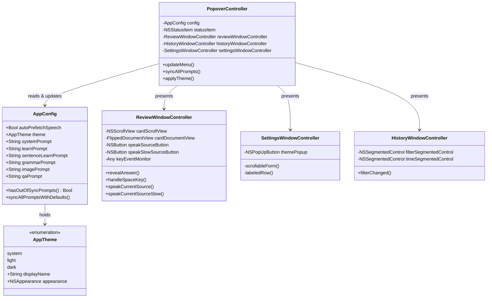

# Spaced Repetition, Prefetch Optimization, Appearance Theme, Prompt Sync, and UI Refinements

## Requirements
1. Optimize speech prefetch quota: enable `autoPrefetchSpeech` by default and restrict automatic prefetching to text with length <= 50 characters (explicit user speech actions retain no length limits).
2. Rebrand SRS to "Spaced Repetition" across all menu bar items, popover icons, badges, and window titles.
3. Fix Spaced Repetition review shortcuts: prevent shortcut loss on text selection/clicking via local key event monitoring, add hotkeys `4` (normal speed 1.0x) and `5` (slow speed 0.5x), and enable looping scroll with Space key (Space reveals answer -> subsequent Space scrolls down -> final Space at bottom scrolls back to top).
4. Auto-switch date filter to "All" when clicking "Saved" in History window.
5. Menu Bar "Sync All Prompts": add menu option if any prompt differs from app default to allow 1-click batch sync without opening settings.
6. Appearance setting (Dark / Light / System): add theme configuration supporting system default, forced dark, and forced light modes.
7. Settings layout alignment: align form rows to top (`alignment = .top` / leading top) instead of bottom/center so multiline inputs and tables layout cleanly.

## Entities

## Approach
1. Speech Prefetch Quota Optimization:
   - In `AppConfig.swift`, set `autoPrefetchSpeech: true` by default.
   - In `PopoverController+Speech.swift:prefetchSpeech`, add check `guard identity.text.count <= 50 else { return }`. Manual audio triggers in `playSpeech` remain unrestricted.

2. Rebrand SRS -> Spaced Repetition:
   - In `PopoverController+Menu.swift` and `PopoverController+Chrome.swift`, rename "Review SRS" strings and tooltips to "Spaced Repetition".
   - In `PopoverController+Menu.swift:updateReviewBadge`, format title as `"Spaced Repetition (\(stats.dueCount) cards)"` or `"Spaced Repetition"`.
   - In `ReviewWindowController.swift`, set `window.title = "Spaced Repetition"`.

3. Review Window Keyboard Handling & Looping Space Scroll:
   - In `ReviewWindowController.swift`, register `NSEvent.addLocalMonitorForEvents(matching: .keyDown)` for window key events.
   - Intercept keys: `Space`, `1`, `2`, `3`, `4`, `5`.
   - Implement `handleSpaceKey()`:
     - If `!isAnswerRevealed`: call `revealAnswer()`.
     - If `isAnswerRevealed`: inspect `cardScrollView.contentView.documentVisibleRect`. If scroller can scroll down, scroll down by page/fraction; if already at or near bottom (or no scrollbar), scroll back to top `NSPoint(x: 0, y: 0)`.
   - Map `4` to `speakCurrentSource()` (1.0x) and `5` to `speakCurrentSourceSlow()` (0.5x). Set button tooltips and `keyEquivalent` accordingly.

4. History Date Filter Reset on Saved:
   - In `HistoryWindowController.swift:filterChanged()`, if `filterSegmentedControl.selectedSegment == 1` ("Saved"), set `timeSegmentedControl.selectedSegment = 0` ("All").

5. Menu Bar "Sync All Prompts with App":
   - Add prompt comparison helper in `AppConfig` or `PopoverController+Menu`: check if any of the 6 prompts (`systemPrompt`, `learnPrompt`, `sentenceLearnPrompt`, `grammarPrompt`, `imagePrompt`, `qaPrompt`) differs from `AppConfig.default*`.
   - In `PopoverController+Menu.swift:menuWillOpen`, if out of sync, show a menu item `"Sync All Prompts with App"` with action `@objc func syncAllPromptsMenu()`.
   - When clicked, update config with default prompts, save, and reload.

6. App Theme (Dark / Light / System):
   - Define `AppTheme: String, Codable, CaseIterable` with `.system`, `.light`, `.dark`.
   - Add `theme: AppTheme` to `AppConfig` (default: `.system`).
   - Add appearance updater helper `AppThemePolicy.apply(theme: AppTheme, to windows: [NSWindow])` or set `NSApp.appearance = theme.nsAppearance` (or window-level appearance).
   - In `SettingsWindowController.swift`, add Theme dropdown (`themePopup`) in General tab.

7. Settings Layout Top Alignment:
   - In `SettingsWindowController.swift:scrollableForm`, wrap vertical stack inside a container anchored with `topAnchor` (avoiding center/bottom stretching when content is short) and set row alignments `row.alignment = .top` for `labeledRow` so labels align with top of multiline inputs/stacks.

## Structure

### Inheritance Relationships
1. `AppTheme` conforms to `String, Codable, CaseIterable, Sendable`.
2. `ReviewWindowController` extends `NSWindowController` with `AVAudioPlayerDelegate`, `NSWindowDelegate`.
3. `HistoryWindowController` extends `NSWindowController` with `NSTableViewDelegate`, `NSTableViewDataSource`.
4. `SettingsWindowController` extends `NSWindowController` with `NSTextViewDelegate`, `NSTableViewDelegate`.

### Dependencies
1. `PopoverController` orchestrates theme updates across `panel`, `settingsWindowController`, `historyWindowController`, `reviewWindowController`.
2. `ReviewWindowController` controls `cardScrollView` scroll positions and audio triggers.
3. `SettingsWindowController` reflects `AppConfig.theme` and prompt defaults.

## Operations

### Update Configuration & Theme - AppConfig.swift & AppTheme.swift
1. Create `AppTheme` enum with cases: `system`, `light`, `dark`.
2. Update `AppConfig`:
   - Add `var theme: AppTheme = .system`.
   - Set `autoPrefetchSpeech: true` in `AppConfig.default`.
   - Add helper `var hasOutOfSyncPrompts: Bool` comparing each prompt against default prompts.
   - Add helper `mutating func syncAllPromptsWithDefaults()`.

### Update Speech Prefetch Limit - PopoverController+Speech.swift
1. Method: `prefetchSpeech(_ identity: SpeechIdentity?, translationGeneration: Int?)`
   - Add condition: `guard identity.text.count <= 50 else { return }`.

### Rebrand SRS & Add Sync All Prompts - PopoverController+Menu.swift & PopoverController+Chrome.swift
1. Rename "Review SRS" to "Spaced Repetition".
2. In `PopoverController+Menu.swift`:
   - Add menu item tag `syncPromptsMenuItemTag`.
   - In `menuWillOpen`, toggle visibility of `Sync All Prompts with App` based on `config.hasOutOfSyncPrompts`.
   - Implement `@objc func syncAllPromptsMenu()` to overwrite all prompts with defaults, save config, reload, and show status confirmation.

### Enhance Review Window Shortcuts & Space Loop Scroll - ReviewWindowController.swift
1. Add `keyEventMonitor: Any?` in `init`/`showReview()`.
2. Intercept `kVK_Space`:
   - Execute `handleSpaceAction()`.
3. Implement `handleSpaceAction()`:
   - If `!isAnswerRevealed`: reveal answer and adjust window height.
   - If `isAnswerRevealed`: check `cardScrollView.documentVisibleRect` and `cardDocumentView.bounds`. If `documentVisibleRect.maxY < cardDocumentView.bounds.height - 5`, scroll down by `cardScrollView.contentView.bounds.height * 0.75`; else scroll to `NSPoint.zero`.
4. Intercept `1`, `2`, `3` to trigger `gradeClicked`.
5. Intercept `4` for `speakCurrentSource()` and `5` for `speakCurrentSourceSlow()`.

### Update History Filter Transition - HistoryWindowController.swift
1. Method: `filterChanged()`
   - If `filterSegmentedControl.selectedSegment == 1` (Saved), set `timeSegmentedControl.selectedSegment = 0` (All).
   - Reload history.

### Update Settings Layout & Theme Option - SettingsWindowController.swift
1. Add `themePopup` populated with `AppTheme.allCases.map(\.displayName)`.
2. In `labeledRow`, set `row.alignment = .top`.
3. In `scrollableForm`, ensure the content stack anchors to the top so items do not align bottom when height expands.
4. Populate and collect `theme` in `populate()` and `collectConfig()`.

## Norms
1. Maintain native macOS HIG with English text and SF Symbols.
2. Ensure backward compatibility in `AppConfig` JSON decoding with default fallbacks for `theme` and `autoPrefetchSpeech`.
3. Clean up event monitors on window closure.

## Safeguards
1. Space key scrolling must not swallow text editing in other windows or when Review window is not active.
2. Sync All Prompts in menu must prompt confirmation or clearly notify status without data loss of other configuration fields.
3. Theme changes must apply smoothly to all active windows and popup panels without requiring app restart.
4. Speech prefetch <= 50 character rule must never block manual user speech clicks on long text.
