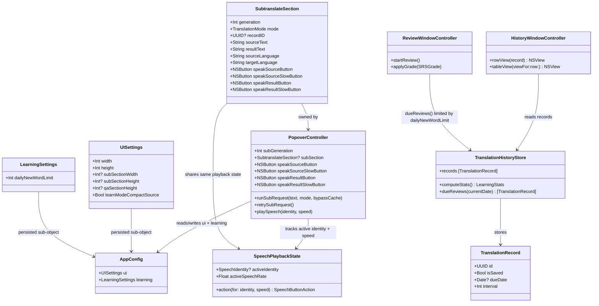

# Cải thiện Popup Translate: chống gọi API trùng, sửa lỗi màu trắng khi chọn record lịch sử, tối ưu resize UI, nút speak theo tốc độ, và cấu hình số từ học mỗi ngày

## Requirements

Loại bỏ các điểm ma sát còn sót lại trong luồng dùng hàng ngày của popup dịch và cửa sổ lịch sử: ngăn floating selection bar gọi lại API khi người dùng bấm lại action đã cache; khắc phục hàng lịch sử bị "biến mất" (chữ trắng trên nền trắng) khi được chọn; cho phép popup và sub-translate section co giãn theo nhu cầu người dùng (kéo thả, nhớ kích thước) thay vì kích thước cố định; thu gọn UI khi không cần thiết (ẩn Q&A, thu hẹp raw text ở chế độ Learn); thay select chọn tốc độ đọc bằng 2 nút speak tường minh (chậm 0.5x / mặc định 1.0x) áp dụng cho cả source lẫn result ở cả main pane và sub-translate section; và cho phép người dùng tự cấu hình số từ vựng học mỗi ngày thay vì hard-code 12 từ.

## Entities

## Approach

1. Sửa lỗi cache floating selection bar / sub-section:
   - `runSubRequest` (PopoverController+Subtranslate.swift:163) đã có tham số `bypassCache` và logic `historyStore.reusableRecord(...)` để tránh gọi API trùng khi cache hit — nhưng lỗi người dùng báo là "bấm lại vẫn gọi API" nghĩa là một action khác (không đi qua `runSubRequest`, ví dụ nút action trên floating selection bar gọi `updateFloatingSelectionBar`/action tương ứng) không truyền `bypassCache: false` đúng cách, hoặc gọi thẳng `translator.translate/learn/proofread` bỏ qua bước kiểm tra `reusableRecord`. Phải trace toàn bộ đường gọi từ floating bar's action buttons đến `runSubRequest`, đảm bảo mọi entrypoint đều đi qua cùng một cổng cache thay vì tạo request mới mỗi lần bấm.
   - Không tạo cơ chế cache riêng mới; tái sử dụng `historyStore.reusableRecord` đã có, chỉ sửa các call site đang bỏ qua nó.

2. Sửa lỗi màu trắng khi chọn record lịch sử:
   - Nguyên nhân xác nhận qua ảnh: `HistoryWindowController.rowView(for:)` (dòng 260-358) trả về `NSVisualEffectView` chứa `NSStackView` text — không dùng `NSTableCellView`/`NSTableRowView` tuỳ biến nào override `isSelected` để tự vẽ nền accent + đổi màu chữ. `NSTableView` mặc định vẽ selection highlight (viền xanh + nền `.selectedContentBackgroundColor` ở dưới) khi row/cell là `NSView` thường không tương thích tốt với `emphasized` state — nhưng ảnh cho thấy nền vẫn trắng còn nội dung biến mất hoàn toàn, tức có khả năng lớn hơn: `selectionHighlightStyle` mặc định (`.regular`) của `NSTableView` áp emphasized-blue selection color lên `NSVisualEffectView`, và labelColor/secondaryLabelColor của các `NSTextField` bị hệ thống tự đảo sang light-on-dark control text khi row được đánh dấu "selected" trong accessibility/emphasized context dù nền thực tế của `NSVisualEffectView` (material `.contentBackground`) không đổi theo — dẫn đến double-flip: nền không đổi (giữ material sáng) nhưng chữ đổi theo state selected (chuyển trắng), ra kết quả trắng trên trắng.
   - Cách khắc phục đúng chuẩn AppKit: cung cấp `tableView(_:rowViewForRow:)` trả về `NSTableRowView` tuỳ biến với `selectionHighlightStyle = .none` (tắt hẳn highlight mặc định của hệ thống, vì UI đã tự vẽ "card" bo góc riêng), sau đó tự vẽ trạng thái selected bằng cách quan sát `isSelected`/`isEmphasized` để đổi `layer?.borderColor`/`backgroundColor` của `NSVisualEffectView`, giữ nguyên màu chữ cố định (không phụ thuộc theme selection).

3. Tối ưu UI/UX popup (resize + Learn mode compact source):
   - Thêm 2 field mới vào `UISettings` (phần `ui` trong `AppConfig`): `subSectionWidth`/`subSectionHeight` (kích thước đã lưu của sub-translate split), và cờ hiển thị compact ở Learn mode. Tăng các hằng số trần trong `ChromeLayout` (`splitMaxPaneHeight`, `splitMaxStackedPaneHeight`, panel max width) theo yêu cầu, đồng thời cho phép các giá trị này bị override bởi kích thước đã lưu trong settings (trong khoảng min-max).
   - Thêm resize handle kéo thả trên viền panel (góc dưới-phải) và trên `splitDivider` giữa 2 section — dùng `NSPanGestureRecognizer` hoặc mouse-drag tracking để đổi `panel.frame`/section widths trong thời gian thực, clamp theo min/max đã định nghĩa, rồi lưu giá trị cuối cùng vào `config.ui` qua `saveSettings()` khi thả chuột.
   - Learn mode compact source: khi `section.mode == .learn`, set `panes.left` (bên raw text) narrow hơn (ví dụ 1/3 tổng width) trong `layoutSubSection`/`PopoverLayoutMath.splitPaneWidth`, còn các mode khác giữ tỉ lệ 1:1 hiện tại.

4. Thu gọn Q&A input khi ẩn:
   - `PopoverLayoutMath.multiStackedSectionHeights`/`splitPrismHeight` đã nhận `qaInputHeight` như một tham số riêng cộng vào tổng chiều cao — khi Q&A section bị ẩn (`qaSection == nil` hoặc `isHidden == true`), phải truyền `qaInputHeight: 0` (logic `qaAddition = qaInputHeight > 0 ? ... : 0` đã có sẵn, chỉ cần đảm bảo call site truyền đúng 0 khi ẩn) để `reflowLayout()` co lại đúng, không chừa khoảng trắng thừa.

5. Cấu hình số từ học mỗi ngày (spaced repetition):
   - Thêm `LearningSettings.dailyNewWordLimit: Int` (mặc định 12) vào `AppConfig`, hiển thị field trong `SettingsWindowController` (tab General hoặc Advanced, cạnh các field learning khác).
   - `TranslationHistoryStore.dueReviews`/`computeStats` không đổi logic xếp lịch SRS hiện có (record đã đến hạn dựa trên `dueDate`) — chỉ giới hạn số **từ mới** (chưa từng review, `interval == 0`/chưa có `dueDate`) được đưa vào phiên ôn tập mỗi ngày theo `dailyNewWordLimit`, trong khi từ đã đến hạn ôn lại (review cards) không bị giới hạn bởi con số này. `ReviewWindowController.showReview`/`startReviewAll` cần lọc theo giới hạn này khi build `recordsToReview`.

6. Thay select tốc độ đọc bằng 2 nút speak (chậm/mặc định):
   - Hiện `speechRatePopUp` (PopoverController+Chrome.swift:164) là 1 `NSPopUpButton` duy nhất trong `sourceHeaderBar`, set biến toàn cục `speechRate: Float` dùng chung cho mọi playback qua `speechRateChanged(_:)` (PopoverController+Speech.swift:262-266); `playSpeech`/`loadAndPlaySpeech`/`startPlayback` đều đọc biến global này thay vì nhận tốc độ theo từng lần bấm. `SubtranslateSection` hiện không có control tốc độ nào.
   - `ReviewWindowController.swift` đã có sẵn đúng pattern cần áp dụng: `speakSourceButton` (1.0x) và `speakSlowSourceButton` (0.5x) là 2 nút độc lập, `handleSpeechPlay(speed:)` (dòng 653) và `playSpeech(identity:speed:)` (dòng 682) nhận `speed: Float` trực tiếp theo từng lần bấm, `updateSpeakButtonUI()` (dòng 588) phân biệt icon play/pause/loading theo cặp `(activeSpeechIdentity, activeSpeechRate)` của từng nút. Tái dùng nguyên pattern này thay vì tạo cơ chế mới.
   - Refactor `PopoverController+Speech.swift`: xoá `speechRatePopUp`/`speechRateChanged`/biến global `speechRate`; đổi chữ ký `playSpeech`, `loadAndPlaySpeech`, `startPlayback` để nhận `speed: Float = 1.0` theo từng lời gọi (giống `ReviewWindowController`); mở rộng `updateSpeechButton`/`updateSpeakButtons`/`updateSubSpeakButtons` để mỗi nút tự biết tốc độ nó đại diện, chỉ đổi icon pause/resume khi identity + speed đang active khớp với chính nó.
   - Thêm 2 nút mới ở main pane (`speakSourceSlowButton`, `speakResultSlowButton`, cạnh `speakSourceButton`/`speakResultButton` hiện có trong `sourceHeaderBar`/`resultHeaderBar`) và 2 nút mới trong `SubtranslateSection` (`speakSourceSlowButton`, `speakResultSlowButton`, cạnh `speakSourceButton`/`speakResultButton` sẵn có) — dùng `configureIconButton` sẵn có, symbol "tortoise" cho nút chậm (đồng bộ với icon dùng trong `ReviewWindowController`).
   - Bấm nút chậm trong lúc đang phát tốc độ thường (hoặc ngược lại) phải dừng phát hiện tại rồi phát lại ở tốc độ mới, không cho 2 `AVAudioPlayer` chạy song song — theo đúng hành vi `handleSpeechPlay(speed:)` của `ReviewWindowController`. Audio cache (`speechCache`, `attachAudio`) vẫn khoá theo `SpeechIdentity` như hiện tại, không tạo cache riêng theo tốc độ — tốc độ chỉ ảnh hưởng `AVAudioPlayer.rate` tại thời điểm phát (`enableRate = true`), không phải tham số gọi API `translator.speak`.

## Structure

### Inheritance Relationships
1. `HistoryWindowController` conforms `NSTableViewDataSource`, `NSTableViewDelegate` — thêm implement `tableView(_:rowViewForRow:)` (chưa có, hiện chỉ có `tableView(_:viewFor:row:)`).
2. `HistoryRowView` (mới) extends `NSTableRowView`, override `drawSelection(in:)`/set `selectionHighlightStyle = .none`.
3. `AppConfig` struct chứa `UISettings` và `LearningSettings` như sub-struct `Codable`.

### Dependencies
1. `PopoverController+Subtranslate` gọi `historyStore.reusableRecord` (đã có) — mọi entrypoint action trên floating bar phải đi qua `runSubRequest`.
2. `PopoverController+Layout` đọc `config.ui.subSectionWidth/Height` để tính `preferredPopoverHeight()`/`maxPopoverHeight()` thay vì chỉ dùng hằng số `ChromeLayout`.
3. `SettingsWindowController` đọc/ghi `workingConfig.learning.dailyNewWordLimit` qua `populate(config:)`/`saveClicked`.
4. `ReviewWindowController` đọc `config?.learning.dailyNewWordLimit` khi build danh sách ôn tập.
5. `PopoverController+Chrome.swift` không còn tạo/add `speechRatePopUp` vào `sourceHeaderBar`; thay bằng thêm `speakSourceSlowButton`/`speakResultSlowButton` cạnh các nút speak hiện có.
6. `PopoverController+Subtranslate.swift` (`makeSubSection()`) thêm `speakSourceSlowButton`/`speakResultSlowButton` vào `sourceHeaderBar`/`resultHeaderBar` của `SubtranslateSection`, cùng `layoutSubSection`/`layoutPaneChrome` cấp thêm chỗ cho 2 nút mới trong `trailingIcons`.
7. `PopoverController+Speech.swift` là nơi duy nhất chứa logic phát/cache speech; mọi call site (`speakInput`, `speakResult`, `speakSubSource`, `speakSubResult`, floating bar) phải truyền `speed` tường minh thay vì đọc biến global.

### Layered Architecture
1. UI Layer (`PopoverController+*.swift`, `HistoryWindowController`, `ReviewWindowController`, `SettingsWindowController`): render, xử lý sự kiện chuột/kéo thả, đọc-ghi config.
2. Layout Math Layer (`PopoverLayoutMath`): các phép tính thuần túy (đo chiều cao/rộng, clamp min-max) — không đổi chữ ký hàm hiện có trừ khi cần thêm tham số optional có default.
3. Persistence Layer (`AppConfig`, `TranslationHistoryStore`): lưu/đọc cấu hình JSON và bản ghi lịch sử dịch/SRS.

## Operations

### Sửa lỗi cache floating selection bar

1. Trace toàn bộ call site gọi action trên `selectionFloatingBar` (Translate/Learn/Proofread buttons) trong `PopoverController+Subtranslate.swift` và `PopoverController+Language.swift` — xác định action nào KHÔNG đi qua `runSubRequest(text:mode:bypassCache:)`.
2. Với action nào đang gọi thẳng `translator.translate/learn/proofread` mà bỏ qua `historyStore.reusableRecord`, sửa lại để gọi `runSubRequest(text:mode:bypassCache: false)` (mặc định), đảm bảo bấm lại cùng action + cùng text sẽ trả kết quả từ cache thay vì gọi API.
3. Xác nhận `subGeneration`/`section.generation` không bị tăng sai khiến điều kiện `guard let section = subSection, section.generation == generation, generation == subGeneration else { return }` trong `finishSubRequest` luôn fail rồi kích hoạt retry ẩn.

### Sửa lỗi màu trắng khi chọn record lịch sử

1. Tạo class `HistoryRowView: NSTableRowView` trong `HistoryWindowController.swift`, override `selectionHighlightStyle` trả `.none` (tắt highlight mặc định của AppKit).
2. Implement `tableView(_ tableView: NSTableView, rowViewFor row: Int) -> NSTableRowView?` trả `HistoryRowView()`.
3. Trong `rowView(for:)`, không đổi màu chữ theo state selected (giữ `labelColor`/`secondaryLabelColor` cố định); nếu muốn thể hiện trạng thái chọn, vẽ border/nền accent nhẹ trên `NSVisualEffectView.layer` dựa trên `rowView.isSelected` (quan sát qua `NSTableRowView.isSelected` didSet hoặc so sánh `tableView.selectedRow == row`).
4. Verify: chọn 1 record trong Lịch sử dịch, xác nhận text (metadata, source, translation) vẫn hiển thị rõ, không bị trắng-trên-trắng ở cả 2 theme sáng/tối.

### Resize kéo thả cho popup + sub-section, lưu vào settings

1. Thêm field `subSectionWidth: Int?`, `subSectionHeight: Int?` vào `UISettings` struct trong `AppConfig.swift`, có default `nil` (dùng giá trị tính tự động khi chưa từng resize thủ công).
2. Tăng `ChromeLayout.splitMaxPaneHeight` và `splitMaxStackedPaneHeight` lên giá trị lớn hơn hiện tại (theo yêu cầu "tăng height/width tối đa"); giữ `splitMinPaneHeight`/`splitMinStackedPaneHeight` làm sàn.
3. Thêm resize handle: 1 view mỏng trên cạnh dưới-phải panel (drag toàn panel), và tái sử dụng `section.splitDivider` hiện có (drag đổi tỉ lệ 2 pane) — dùng `NSEvent` mouse-drag tracking hoặc `NSPanGestureRecognizer`, tính delta, clamp theo min/max của `ChromeLayout`, cập nhật `applyPanelFrame`/`layoutSubSection` trong lúc kéo (live resize).
4. Khi kết thúc kéo (mouseUp), ghi giá trị cuối cùng vào `config.ui.width/height/subSectionWidth/subSectionHeight` rồi gọi `saveSettings()` (đã có tại `PopoverController+Menu.swift:180`).
5. Ở lần mở popup sau, `preferredPopoverHeight()`/`layoutSubSection` đọc `config.ui.subSectionWidth/Height` nếu có, thay vì luôn tính lại từ nội dung.

### Learn mode: thu hẹp raw text pane

1. Trong `layoutSubSection` (PopoverController+Subtranslate.swift:81), khi `section.mode == .learn`, gọi biến thể của `PopoverLayoutMath.splitPaneWidth` với tỉ lệ 1/3-2/3 thay vì 1/2-1/2 (thêm tham số `ratio: CGFloat = 0.5` cho `splitPaneWidth`, truyền `0.33` khi mode `.learn`).
2. Các mode `.translate`/`.proofread` giữ nguyên tỉ lệ 1:1 hiện tại.

### Thu gọn Q&A section khi ẩn

1. Tìm call site build `qaInputHeight` truyền vào `splitPrismHeight`/`multiStackedSectionHeights` trong `PopoverController+Layout.swift`; đảm bảo khi `qaSection` bị ẩn/nil, giá trị truyền vào là `0` (không phải chiều cao cố định `ChromeLayout.qaInputHeight`).
2. Verify `reflowLayout()` co đúng chiều cao panel khi Q&A input đang ẩn.

### Cấu hình số từ học mỗi ngày

1. Thêm struct `LearningSettings: Codable { var dailyNewWordLimit: Int = 12 }` và field `learning: LearningSettings = LearningSettings()` vào `AppConfig`.
2. Thêm `NSTextField` (`dailyNewWordLimitField`, dùng `integerFormatter(minimum: 1)` có sẵn) vào `SettingsWindowController.makeGeneralView()` hoặc `makeAdvancedView()`, label "Daily New Words".
3. Populate/save field này trong `populate(config:apiKey:)` và `saveClicked` cùng luồng với các field khác.
4. Trong `ReviewWindowController` (hoặc nơi build `recordsToReview`), tách due records thành "new" (chưa có `dueDate`/`interval == 0`) và "review" (đã có lịch); giới hạn số lượng "new" lấy ra theo `config?.learning.dailyNewWordLimit`, không giới hạn "review".
5. Cập nhật thuật toán sắp xếp: ưu tiên review cards đã quá hạn trước, sau đó thêm new words cho tới khi chạm `dailyNewWordLimit` — không đổi thuật toán tính `dueDate`/`interval` (`applySRSGrade`) đã có.

### Thay select tốc độ đọc bằng 2 nút speak chậm/mặc định

1. Xoá `speechRatePopUp` (khai báo property + add subview trong `sourceHeaderBar`), `speechRateChanged(_:)`, và biến global `speechRate` khỏi `PopoverController`.
2. Thêm property `speakSourceSlowButton`, `speakResultSlowButton` vào `PopoverController`; add vào `sourceHeaderBar`/`resultHeaderBar` cạnh `speakSourceButton`/`speakResultButton` hiện có trong `PopoverController+Chrome.swift`, cấu hình bằng `configureIconButton(..., symbol: "tortoise", action: #selector(speakInputSlow)/#selector(speakResultSlow), label: ...)`.
3. Thêm property `speakSourceSlowButton`, `speakResultSlowButton` vào `SubtranslateSection`; add vào `sourceHeaderBar`/`resultHeaderBar` của section trong `makeSubSection()` (PopoverController+Subtranslate.swift:8), cạnh `speakSourceButton`/`speakResultButton` sẵn có; thêm 2 selector mới `speakSubSourceSlow()`/`speakSubResultSlow()`.
4. Đổi chữ ký `playSpeech(_ identity: SpeechIdentity?, speed: Float = 1.0)`, `loadAndPlaySpeech(_ identity:, speed:)`, `startPlayback(_:identity:speed:loadingGeneration:)` trong `PopoverController+Speech.swift` để nhận `speed` per-call thay vì đọc `speechRate` global (theo đúng chữ ký `startPlayback(_:identity:speed:loadingGeneration:)` đã có mẫu trong `ReviewWindowController.swift:712`).
5. Cập nhật mọi call site hiện tại: `speakInput()`/`speakResult()` (PopoverController+Speech.swift:259-260) gọi `playSpeech(identity, speed: 1.0)`; thêm `speakInputSlow()`/`speakResultSlow()` gọi `playSpeech(identity, speed: 0.5)`; `speakSubSource()`/`speakSubResult()` (PopoverController+Subtranslate.swift:297-298) tương tự tách thành bản 1.0x/0.5x.
6. Mở rộng `updateSpeechButton`/`updateSpeakButtons`/`updateSubSpeakButtons` (PopoverController+Speech.swift:6-21) nhận thêm tham số `speed: Float` cho mỗi nút, so khớp với `SpeechPlaybackState` hiện tại (đang track theo `identity` — cần mở rộng thêm `speed` vào state so sánh, giống `activeSpeechRate` trong `ReviewWindowController`) để hiển thị đúng icon play/pause/loading độc lập cho 2 nút cùng identity nhưng khác tốc độ.
7. Cập nhật `layoutPaneChrome` (PopoverController+Layout.swift) và `layoutSubSection` (PopoverController+Subtranslate.swift:81) thêm width cho nút slow mới trong `trailingIcons` của mỗi header bar.
8. Verify: bấm nút speak thường rồi bấm nút speak chậm (hoặc ngược lại) trong lúc đang phát — audio cũ dừng ngay, audio mới phát ở tốc độ đúng; không có 2 audio phát chồng nhau; áp dụng đúng cho cả 4 vị trí (main source, main result, sub source, sub result).

## Norms

1. Annotation Standards: mọi `@objc` action mới cho resize/drag phải gắn `accessibilityLabel` phù hợp như các control hiện có trong file.
2. Dependency Injection: không tạo singleton mới; `config`/`historyStore` tiếp tục được truyền qua constructor/property injection như pattern hiện tại của `PopoverController`, `ReviewWindowController`, `SettingsWindowController`.
3. Exception Handling: các thao tác ghi `AppConfig` (resize, đổi `dailyNewWordLimit`) dùng `do/catch` quanh `saveSettings()`/`historyStore` write, set `status`/alert khi lỗi — theo đúng pattern `setStatus("... failed: \(error.localizedDescription)", autoClearAfter: 12)` đã dùng trong file.
4. Data Validation: `dailyNewWordLimit` bắt buộc >= 1 (dùng `integerFormatter(minimum: 1)` sẵn có); kích thước resize luôn clamp trong khoảng `[splitMin*, splitMax*]`/`ChromeLayout` trước khi lưu.
5. Logging: giữ nguyên style log `NSLog("[NTranslate][...] ...")` nếu cần thêm log debug cho luồng cache/resize.
6. Documentation Standards: không thêm comment giải thích cái gì code đã tự nói; chỉ comment khi có constraint/lý do ẩn (giống style hiện tại trong `ChromeLayout`, `PopoverLayoutMath`).

## Safeguards

1. Functional Constraints: sửa cache phải không phá vỡ hành vi `retrySubRequest`/nút "Retry" hiện tại vẫn luôn bypass cache (`bypassCache: true`) để force gọi API mới khi người dùng chủ động muốn làm mới.
2. Performance Constraints: live-resize (kéo thả) không được gọi lại toàn bộ `reflowLayout()` (đo lại text) trên mỗi pixel di chuyển nếu gây giật khung hình — có thể throttle bằng cách chỉ resize frame trong lúc kéo, đo lại text/measuredTextHeight khi mouseUp.
3. Security Constraints: không lưu bất kỳ nội dung dịch/text nào vào `UISettings`; chỉ lưu số đo hình học (Int/CGFloat) và cấu hình số.
4. Integration Constraints: `UISettings`/`LearningSettings` mới phải giữ backward-compatible khi đọc config JSON cũ chưa có các field này (dùng default value qua `Codable` với `decodeIfPresent`/property default).
5. Business Rule Constraints: giới hạn `dailyNewWordLimit` chỉ áp dụng cho từ **mới** trong phiên ôn tập tạo bởi `ReviewWindowController`; không giới hạn số từ đã lưu (`isSaved`) hay số bản ghi lịch sử dịch thông thường.
6. Exception Handling Constraints: lỗi ghi config (disk full, permission) khi lưu resize/settings phải hiển thị qua `setStatus`/`NSAlert` đã có, không được silent-fail khiến người dùng tưởng đã lưu.
7. Technical Constraints: không thêm dependency bên ngoài (SPM package) cho drag-resize — dùng `NSEvent`/`NSPanGestureRecognizer` sẵn có trong AppKit.
8. Data Constraints: `subSectionWidth`/`subSectionHeight` lưu dạng `Int?` (pixel, đã làm tròn) để tương thích style các field kích thước khác (`width`, `height`) trong `UISettings`.
9. API Constraints: không đổi chữ ký public của `PopoverLayoutMath.splitPaneWidth`/`splitPrismHeight` theo cách phá vỡ test hiện có trong `Tests/translateTests/translateTests.swift` — chỉ thêm tham số mới có default value.
10. Playback Constraints: `playSpeech`/`loadAndPlaySpeech`/`startPlayback` sau khi thêm tham số `speed` phải giữ default `speed: Float = 1.0` để mọi call site cũ (nếu còn sót) không cần sửa vẫn compile đúng hành vi tốc độ mặc định như trước.
11. Concurrency Constraints: đổi tốc độ giữa lúc đang phát phải dừng `AVAudioPlayer` hiện tại trước khi tạo player mới (không giữ 2 player instance cùng lúc), tránh 2 luồng audio chồng tiếng.
12. UI Constraints: nút speak chậm dùng chung `contentTintColor`/style với nút speak thường (`configureIconButton`), chỉ khác symbol ("tortoise" vs "speaker.wave.2"), để nhất quán icon set đã dùng trong `ReviewWindowController`.
