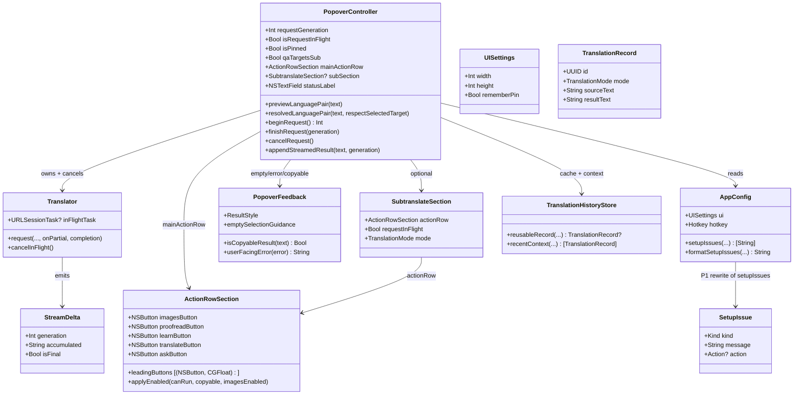

# Master UX: popup cảm giác sống, keyboard-first, tính năng tìm được

Đây là **master prompt**. Implement theo wave P0 → P5; mỗi wave merge độc lập. Không cài hết trong một PR. Wave sau không được phá acceptance của wave trước.

## Requirements

Làm popup NTranslate cảm giác sống (kết quả hiện dần, hủy được, không giật layout), cho người dùng tự cứu khi setup/lỗi (nút thay vì chữ đỏ), dùng được bằng bàn phím và VoiceOver, rồi làm các hành động chính tìm thấy được — mà không đổi visual language Liquid Glass / AppKit hiện tại.

Ranh giới: chỉ popover + menubar + Settings/History/Review đã có. Không cửa sổ mới. Không SwiftUI. Không viết lại `PopoverLayoutMath`. Streaming API nằm trong P0. Settings (P5) là wave cuối. UI text tiếng Anh, không emoji.

Định nghĩa xong theo wave: P0 = cảm giác sống; P1 = cứu được khi lỗi; P2 = keyboard-first; P3 = layout/navigation; P4 = tìm được tính năng; P5 = Settings bớt developer-facing.

## Baseline (working tree 2026-08-30)

Uncommitted trên `main` đã đổi architecture. Prompt này **bám tree đó**, không viết lại như lúc audit.

Đã có, cấm làm lại:
- `ActionRowSection` dùng chung main + sub. `leadingButtons` = Translate, Learn, Proofread, Images (trái). Ask ghim phải. Hẹp thì ẩn leading, không đè Ask. `applyEnabled(canRun:copyable:imagesEnabled:)`.
- Sub pane có action row riêng (`runSubTranslate` / `runSubLearn` / `runSubProofread` / `askSubClicked`). Images disabled trên sub. `SubtranslateSection.requestInFlight` tách khỏi main `isRequestInFlight`.
- Q&A một input, `qaTargetsSub` chọn pane. Floating bar gắn cả sub; Quick Translate + label kết quả + cache `reusableSubRecord`.
- `previewLanguagePair` (không đụng MRU) vs `resolvedLanguagePair(respectSelectedTarget:)`. `LanguageDetector.resolvedPair(..., respectSelectedTarget:)`.
- `PopoverLayoutMath.stackedChromeOverhead`, `qaInputGap`, `actionButtonGap`, clamp stacked panes không overflow. `splitPrismHeight` nhận `hasSub` + `sectionGap`.
- `AppConfig.ui.width` default **820**. `LearningSettings.dailyReviewLimit` (decode legacy `dailyNewWordLimit`). Settings label "Daily Reviews".
- `Translator.requestTimeoutInterval = 30`, `isDictionaryTerm` (Learn card vs sentence). `stream` vẫn `false`.
- `SelectableTextView.acceptsFirstMouse`. `focusInputTextView` retry khi chuột đang xuống. Window menu Close (`⌘W`). Review `onOpenTranslate`.
- Shortcut labels trên cả hai row: Translate / Learn / Proofread / Ask (`⌘K`). Tooltip Learn/Proofread/Images vẫn chỉ lặp tên nút.

Chưa có (vẫn là việc của các wave): streaming, Stop, status overlay, empty/setup có nút, focus ring, contrast/Reduce Transparency/VoiceOver, header overflow, pin persist, ISO `paneLanguageCode`, menubar due badge, Settings tách Advanced, Test connection.

## Entities

Không tạo `ActionRowSection` mới. Không bọc `List`/`String` trừ `StreamDelta` và `SetupIssue`. `UISettings.rememberPin` chỉ thêm khi P3. Giữ `previewLanguagePair` / `dailyReviewLimit` / `isDictionaryTerm`.

## Approach

1. Perceived latency (P0):
   - Đổi `Translator.requestPayload` `"stream": false` → `true`. Đọc SSE OpenAI-compat (`data: {choices[0].delta.content}`) qua `URLSession` bytes/`dataTask` giữ `URLSessionTask` để cancel.
   - Thêm `onPartial: (@Sendable (String) -> Void)?` trên `translate` / `learn` / `proofread` / `ask`. Image translation và speech **không** stream.
   - Translate vẫn kết thúc bằng JSON `{translation, sourceLanguage}`. Trong lúc stream: hiện raw increment; lúc `isFinal` parse bằng `Translator.translationResult` hiện có. Nếu JSON không đóng được thì giữ raw + `ResultStyle.error` — không bịa translation.
   - Learn / Proofread / Ask là prose: `onPartial` ghi thẳng vào pane (`setResultText` markdown chỉ lúc final, hoặc plain khi đang stream để tránh parse dở).
   - Main `isRequestInFlight` và `subSection.requestInFlight` là hai cờ. Stop trên **row đang chạy**: main `translateButton` hoặc `sub.actionRow.translateButton`. Gọi `translator.cancelInFlight()` + increment đúng generation (main `requestGeneration` hoặc `subGeneration`). `ActionRowSection.applyEnabled` vẫn dùng cho enable; Stop là đổi title/action của Translate, không xóa row.
   - Floating Quick Translate **không** stream (câu ngắn, label nhỏ). Image + speech không stream.
   - Loading: spinner hoặc `ResultStyle.loading`; không để "Translating..." đứng yên nếu đã có token.
   - Status: overlay header, **cấm** `reflowLayout()` khi hide/show. `splitPrismHeight` vẫn nhận `statusHeight` từ `PopoverLayoutMath`; truyền `0` khi overlay (đừng xóa param, call site đổi).
   - Timeout 30s (`requestTimeoutInterval`) giữ. Cancel user phải thắng timeout.

2. Onboarding / error (P1):
   - `setupIssues` trả message người dùng, không tên field (`API base URL` không `apiBaseURL`). `formatSetupIssues` bỏ prefix `Error:` hàng loạt.
   - Empty/setup state trong result pane: 1–2 câu + nút `Open Settings` / `Grant Accessibility` (reuse `#selector(openSettingsMenu)` / `#selector(requestAccessibilityPermissionMenu)`).
   - Lỗi runtime: `PopoverFeedback.userFacingError` map mạng / 401 / timeout; khối lỗi có Retry (cùng `retryRequest`).
   - Settings: nút Test connection — một chat completion ngắn, hiện OK/fail trong Settings, không ghi history.

3. Accessibility (P2):
   - Bỏ `focusRingType = .none` trên input/result/QA. Giữ none trên glass chrome nếu ring làm hỏng kính.
   - Floor 11pt cho mọi label; badge review được clamp, không 8pt.
   - `Palette.paneLabel` / `mutedText` tăng alpha để đạt ~4.5:1 trên pane fill.
   - `accessibilityDisplayShouldReduceTransparency`: pane fill đặc, tắt glass blur.
   - `NSAccessibility.post(.announcementRequested)` khi `setStatus`, lỗi, Copied, request xong.

4. Layout (P3):
   - Action row **đã xong** (Translate trái, Ask phải, overflow ẩn leading). Không đảo lại thành Images-trái / Translate-phải. Khoảng trống giữa cụm trái và Ask là chủ ý.
   - Header vẫn hardcode: ẩn `updateButton` trừ khi có release. Title/language rút khi chật, không đè Close. Default width giờ 820 (dễ chật hơn 900).
   - `isPinned` persist `UISettings` (default false). `presentPanel` đang `isPinned = false` mỗi lần mở; sửa chỗ đó. Kéo panel vẫn auto-pin.
   - `paneLanguageCode`: bảng ISO 639-1, bỏ `prefix(2)`.
   - Không viết lại `stackedChromeOverhead` / clamp stacked. Divider kéo: optional, chỉ nếu không đụng math.

5. Discoverability (P4):
   - Empty state nội suy `config.hotkey.displayString`.
   - Tooltip Learn / Proofread / Images mô tả kết quả; Images hint mở trình duyệt.
   - Shortcut labels T/L/P/Ask đã có trên cả hai row. Chỉ bổ sung tooltip mô tả + Images (mở trình duyệt). Không gắn hotkey giả cho Images.
   - Subtranslate đã có floating bar + sub row. Hint một lần khi `usesSubtranslate` vừa true. Không xây lại floating.
   - Menubar icon: badge due cards; optional tint khi `isRequestInFlight`.
   - Menu "Learning Progress...": một dòng stats disabled + một dòng action. Ellipsis `…`.

6. Settings (P5):
   - General: Theme, languages, length, reviews, auto-copy — user-facing.
   - Advanced: API URL, Speech URL, Model, Test connection, hotkeys.
   - Hotkey: giữ `HotkeyFields` nếu recorder tốn effort; **bắt buộc** hiện conflict (reuse `registrableHotkeys` skipped names) trong tab, không nuốt silent.
   - Prompts: giữ editor; mỗi prompt một câu mô tả biến `{{...}}`.

7. Rủi ro:
   - Stream + JSON translate: parse dở → chỉ commit lúc final.
   - Cancel race: mọi `onPartial` / completion check `generation == requestGeneration`.
   - `closePanel` hủy cả main và sub in-flight (`sub.requestInFlight`). Không persist sub-pane.
   - Hai request (main + floating) có thể chồng: `cancelInFlight` phải biết task nào, hoặc một `inFlightTask` tại một thời điểm. Ưu tiên cancel đúng generation; floating giữ one-shot.

## Structure

### Inheritance / existing types
1. `PopoverController` giữ orchestration; không base class mới.
2. `Translator` thêm stream + cancel; completion signature cũ vẫn có (onPartial optional).
3. `PopoverFeedback.ResultStyle` thêm case nếu cần `.streaming` — chỉ khi `.loading` không đủ.
4. `SetupIssue.Kind`: `apiKey`, `url`, `model`, `accessibility`, `load`.

### Dependencies
1. `PopoverController` gọi `Translator` (stream/cancel) và `TranslationHistoryStore` (cache không đổi).
2. `PopoverController+Status` sở hữu overlay status + VoiceOver announcement.
3. `PopoverController+Chrome` / `+Layout` / `ActionRowSection` sở hữu action-row + header overflow.
4. `SettingsWindowController` Test connection → `Translator` one-shot non-stream.
5. `UpdateManager` → visibility của `updateButton`.

### Layered (AppKit, không Spring)
1. Chrome / layout: `PopoverController+Chrome`, `+Layout`, `PopoverLayoutMath` (chỉ gọi, không rewrite).
2. Feedback: `PopoverFeedback`, `+Status`.
3. Request: `Translator`, `+Translate`, `+Actions`, `+QA`, `+Subtranslate`.
4. Persistence: `AppConfig`, `APIKeyStore`, `TranslationHistoryStore`.
5. Surfaces khác: `SettingsWindowController`, `HistoryWindowController`, `ReviewWindowController` — chỉ đụng khi wave yêu cầu.

## Operations

Implement **theo thứ tự wave**. Mỗi wave một PR. Verify `swift build` (không `swift test`). Sau wave có source change: `./install-app.sh` và báo version/build.

### Wave P0 — Cảm giác sống

#### Update Translator — stream + cancel
1. Responsibility: SSE OpenAI-compat; cancel được; completion cuối cùng vẫn `Result<String, Error>` / `TranslationResult`.
2. Methods:
   - `request(..., onPartial: (@Sendable (String) -> Void)?, completion:)`
     - Logic: `"stream": true`; parse dòng `data:`; bỏ `data: [DONE]`; cộng `delta.content`; mỗi chunk `onPartial(accumulated)` trên MainActor qua caller.
     - Translate: accumulated raw; completion gọi `translationResult(from:requestedSource:inputText:supportedLanguages:)`.
     - Lỗi HTTP / schema: completion `.failure`, không gọi onPartial sau fail.
   - `cancelInFlight()`: `inFlightTask?.cancel()`; task nil.
3. Constraints: image, `speak`, floating Quick Translate giữ non-stream. `requestTimeoutInterval` 30s giữ. Không đổi `isDictionaryTerm` / prompt templates.

#### Update PopoverController — Stop + stream render
1. `beginRequest` giữ increment generation + `isRequestInFlight`. Sub giữ `subGeneration` + `section.requestInFlight`.
2. `cancelRequest(scope:)`: increment generation đúng scope, `translator?.cancelInFlight()` nếu task thuộc scope đó, clear in-flight flag, `updateBusyState()` / `updateSubButtons`. Không xóa source. Result: giữ partial hoặc "Stopped".
3. Wire `onPartial` từ `performTranslate` / `runLearn` / `runProofread` / `runSubRequest` / QA (`qaTargets()`). `guard` generation. `appendStreamedResult` plain. `reflowLayout` throttle (~100ms hoặc khi measured height đổi). Cấm reflow mỗi token.
4. Khi in-flight: Translate trên row đó thành Stop (`stop.circle` → `cancelRequest`). `applyEnabled` vẫn disable Learn/Proofread/Images/Ask. Một Stop trên row đang chạy.
5. `PopoverFeedback.isCopyableResult`: partial không copyable đến final. `applyEnabled(..., copyable:)` phải theo rule này (Ask tắt khi đang stream).

#### Update status overlay — hết giật
1. `statusLabel` overlay header. `splitPrismHeight(..., statusHeight: 0)` khi overlay. Không xóa param `statusHeight` trong `PopoverLayoutMath`.
2. `setStatus` / `clearStatus`: không `reflowLayout()` chỉ vì hide/show.
3. Auto-clear 4s giữ.

#### Acceptance P0
- Learn/Ask hiện dần; Stop hủy và token stale bị drop.
- Translate: lúc xong parse JSON đúng như hiện tại; cache `reusableRecord` không đổi.
- Hiện/ẩn status không đổi `panel.frame.height`.
- `swift build` sạch.

### Wave P1 — Cứu được khi lỗi

#### Update AppConfig.setupIssues + formatSetupIssues
1. Message user-facing (khớp giọng `validationIssues`: "API base URL must be…").
2. `formatSetupIssues`: không prefix `Error:` mỗi dòng. Panel setup dùng `ResultStyle.error` một lần, không nhân chữ Error.

#### Update openTranslatePanelShowingSetupStatus
1. Nếu `issues` không rỗng: result pane hiện copy + nút Open Settings và/hoặc Grant Accessibility tùy `Kind`.
2. Empty thành công: `PopoverFeedback.emptySelectionGuidance` kèm `config.hotkey.displayString`.

#### Update runtime error
1. `PopoverFeedback.userFacingError(Error) -> String`.
2. Failure path trong `+Translate` / `+Actions` / `+QA`: text lỗi + Retry nhìn thấy (không chỉ icon header).
3. Settings: `Test connection` — request tối thiểu, status trong cửa sổ Settings.

#### Acceptance P1
- Máy không key: thấy nút Settings, không phải tự mở menu.
- Lỗi mạng: Retry trong pane.
- Test connection không tạo `TranslationRecord`.

### Wave P2 — Keyboard-first

#### Update focus + type
1. `inputTextView`, `textView`, `qaInputField`, scroll views: `focusRingType = .default` (hoặc system).
2. ChromeLayout: status/language/header label ≥ 11pt; review badge ≥ 10pt nếu 11 không vừa vòng 13pt.
3. `Palette` tăng contrast `paneLabel`, `mutedText`, `placeholderText`.

#### Update system flags + VoiceOver
1. Reduce Transparency: `applySplitHostChrome` / `LiquidGlassChrome` chọn fill đặc.
2. `setStatus`, `setResultText` error, `flashCopied`, `finishRequest` success: `NSAccessibility.post`.

#### Acceptance P2
- Tab thấy ring trên input.
- VoiceOver đọc "Copied" và message lỗi.
- Reduce Transparency: chữ đọc được trên pane.

### Wave P3 — Layout / navigation

#### Skip layoutActionRow
Đã có overflow hide. Không đảo thứ tự nút.

#### Update header chrome
1. `updateButton.isHidden` khi không có update pending.
2. Title + language + 6 chrome icon: nếu overflow (width 820), rút title rồi language width. Không overlap Close.

#### Update pin + language codes
1. Persist pin trong `AppConfig.ui`; `presentPanel` đọc lại, đừng reset `false` mỗi lần mở. Kéo panel vẫn pin.
2. `paneLanguageCode`: ISO 639-1 cho mọi language trong Settings. Unknown không `prefix(2)`.

#### Acceptance P3
- Width 820: language không đè Close.
- Quit/reopen: pin nhớ.
- "Portuguese" → PT không PO.

### Wave P4 — Tìm được tính năng

#### Update copy + affordance
1. Tooltip Learn / Proofread / Images / Ask: một câu kết quả + shortcut (shortcut T/L/P/Ask đã có trên title).
2. Không thêm shortcut giả cho Images. Tooltip Images: mở trình duyệt.
3. Subtranslate hint một lần mỗi session khi `usesSubtranslate` vừa true. Không đụng floating Quick Translate.
4. `statusItem.button` image/tooltip khi `dueCount > 0`; clear khi 0.
5. `showLearningStats` / `updateReviewBadge`: stats line `isEnabled = false`; action riêng; `…` không `...`.

#### Acceptance P4
- User mới đọc empty state biết hotkey thật.
- Hover Learn biết khác Translate.
- Due cards thấy trên menubar khi panel đóng.

### Wave P5 — Settings

#### Update SettingsWindowController tabs
1. General: Theme, API Key, Source/Target/Native, max length, `dailyReviewLimit` ("Daily Reviews"), auto-copy, simulate copy, prefetch speech. Không đổi tên field lại `dailyNewWordLimit`.
2. Advanced: Base URL, Speech URL, Model, Test connection, hotkeys, panel width/height, history directory.
3. Hotkey rows: list `skipped` từ `PopoverIntegrationPolicy.registrableHotkeys` dưới editor khi Save hoặc live.
4. Prompts: một dòng mô tả biến dưới mỗi editor.

#### Acceptance P5
- User không thấy API Base URL ở tab đầu.
- Hai hotkey trùng: Save báo, không register silent.

## Norms

1. UI strings: English. Không emoji. SF Symbols.
2. Verify: `swift build` only. Không `swift test`.
3. Source/resource đổi → `./install-app.sh`; báo version/build.
4. `AppConfig.default` đổi field → cập nhật `~/Library/Application Support/NTranslate/config.json` trên máy user (rule repo).
5. MainActor UI. Stream callback hop MainActor trước khi đụng view.
6. Mọi request async: `generation == requestGeneration` trước khi mutate pane.
7. Cache: không bypass `reusableRecord` / `appendIfAbsent`. Stream xong mới ghi history (final text).
8. Layout: frame-based. Chrome height đi qua `stackedChromeOverhead`, không công thức song song. Không Auto Layout cho popover chrome.
9. SPDD file sau này cho wave lẻ: `ISSUE-YYYYMMDDHHmm-[Feat]-popup-ux-pN-...md` nếu tách prompt con.
10. Comment: chỉ khi non-obvious (stream JSON, status overlay).

## Safeguards

1. Functional: không cửa sổ mới; không SwiftUI; không rewrite `PopoverLayoutMath` / `ActionRowSection` / floating bar. Image, speech, floating Quick Translate không stream.
2. Performance: không `reflowLayout` mỗi token; status overlay không đổi panel height; stream cancel trong 100ms (task.cancel).
3. Security: Test connection không log API key; lỗi HTTP không dump body thô lên UI nếu chứa key/token.
4. Integration: 9router OpenAI-compat SSE; nếu endpoint không stream, fallback one-shot hiện tại (completion-only) + Stop vẫn cancel task.
5. Business: history/SRS/`dailyReviewLimit`/`isDictionaryTerm`/`previewLanguagePair`/`shouldSubtranslate` không đổi nghĩa.
6. Exception: cancel = không error đỏ; Stop là hành động user.
7. Technical: `focusRingType = .none` chỉ còn trên glass host. Dynamic Type không bắt buộc (layout frame) — floor 11pt là đủ P2.
8. Data: pin persist missing key = false. Không đổi hotkey default. Không đổi `ui.width` default (820). `dailyReviewLimit` encode key mới, vẫn decode `dailyNewWordLimit`.
9. API: `Translator` public methods giữ completion; `onPartial` optional default nil.
10. Close panel: hủy in-flight; không auto-reopen sub-stack (out of scope).
11. Wave isolation: P1+ không revert overlay status / Stop / stream của P0.
12. Không implement trước khi user confirm wave (bắt đầu P0 trừ khi user chỉ định wave khác).
