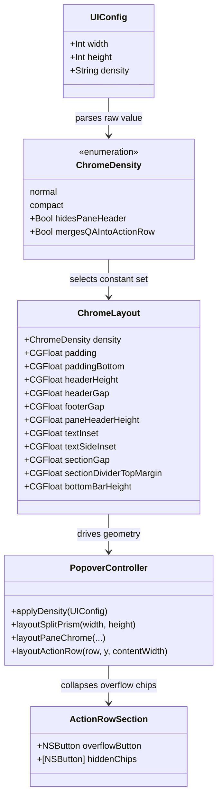

# Density Setting cho Translate Popup — Normal / Compact

## Requirements

Cho người dùng chọn mật độ giao diện popup dịch qua Settings: **Normal** giữ nguyên hiện trạng, **Compact** thu hồi tối đa không gian dọc và ngang để cùng một chiều cao cửa sổ hiển thị nhiều nội dung hơn.

- Một công tắc duy nhất trong Settings, không phơi ra hàng chục slider padding.
- Normal là mặc định; config cũ thiếu field phải rơi về Normal.
- Không đổi hành vi dịch, speech, Q&A, subtranslate, OCR.

Ranh giới: chỉ chạm hằng số layout, các hàm layout trong `PopoverController+Layout.swift`, một field config và một control Settings. Không refactor cấu trúc view, không đổi API `PopoverLayoutMath`.

Ngân sách dọc hiện tại (panel chỉ có pane chính):

| Thành phần | Hằng số | pt |
| --- | --- | --- |
| padding (trên) | `padding` | 14 |
| header row | `headerHeight` | 32 |
| gap header → body | `headerGap` | 12 |
| pane header (mỗi pane) | `paneHeaderHeight` | 30 |
| text inset trong `paneHeight` | hard-code `+20` | 20 |
| gap body → action row | `footerGap` | 16 |
| action row | `bottomBarHeight` | 32 |
| padding (dưới) | `paddingBottom` | 16 |
| **Tổng chrome cố định** | | **172** |

Có subtranslate cộng thêm `sectionDividerReserved` 34 + action row 32 + `footerGap` 16. Có Q&A cộng `sectionGap` 10 + `qaInputHeight` 28 + `qaInputGap` 12.

Bản so sánh trực quan: `spdd/review/popup-density-phases.html`.

## Entities



Ràng buộc bảo thủ: `ChromeLayout` giữ nguyên là `enum` với các `static` property. KHÔNG chuyển sang struct instance, KHÔNG dependency-inject. Chỉ đổi `static let` sang `static var` computed cho những field mà density thay đổi, cộng một `static var density`. Mọi call site đọc `L.padding` giữ nguyên chữ ký. `ActionRowSection` chỉ thêm một nút overflow, không đổi cách tạo chip.

## Approach

### Compact gồm những gì

Một setting, bốn thay đổi hình học gộp lại:

**1. Nén hằng số** — chrome cố định 172pt xuống 130pt.

| Hằng số | Normal | Compact |
| --- | --- | --- |
| `padding` | 14 | 10 |
| `paddingBottom` | 16 | 10 |
| `headerHeight` (kéo theo `languageControlHeight`, `chromeIconSize`, `swapWidth`) | 32 | 28 |
| `headerGap` | 12 | 8 |
| `footerGap` | 16 | 10 |
| `paneHeaderHeight` | 30 | 24 |
| `paneHeaderTopInset` | 4 | 2 |
| `textInset` (thay magic `+20`) | 20 | 12 |
| `textSideInset` (thay magic `24` / `12`) | 24 | 20 |
| `sectionGap` | 10 | 6 |
| `sectionDividerTopMargin` | 14 | 8 |
| `sectionDividerHeight` | 20 | 16 |
| `controlHeight` / `bottomBarHeight` | 32 | 28 |
| `qaInputHeight` | 28 | 26 |

**2. Bỏ pane header bar** — `paneHeaderHeight` về 0; label "Source"/"Result" biến mất (header chính đã có tên ngôn ngữ), icon speak/copy/save/retry nổi ở góc trên phải trong scroll view, nền glass mờ. Thu thêm 24pt mỗi split section.

Pill icon nổi trên body sẽ đè lên dòng text đầu tiên. Giải pháp là `NSTextContainer.exclusionPaths`: khai báo vùng pill làm vùng loại trừ, TextKit tự cho chữ chảy vòng quanh nó. Không tốn thêm pt nào, không cần hover, và các dòng dưới vẫn dùng trọn bề rộng pane. Ba hướng thay thế đều kém hơn: ẩn icon tới khi hover thì mất affordance và vẫn đè lúc hover; thu hẹp cả cột text theo bề rộng pill thì phí chỗ ở mọi dòng; giữ lại một strip mỏng thì mất chính phần tiết kiệm.

**3. Gộp Q&A input vào action row** — khi Q&A đang mở, chips và ô nhập chia một hàng; ô nhập chiếm phần dư. Thu 34pt (`qaInputHeight` + `qaInputGap`). Chỉ áp dụng khi phần dư còn tối thiểu 150pt cho ô nhập, ngược lại tự rơi về hai hàng.

**4. Overflow menu cho action row** — chip vượt `contentWidth` gom vào nút `ellipsis` mở `NSMenu`. Không thu pt dọc; nó chặn tình trạng chip bị cắt ở panel hẹp. Vì đây là sửa lỗi tràn chứ không phải nén, **áp cho cả Normal lẫn Compact**.

Tổng: 42pt ở panel chỉ có main; khoảng 120pt khi có cả subtranslate và Q&A ở panel 420pt.

### Nguyên tắc gating

`ChromeDensity` mang hai cờ hành vi để layout không phải kiểm tra `== .compact` rải rác:

```swift
enum ChromeDensity: String {
    case normal, compact
    var hidesPaneHeader: Bool { self == .compact }
    var mergesQAIntoActionRow: Bool { self == .compact }
}
```

### Thứ tự triển khai

Làm theo lát cắt an toàn dần: (1) hằng số + setting, (2) overflow menu, (3) merge Q&A row, (4) bỏ pane header. Sau mỗi lát chạy `swift build` và mở popup kiểm tra bốn tổ hợp kịch bản. Bỏ pane header để cuối vì nó là thay đổi affordance duy nhất.

## Structure

### Dependencies

1. `PopoverController+Layout.layoutSplitPrism` đọc mọi hằng số qua `let L = ChromeLayout.self` — giữ nguyên pattern này.
2. `PopoverController+Chrome`, `+QA`, `+Subtranslate` cũng gọi `ChromeLayout` và `layoutPaneChrome`; thay đổi hằng số lan tự động.
3. `PopoverLayoutMath` nhận hằng số qua tham số (`paneHeaderHeight:`, `sectionGap:`, `footerGap:`, `qaInputHeight:`) — KHÔNG sửa file này.
4. `AppConfig.UIConfig.density` là nguồn sự thật duy nhất; `PopoverController.applyDensity` là điểm ghi duy nhất vào `ChromeLayout.density`.
5. `SettingsWindowController` ghi config rồi phát tín hiệu reload như các field UI khác.

### Layered

1. Config: `AppConfig.UIConfig.density` (`"normal"` | `"compact"`, default `"normal"`).
2. Constant: `ChromeLayout` chọn giá trị theo `density`.
3. Layout: `PopoverController+Layout` đọc hằng số, cộng hai nhánh cho pane header ẩn và Q&A gộp hàng.
4. Settings: popup `NSPopUpButton` "Density".

## Operations

### 1. Thêm `ChromeDensity` và mở computed constants — Sources/translate/PopoverController.swift

1. Khai báo enum ngay trên `ChromeLayout`:
   ```swift
   enum ChromeDensity: String {
       case normal, compact
       var hidesPaneHeader: Bool { self == .compact }
       var mergesQAIntoActionRow: Bool { self == .compact }
   }
   ```
2. Trong `ChromeLayout` thêm `static var density: ChromeDensity = .normal`.
3. Chuyển các field bị ảnh hưởng sang computed, theo đúng bảng ở phần Approach:
   ```swift
   static var padding: CGFloat { density == .compact ? 10 : 14 }
   static var paddingBottom: CGFloat { density == .compact ? 10 : 16 }
   static var headerHeight: CGFloat { density == .compact ? 28 : 32 }
   static var headerGap: CGFloat { density == .compact ? 8 : 12 }
   static var footerGap: CGFloat { density == .compact ? 10 : 16 }
   static var paneHeaderHeight: CGFloat { density.hidesPaneHeader ? 0 : 30 }
   static var paneHeaderTopInset: CGFloat { density == .compact ? 2 : 4 }
   static var sectionGap: CGFloat { density == .compact ? 6 : 10 }
   static var sectionDividerHeight: CGFloat { density == .compact ? 16 : 20 }
   static var sectionDividerTopMargin: CGFloat { density == .compact ? 8 : 14 }
   static var controlHeight: CGFloat { density == .compact ? 28 : 32 }
   static var qaInputHeight: CGFloat { density == .compact ? 26 : 28 }
   static var languageControlHeight: CGFloat { headerHeight }
   static var chromeIconSize: CGFloat { headerHeight }
   static var swapWidth: CGFloat { languageControlHeight }
   static var bottomBarHeight: CGFloat { controlHeight }
   ```
4. Thêm hằng số thay magic number:
   ```swift
   static var textInset: CGFloat { density == .compact ? 12 : 20 }
   static var textSideInset: CGFloat { density == .compact ? 20 : 24 }
   ```
5. Giữ nguyên `sectionDividerReserved` (computed sẵn), `dividerWidth`, `splitMin*`, `splitMax*`, mọi font size.

### 2. Thay magic number bằng hằng số — Sources/translate/PopoverController+Layout.swift

1. `paneHeight(source:result:paneWidth:)`: `paneWidth - 24` thành `paneWidth - L.textSideInset`; hai chỗ `+ 20` thành `+ L.textInset`.
2. `measuredQAPaneHeight`: cùng thay thế.
3. `layoutSplitPrism`: `splitDivider.frame` dùng `y: L.padding`, `height: splitHeight - L.padding * 2` thay `14` / `28`.
4. `layoutPaneChrome`: `x: 12` của `headerLabel` / `inputContextLabel` / `imagePlaceholderLabel` thành `x: L.textSideInset / 2`.
5. `layoutSetupActions`: `barH = 34` thành `barH = L.controlHeight + 2`.

### 3. Ẩn pane header ở Compact — Sources/translate/PopoverController+Layout.swift

1. Trong `layoutPaneChrome`, khi `L.density.hidesPaneHeader`:
   - `headerBar.isHidden = true`, `headerLabel.isHidden = true`.
   - Đặt `trailingIcons` trong toạ độ pane, neo góc trên phải body: `y = bodyHeight - L.textInset / 2 - icon`, `iconX` lùi từ `paneWidth - 10 - icon` như hiện tại.
   - Thêm một `NSVisualEffectView` nền cho cụm icon để chữ dưới không lẫn; corner radius `icon / 2`.
2. Khi không ẩn, khôi phục `isHidden = false` và giữ nguyên nhánh hiện có — không đổi một dòng nào của nhánh normal.
3. `bodyHeight` đã được tính từ `splitHeight - L.paneHeaderHeight`; vì `paneHeaderHeight` về 0 nên toàn bộ chiều cao thành body, không cần sửa chỗ tính.
4. Chống đè chữ: sau khi đặt frame cho pill, gán `textView.textContainer?.exclusionPaths` một `NSBezierPath` bao vùng pill quy về toạ độ text container (gốc trên trái), cộng 6pt đệm quanh. Ở Normal gán mảng rỗng để trả lại hành vi cũ.
5. Vùng loại trừ phải tính lại mỗi lần layout vì nó phụ thuộc `paneWidth` và số icon đang hiện.

### 4. Gộp Q&A input vào action row ở Compact — Sources/translate/PopoverController+Layout.swift

1. Thêm computed:
   ```swift
   var mergesQAInput: Bool {
       ChromeLayout.density.mergesQAIntoActionRow && visibleQAInputHeight > 0
   }
   ```
2. Trong `layoutSplitPrism`, khi `mergesQAInput`:
   - `qaAddition = 0` (không dành hàng riêng cho ô nhập).
   - Sau `layoutActionRow(mainActionRow, ...)`, đặt `qaInputField.frame` vào phần dư bên phải chip cuối: `x = lastChip.maxX + 8`, `width = contentWidth - (x - L.padding)`, `height = L.bottomBarHeight`, cùng `y` với action row.
   - Nếu `width < 150`, bỏ gộp cho lần layout này: đặt lại `qaAddition` và rơi về nhánh hai hàng.
3. `layoutActionRow` trả về `maxX` của chip cuối để bước trên dùng — đổi kiểu trả về từ `Void` sang `CGFloat` (chỉ một call site trong file này và các call site ở `+Subtranslate` bỏ qua giá trị).

### 5. Overflow menu cho action row (áp cả hai density) — Sources/translate/ActionRowSection.swift + PopoverController+Layout.swift

1. `ActionRowSection` thêm `let overflowButton: NSButton` (SF Symbol `ellipsis`), mặc định `isHidden = true`.
2. Trong `layoutActionRow`, sau khi cộng `actionButtonChipWidth` của toàn bộ chip:
   - Nếu tổng + gap ≤ available: ẩn `overflowButton`, hiện mọi chip, giữ nguyên logic hiện tại.
   - Nếu vượt: cắt chip từ cuối danh sách cho tới khi tổng + `overflowButton` vừa; chip bị cắt đặt `isHidden = true` và gom vào `NSMenu` của `overflowButton`.
3. Menu item dùng đúng `target` / `action` / `title` của chip gốc nên không nhân đôi handler.
4. Khi `mergesQAInput`, `available` phải trừ trước 150pt dành cho ô nhập.

### 5b. Sửa canh giữa dọc của ô Q&A — Sources/translate/PopoverController+QA.swift

`VerticallyCenteredTextFieldCell` canh giữa theo `cellSize(forBounds:)`, tức chiều cao của chuỗi sau khi xuống dòng. Field không bật single-line nên chuỗi dài wrap thành nhiều dòng, `heightDelta` về 0 hoặc âm, cell rơi vào nhánh `insetBy(dx:dy:0)` và chữ dính mép trên. Ô càng hẹp càng dễ dính, nên Compact gộp hàng làm lỗi lộ ra thường xuyên.

1. Trong `setupQAInput` (hoặc chỗ cấu hình `qaInputField`): `usesSingleLineMode = true`, `cell?.wraps = false`, `cell?.isScrollable = true`, `lineBreakMode = .byClipping`.
2. Trong `VerticallyCenteredTextFieldCell.drawingRect`, canh giữa theo chiều cao một dòng của font (`font.boundingRectForFont.height` làm đáy khi `cellSize` trả về giá trị lớn hơn ô), không theo chiều cao chuỗi đã wrap.
3. Giữ nguyên `horizontalInset`; không đổi hành vi ở Normal ngoài việc chữ giờ luôn canh giữa.

### 6. Config field — Sources/translate/AppConfig.swift

1. `UIConfig` thêm `var density: String` default `"normal"`; decode tolerant, giá trị lạ rơi về `"normal"`.
2. `AppConfig.default` set `density: "normal"`.
3. Cập nhật `~/Library/Application Support/NTranslate/config.json` trên máy user thêm `"density": "normal"`, vì config đã tồn tại không tự nhận default mới.

### 7. Áp density khi load và khi đổi — Sources/translate/PopoverController.swift

1. Thêm:
   ```swift
   func applyDensity(_ ui: AppConfig.UIConfig) {
       ChromeLayout.density = ChromeDensity(rawValue: ui.density) ?? .normal
   }
   ```
2. Gọi trong init và ở mọi chỗ gán lại `config`.
3. Sau khi gọi, nếu panel đang hiện thì `reflowLayout()`; nếu đang ẩn thì lần mở kế tiếp tự lấy giá trị mới.

### 8. Settings UI — Sources/translate/SettingsWindowController.swift

1. Thêm `NSPopUpButton` nhãn "Density" trong section giao diện, đặt cạnh Width / Height.
2. Items: `Normal`, `Compact` (tiếng Anh, không emoji, theo quy ước UI của dự án).
3. Chọn xong: ghi `config.ui.density`, lưu config, phát tín hiệu reload như các field UI khác.
4. Thêm dòng mô tả phụ dưới control: "Compact trims padding and pane headers to fit more text." Giữ một câu, không liệt kê.

### 9. Verify

1. `swift build` sạch.
2. Mở popup ở cả hai density, so sánh: Compact hiển thị thêm tối thiểu 2 dòng mỗi pane ở cùng chiều cao.
3. Bốn tổ hợp: chỉ main; main + sub; main + Q&A; main + sub + Q&A. Không pane nào âm chiều cao hay bị cắt.
4. Panel hẹp (width 420): action row không có chip nào bị cắt ở cả hai density; nút `ellipsis` mở menu đúng chip bị ẩn.
5. Đổi density khi popup đang mở: layout phải reflow ngay, không cần khởi động lại app.

## Norms

1. Không hard-code số đo mới trong hàm layout; mọi giá trị đi qua `ChromeLayout`.
2. Nhánh điều kiện density chỉ đọc `ChromeLayout.density.hidesPaneHeader` / `.mergesQAIntoActionRow`, không rải `== .compact`.
3. Mọi text UI tiếng Anh, không emoji, dùng SF Symbols.
4. `static let` thành `static var` computed — không thêm state, không cache.
5. Comment giữ phong cách hiện có: một dòng, nói lý do chứ không mô tả code.
6. Không thêm dependency, không thêm file mới ngoài trường hợp `ActionRowSection` cần một helper nhỏ.
7. Chỉ chạy `./install-app.sh` sau khi task hoàn tất; báo user version/build từ output.

## Safeguards

1. **Functional**: mọi tính năng hiện có (dịch, speech, Q&A, subtranslate, OCR, history, review) hoạt động y hệt ở cả hai density.
2. **Normal bất biến**: ở `density == .normal`, mọi số đo phải khớp bit-for-bit với hiện tại. Đây là tiêu chí chặn merge.
3. **Layout**: `currentSplitPaneHeight` cộng chrome không vượt clamp `config.ui.height`; pane không âm chiều cao ở kích thước panel nhỏ nhất.
4. **Touch target**: không hạ chip/icon dưới 24pt.
5. **Affordance**: khi pane header ẩn, cụm icon phải luôn hiển thị (không phụ thuộc hover) và có nền tách khỏi text bên dưới.
5b. **Không che chữ**: pill icon không được đè lên bất kỳ glyph nào. Text phải chảy vòng qua vùng pill bằng `exclusionPaths`, kiểm tra với đoạn dịch dài hơn chiều cao pane.
5c. **Canh giữa ô nhập**: chữ và placeholder trong `qaInputField` phải canh giữa dọc ở mọi độ dài chuỗi và mọi bề rộng ô, cả Normal lẫn Compact.
6. **Q&A merge**: chỉ gộp khi ô nhập còn tối thiểu 150pt; dưới ngưỡng bắt buộc rơi về hai hàng.
7. **Overflow**: menu chỉ chứa chip đang bị ẩn; không nhân đôi action, không đổi thứ tự chip còn hiện.
8. **Compatibility**: config.json cũ thiếu `density` decode được và rơi về `normal`.
9. **Scope**: KHÔNG sửa `PopoverLayoutMath.swift`, KHÔNG đổi kiến trúc view, KHÔNG tách `layoutSplitPrism` thành nhiều hàm.
10. **Verification**: `swift build` là kênh verify duy nhất; không chạy `swift test` (toolchain thiếu module `Testing`).
