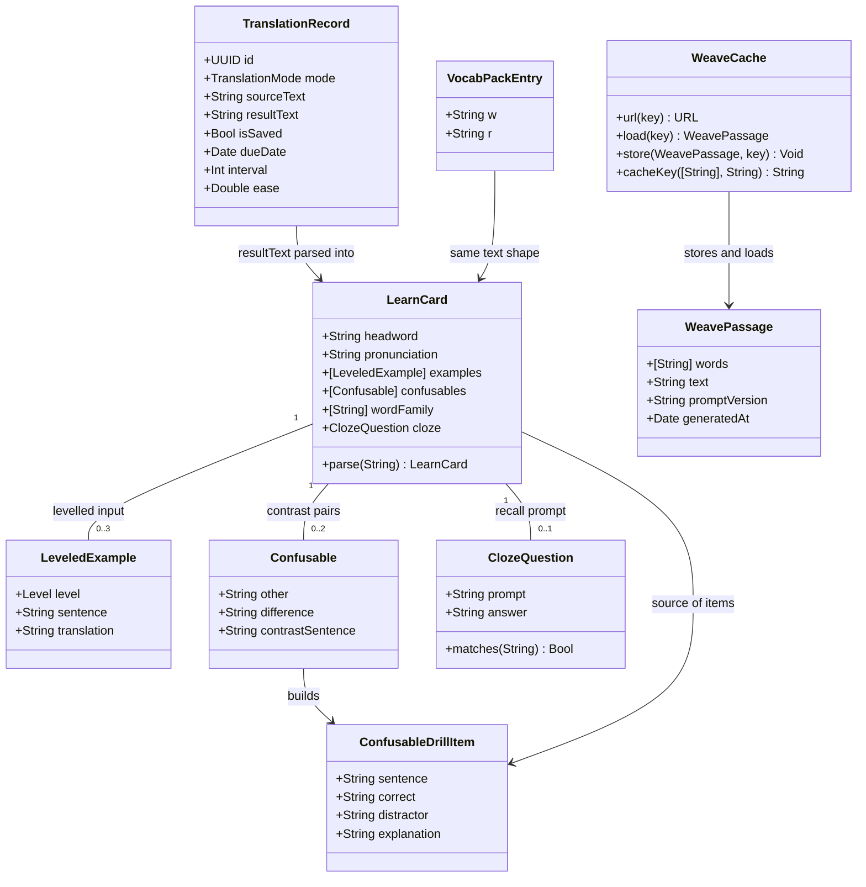

# Learn card enrichment: levelled examples, confusable drill, weave reading, cloze review, word family

## Requirements

Deepen what a learner gets from one Learn lookup and one review session, without adding an LLM call to the interactive path.

- Enrich the pre-generated Learn card so a single lookup teaches usage at three difficulty levels and shows the word's morphological family, not just one meaning plus two flat examples.
- Turn material the card already carries (`Tự kiểm tra`, `Dễ nhầm với`) into active recall inside the Review window, so reviewing becomes answering rather than re-reading.
- Give a review session one coherent short passage that weaves the due words together, so a learner meets the words in connected prose instead of isolated cards.

Boundaries: English to Vietnamese only, matching the shipped pack. SM-2 scheduling, grading, history storage, and the Learn request path stay untouched. No new persisted per-word fields: everything except the weave passage is derived from `TranslationRecord.resultText` at display time.

Value: cost stays at the existing one-call-per-word (pack absorbs it offline), while the learner gains levelled input, contrast practice, morphology, and connected reading.

## Entities



Conservative notes: `TranslationRecord`, `VocabPackEntry`, `VocabPackFile`, and the history store schema are unchanged. `LearnCard` and its children are transient parse results, never persisted. `WeavePassage` is the only new persisted artifact and lives in its own cache directory, outside the history store.

## Approach

1. Card content (offline, no app change):
   - Extend `AppConfig.defaultLearnPrompt` with a levelled `Ví dụ` section (`dễ`, `trung`, `khó`) replacing the current flat two-example block, and a new `Họ từ` section listing noun/verb/adjective/adverb forms with a short Vietnamese gloss.
   - Regenerate the pack with `Scripts/build-vocab-pack.swift`. The generator is already resumable and circuit-broken, so regeneration is a re-run against a fresh work file, not new code.
   - Rationale: the pack is a plain string cache. Enriching the prompt enriches every consumer (popup, history, review) with zero runtime cost.

2. Parsing (one new pure type):
   - `LearnCard.parse` reads the plain-text card into named sections. It is tolerant: any missing section yields an empty collection, never a failure. Older cards generated before the prompt change parse fine and simply have no `wordFamily` and one unlabelled example level.
   - Rationale: the app already stores millions of characters of card text and has no reader for it. One parser unlocks three features and keeps the storage schema frozen.

3. Review interaction (reuses existing session pipeline):
   - Add a review presentation mode: `flip` (today's behaviour, default), `cloze`, `confusable`. Mode selection happens at session start; grading, `sessionRecords`, and `reviewPriorityScore` are untouched.
   - `cloze` shows `LearnCard.cloze.prompt` with a text field; a normalized match reveals the full card and pre-selects a passing grade suggestion, but the learner still presses the grade button. Cards with no parsable cloze silently fall back to `flip`.
   - `confusable` builds drill items from session cards that have confusables, and skips the session with an explanatory empty state when fewer than three items exist.
   - Rationale: no scheduler changes means no risk to accumulated SRS state.

4. Weave passage (only new network path):
   - New `weavePrompt` in `AppConfig`, new `Translator.weave(words:sourceLang:targetLang:)` following the existing `learn` request shape.
   - Cached on disk keyed by a hash of the sorted word list plus a prompt version string, so reopening the same session costs nothing and a prompt edit invalidates cleanly.
   - Explicitly opt-in via a button on the review start screen. A failure shows a message and leaves the session fully usable.
   - Rationale: the due set is personal and changes daily, so it cannot be precomputed into the pack. Caching by word-set makes repeat sessions free.

Risks: a prompt change forces a full pack regeneration (roughly the same quota cost as the original build); mitigated by keeping the old pack in place until the new one validates. Parse fragility on model output drift is mitigated by tolerant parsing plus a standalone self-check.

## Structure

### Type relationships
1. `LearnCard` is a plain `struct` in `Sources/translate/LearnCard.swift` with a static `parse(_:)`; no class, no protocol, no inheritance.
2. `LeveledExample`, `Confusable`, `ClozeQuestion`, `ConfusableDrillItem` are nested value types in the same file.
3. `WeavePassage` is `Codable`; `WeaveCache` is an `enum` namespace of static functions, matching the style of `VocabPack.packURLs()`.
4. `ReviewPresentationMode` is an `enum` inside `ReviewWindowController`.

### Dependencies
1. `ReviewWindowController` calls `LearnCard.parse` on `record.resultText` inside `loadCurrentCard()`.
2. `ReviewWindowController` calls `Translator.weave` and `WeaveCache` only from the session start screen.
3. `Translator.weave` reuses the existing request builder, streaming handler, and error mapping used by `learn`.
4. `VocabPack`, `TranslationHistoryStore`, and `PopoverController+Actions.runLearn` gain no new dependencies.

### Layering
1. Prompt layer (`AppConfigPrompts.swift`): card format and weave instruction text.
2. Generation layer (`Scripts/build-vocab-pack.swift`): offline production of enriched cards, unchanged code.
3. Parse layer (`LearnCard.swift`): text to structure, pure and synchronous.
4. Presentation layer (`ReviewWindowController.swift`): mode selection, cloze input, drill assembly, passage display.
5. Cache layer (`WeaveCache`): file-backed passage reuse in Application Support.

## Operations

### Update Prompt - `AppConfig.defaultLearnPrompt`
1. Responsibility: instruct the model to emit levelled examples and a word family.
2. Replace the `Ví dụ` block with:
   ```
   Ví dụ
   - [dễ] Example sentence.
     → Bản dịch tiếng Việt.
   - [trung] Example sentence.
     → Bản dịch tiếng Việt.
   - [khó] Example sentence.
     → Bản dịch tiếng Việt.
   ```
3. Add after `Đi kèm thường gặp`:
   ```
   Họ từ
   - <dạng>: <từ loại> - <nghĩa ngắn>
   ```
4. Add hard rules:
   - Each example line must carry exactly one of the tags `[dễ]`, `[trung]`, `[khó]`, in that order, one line each.
   - `[dễ]` uses only A1-A2 vocabulary and a simple clause; `[trung]` sits at B1-B2; `[khó]` shows a less obvious or figurative use at B2-C1.
   - `Họ từ` lists 2-4 real derived forms of the headword. Forms that do not exist are omitted. When the word has no derived family, write `Họ từ: (không có)`.
   - `Họ từ` never repeats the headword itself.
5. Constraint: keep every other section, ordering, and blank-line rule exactly as it is, so existing cards and the existing pack stay parseable.

### Create Value Type - `LearnCard` (`Sources/translate/LearnCard.swift`)
1. Responsibility: parse one Learn card's plain text into typed sections; never throw, never assume a section exists.
2. Attributes:
   - `headword: String` - value after `Từ gốc:`, empty when absent
   - `pronunciation: String` - value after `Phiên âm:`
   - `examples: [LeveledExample]`
   - `confusables: [Confusable]`
   - `wordFamily: [String]`
   - `cloze: ClozeQuestion?`
3. Methods:
   - `static func parse(_ text: String) -> LearnCard`
     - Split into lines, walk once, track the current section by exact heading match (`Ví dụ`, `Dễ nhầm với`, `Họ từ`, `Tự kiểm tra`, `Đi kèm thường gặp`, `Nhớ nhanh`).
     - An item line starts with `- `; its translation continuation starts with `  → ` and attaches to the previous item.
     - In `Ví dụ`, strip a leading `[dễ]`/`[trung]`/`[khó]` tag into `LeveledExample.level`; an untagged line becomes `.unspecified` so pre-change cards still yield examples.
     - In `Dễ nhầm với`, the item line splits on the first `: ` into `other` and `difference`; a following `  → ` line becomes `contrastSentence`. A line reading `(không có)` yields no confusable.
     - In `Họ từ`, take the text before the first `: ` as the form; drop `(không có)`.
     - In `Tự kiểm tra`, the first `- ` line that contains `___` is the prompt; the line starting `- Đáp án:` supplies the answer. A prompt without an answer, or an answer without a prompt, yields `nil`.
     - Unknown headings are ignored, so adding a section later cannot break the parser.
   - `static func normalizeAnswer(_ s: String) -> String` - trim, lowercase, collapse internal whitespace. Reuse the same rule as `VocabPack.normalize` rather than inventing a second one.
   - `ClozeQuestion.matches(_ input: String) -> Bool` - `normalizeAnswer` on both sides, exact comparison.
4. Constraints: pure, `nonisolated`, no AppKit import, no I/O. Must compile standalone under `swiftc` for the self-check.

### Create Value Type - `ConfusableDrillItem`
1. Responsibility: one contrast question assembled from two cards or one card's own confusable.
2. Attributes: `sentence: String`, `correct: String`, `distractor: String`, `explanation: String`.
3. Methods:
   - `static func build(from cards: [LearnCard]) -> [ConfusableDrillItem]`
     - For each card with a confusable that has a `contrastSentence` containing the headword, blank the headword out of the sentence to make `sentence`, set `correct` to the headword, `distractor` to `Confusable.other`, `explanation` to `Confusable.difference`.
     - Skip any card whose contrast sentence does not contain the headword as a whole word; a wrong blank is worse than one fewer item.
     - Return items in card order; the caller shuffles.
4. Constraint: deterministic given its input, so the self-check can assert on it.

### Update Controller - `ReviewWindowController`
1. Add `enum ReviewPresentationMode { case flip, cloze, confusable }` and `private var presentationMode: ReviewPresentationMode = .flip`.
2. Start screen: three mode buttons alongside the existing Review All / Shuffle actions, plus a "Reading" button for the weave passage. English labels, SF Symbols, no emoji.
3. `loadCurrentCard()`:
   - Parse `LearnCard.parse(record.resultText)` once per card into `currentCard`.
   - When `presentationMode == .cloze` and `currentCard.cloze != nil`, show the cloze prompt in `termLabel`, reveal an answer text field, and keep `resultLabel` hidden until the answer is submitted or the learner reveals.
   - Otherwise present exactly as today. No other branch changes.
4. `revealAnswer()`: when a cloze answer was typed, show correct or incorrect against `ClozeQuestion.matches` above the full card text, then show the existing grade buttons unchanged.
5. Confusable session: when `presentationMode == .confusable`, build items via `ConfusableDrillItem.build` from the parsed session cards. Fewer than three items shows a message and returns to the start screen without touching SRS state.
6. Constraint: `applyGrade`, `sessionRecords`, `reviewPriorityScore`, and every SM-2 write path are not modified.

### Create Prompt - `AppConfig.defaultWeavePrompt`
1. Responsibility: produce one short Vietnamese-annotated English passage containing every supplied word.
2. Content requirements:
   - 100-140 English words, one coherent scene, natural register.
   - Every supplied word appears at least once, in any inflected form.
   - Vocabulary outside the supplied list stays at A2 or below so the passage is readable.
   - After the passage, one blank line, then a Vietnamese translation of the whole passage.
   - Plain text only, no markdown, no commentary.
3. Variables: `{{words}}`, `{{config.sourceLang}}`, `{{config.targetLang}}`.
4. Registration: add `weavePrompt` to `AppConfig` with a `decodeIfPresent` fallback to the default, mirroring `learnPrompt` exactly, and add it to `promptsNeedSync` and `syncAllPromptsWithDefaults`. Expose it in `SettingsWindowController` alongside the other prompt editors.

### Implement Service Method - `Translator.weave`
1. Signature: `func weave(_ words: [String], sourceLang: String, targetLang: String, onPartial: @escaping (String) -> Void, completion: @escaping (Result<String, Error>) -> Void) -> URLSessionTask?`
2. Input validation: return a failure without a network call when `words` is empty or exceeds 15 entries.
3. Logic: substitute `{{words}}` with the comma-joined list into `config.weavePrompt`, then reuse the same request construction, streaming accumulation, and error mapping as `learn`. No new transport code.
4. Constraint: cancellable through the same task handle pattern the existing calls use.

### Create Cache - `WeaveCache`
1. Responsibility: reuse a generated passage for the same word set.
2. Methods:
   - `static func cacheKey(words: [String], promptVersion: String) -> String` - lowercase, sort, join with `\n`, prepend `promptVersion`, return a hex SHA-256 digest.
   - `static func url(for key: String) -> URL` - `Application Support/NTranslate/weave/<key>.json`.
   - `static func load(key: String) -> WeavePassage?` - returns `nil` on any read or decode failure.
   - `static func store(_ passage: WeavePassage, key: String)` - creates the directory, writes atomically, ignores failure.
3. Constraint: a cache miss or a corrupt file must never surface as an error to the learner; it just means a fresh call.

### Create Self-check - `Scripts/learn-card-check.swift`
1. Responsibility: fail loudly if card parsing or drill assembly breaks.
2. Cases:
   - A full enriched card parses to 3 levelled examples, 2 confusables, 3 word-family forms, and a cloze whose answer matches the headword.
   - A pre-change card (flat `Ví dụ`, no `Họ từ`) still yields 2 examples at `.unspecified`, and `wordFamily` is empty.
   - `Dễ nhầm với: (không có)` and `Họ từ: (không có)` yield empty collections, not a phantom entry.
   - A cloze prompt with no `Đáp án:` line yields `nil`.
   - `ClozeQuestion.matches` accepts differing case and surrounding whitespace, rejects a different word.
   - `ConfusableDrillItem.build` skips a card whose contrast sentence lacks the headword.
   - An empty string and a card with only `Từ gốc:` both parse without crashing.
3. Run: `swiftc -parse-as-library Sources/translate/LearnCard.swift Scripts/learn-card-check.swift -o /tmp/learn-card-check && /tmp/learn-card-check`

### Update Documentation - `CLAUDE.md`
1. Add the `learn-card-check` command to the existing Test section command list, in the same format as the other checks.

### Regenerate Pack
1. Move `Scripts/.vocab-work/en-vi.jsonl` aside so the new prompt regenerates every card rather than resuming onto the old format.
2. Run the generator in batches; it already stops after 20 consecutive failures and resumes cleanly.
3. Validate with `Scripts/vocab-pack-check.swift` plus a spot parse of 20 random entries through `LearnCard.parse`, asserting each yields 3 levelled examples.
4. Replace `Resources/vocab-en-vi.json` only after validation passes.

## Norms

1. UI text: every visible label, button, placeholder, and empty state is English. Card content stays Vietnamese because it is data, not chrome. No emoji anywhere; SF Symbols only.
2. Naming and style: match the surrounding file. Value types for anything without identity, `enum` namespaces for stateless helpers, `@MainActor` only where AppKit requires it.
3. Comments: explain why, in the style already used in `VocabPack.swift` and `runLearn`, not what the next line does.
4. Parsing: tolerant by default. A missing or malformed section degrades to empty and the feature hides itself; it never throws and never blocks a review.
5. Error handling: follow the existing pattern in `runLearn` and `VocabPack.loadIfNeeded` - write to stderr or `setStatus`, then continue on the path that still works.
6. Prompt edits: any change to a shipped prompt bumps the weave `promptVersion` string and requires a pack regeneration decision to be stated explicitly.
7. Verification: `swift build` for compilation, standalone `swiftc` checks in `Scripts/` for logic. Never `swift test`.
8. Persistence: nothing new goes into the history store. New files live under `Application Support/NTranslate/` in their own subdirectory.

## Safeguards

1. Functional: an unparsable card must present exactly as it does today. `presentationMode == .cloze` on a card with no cloze falls back to `flip` silently, without an error banner.
2. Functional: the confusable drill refuses to start with fewer than three items and returns to the start screen leaving all SRS fields untouched.
3. Performance: `LearnCard.parse` runs once per card display, single pass over the lines, no regular expressions on the hot path. Parsing a 2 KB card must stay under 1 ms.
4. Performance: the weave passage is fetched at most once per distinct word set per prompt version. A cache hit performs no network call.
5. Data: `TranslationRecord` gains no field. The history JSON schema, the pack JSON schema, and the work-file JSONL schema are all unchanged.
6. Compatibility: cards generated before this change must parse without error and keep working in `flip` mode. The shipped pack stays valid until a validated replacement lands.
7. SRS integrity: `applyGrade`, `sessionRecords`, `reviewPriorityScore`, `dueDate`, `interval`, `ease`, `repetitions`, and `lapses` are read-only to this feature except through the existing grade buttons.
8. Cost: no new LLM call on the Learn path, on popup open, or on card advance. The only new call is the explicitly requested weave passage, capped at 15 words per call.
9. Failure isolation: a weave request failure, a cache write failure, or a corrupt cache file leaves the review session fully usable and shows one status message.
10. Input: `Translator.weave` rejects an empty or oversized word list before opening a connection. Cloze answers are compared after normalization only, never evaluated or interpolated into a prompt.
11. Language: the pack and every feature here cover English to Vietnamese only. A different pair falls through to the existing model path, exactly as `VocabPack.languagesMatch` already enforces.
12. Regeneration: the old pack file is not deleted or overwritten until the new one passes `vocab-pack-check` and the 20-entry parse spot check.
