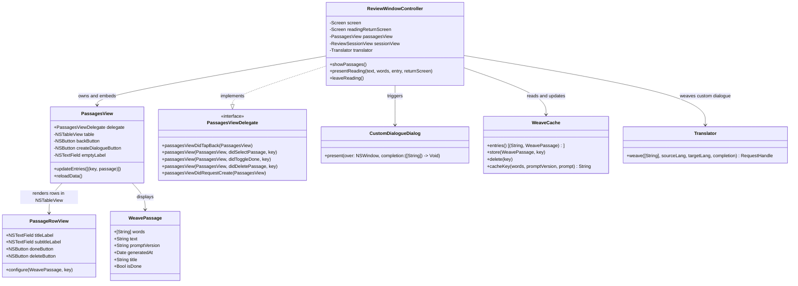

# Saved Passages Screen and Custom Dialogue Generation

## Requirements

Provide a dedicated full screen in the Study window for managing saved passages, generating custom conversational dialogues on demand from user-specified vocabulary, and streamlining passage management.

- Separate Saved Passages from a modal sheet into a first-class screen inside `ReviewWindowController`.
- Add a custom dialogue creation feature allowing users to input arbitrary target words and generate a conversational reading dialogue via LLM.
- Move mark/unmark done and delete actions directly onto each passage record row for direct access.
- Retain navigation context so pressing Back in the reading view returns directly to the Saved Passages list when opened from there.

Boundaries: English UI text only, no emoji, SF Symbols for icons. Existing `WeavePassage` model and `WeaveCache` disk format remain backward-compatible.

Value: Improves study workflow by eliminating modal friction, enabling personalized vocabulary practice in context, and providing direct one-click passage triage.

## Entities

## Approach

1. Screen Integration:
   - Add `.passages` case to `ReviewWindowController.Screen`.
   - Embed `PassagesView` as a subview of `cardView` alongside `homeView`, `sessionView`, `summaryView`, and `newWordsView`.
   - Add `readingReturnScreen: Screen` property in `ReviewWindowController`. When transitioning to reading mode from `.passages`, set `readingReturnScreen = .passages`. When leaving reading, navigate back to `readingReturnScreen`.

2. Dedicated PassagesView:
   - Construct `PassagesView` with a top header bar containing a Back button, header title "Saved Passages", and "Create Dialogue" button with symbol `bubble.left.and.bubble.right`.
   - Render passages in an `NSTableView` with inset style and alternating row background.
   - Display placeholder label "No saved passages yet." when entries list is empty.

3. Row-Level Actions:
   - Render each passage in a custom row view with headline title, word count, generation date, toggle Done button (`checkmark.circle` / `checkmark.circle.fill`), and Delete button (`trash`).
   - Clicking Done toggles `WeavePassage.isDone`, persists to `WeaveCache`, and updates cell state without resetting list selection.
   - Clicking Delete prompts or immediately deletes from `WeaveCache`, removes item from list, and updates table smoothly.
   - Double-clicking or single-clicking open button triggers passage selection delegate.

4. Custom Dialogue Creation Flow:
   - Tapping "Create Dialogue" opens an input sheet or alert asking user to enter target words (comma or space separated).
   - Validate that input contains at least 1 valid word.
   - Derive cache key and invoke `translator.weave(words, ...)`.
   - Transition to reading screen with awaiting status, setting `readingReturnScreen = .passages`.

5. Back Navigation:
   - On `PassagesView`, tapping Back returns to `.home`.
   - On `sessionView` in reading mode, tapping Back inspects `readingReturnScreen` and returns to `.passages` if initiated from the passages screen.

## Structure

### Inheritance Relationships
1. `PassagesView` extends `NSView` and adopts `NSTableViewDataSource`, `NSTableViewDelegate`.
2. `PassagesViewDelegate` protocol defines interaction events between `PassagesView` and `ReviewWindowController`.
3. `CustomDialogueDialog` helper presents word input sheet over host `NSWindow`.

### Dependencies
1. `ReviewWindowController` depends on `PassagesView`, `WeaveCache`, and `Translator`.
2. `PassagesView` delegates actions to `ReviewWindowController` through `PassagesViewDelegate`.
3. `PassagesView` renders `WeavePassage` models read from `WeaveCache`.

### Layered Architecture
1. View Layer: `PassagesView`, `PassageRowView`, `CustomDialogueDialog`.
2. Controller Layer: `ReviewWindowController` coordinating screen switches, reading state, and dialog presentations.
3. Service / Cache Layer: `WeaveCache` disk persistence and `Translator` LLM generation.

## Operations

### Create View Component - `PassagesView` (`Sources/translate/PassagesView.swift`)
1. Responsibility: Render saved passages list with header actions, row-level quick buttons, and empty state.
2. Attributes:
   - `delegate: PassagesViewDelegate?`
   - `entries: [(key: String, passage: WeavePassage)]`
   - `table: NSTableView`
   - `backButton: NSButton`
   - `createDialogueButton: NSButton`
   - `emptyLabel: NSTextField`
3. Methods:
   - `init(frame: NSRect)`: configure layout, constraints, header stack, scroll view, table view.
   - `reload(entries: [(key: String, passage: WeavePassage)])`: update data source, reload table, toggle empty state visibility.
   - `numberOfRows(in tableView: NSTableView) -> Int`
   - `tableView(_ tableView: NSTableView, viewFor tableColumn: NSTableColumn?, row: Int) -> NSView?`
   - `#selector(tapBack)`: notify `delegate?.passagesViewDidTapBack(self)`.
   - `#selector(tapCreate)`: notify `delegate?.passagesViewDidRequestCreate(self)`.
   - `#selector(tapDone(sender:))` / `#selector(tapDelete(sender:))`: extract row index from sender tag/closure and invoke delegate methods.
4. UI Rules: English labels ("Back", "Saved Passages", "Create Dialogue"), SF Symbols (`chevron.backward`, `bubble.left.and.bubble.right`, `checkmark.circle`, `trash`).

### Create Input Dialog - `CustomDialogueDialog` (`Sources/translate/CustomDialogueDialog.swift`)
1. Responsibility: Collect vocabulary words from user via a clean sheet modal.
2. Attributes:
   - `inputField: NSTextField` or `NSTextView`
   - `generateButton: NSButton`
   - `cancelButton: NSButton`
3. Methods:
   - `static func present(over window: NSWindow, completion: @escaping ([String]) -> Void)`:
     - Prompt text: "Enter words to weave into a dialogue (separated by commas or spaces):"
     - Parse input string: split on commas, newlines, and spaces; strip punctuation; filter out empty items.
     - Enforce minimum 1 word, maximum 15 words.
     - Trigger completion handler on confirmation.

### Update Controller - `ReviewWindowController` (`Sources/translate/ReviewWindowController.swift`)
1. Add `.passages` case to `Screen` enum.
2. Add `private let passagesView = PassagesView()` to controller properties.
3. Add `private var readingReturnScreen: Screen = .home` to track navigation origin.
4. In `init`:
   - Configure `passagesView.delegate = self`.
   - Add `passagesView` to `cardView` subviews with matching edge constraints.
5. In `show(_ screen: Screen)`:
   - Update visibility: `passagesView.isHidden = screen != .passages`.
6. Add `showPassages()`:
   - Set `screen = .passages`.
   - Query `WeaveCache.entries()`.
   - Pass entries to `passagesView.reload(entries:)`.
   - Call `show(.passages)`.
7. Update `presentPassageMenu`: replace sheet presentation with `showPassages()`.
8. Update `homeView(_:didRequestPassagesFrom:)`: call `showPassages()`.
9. Update `presentReading`:
   - Accept optional `returnScreen: Screen = .home`.
   - Store `readingReturnScreen = returnScreen`.
10. Update `leaveReading()`:
    - Check `readingReturnScreen`: if `.passages`, call `showPassages()`; otherwise call `goHome()`.
11. Implement `PassagesViewDelegate`:
    - `passagesViewDidTapBack`: call `goHome()`.
    - `passagesView(_:didSelectPassage:key:)`: call `presentReading(passage.text, words: passage.words, entry: (key, passage), returnScreen: .passages)`.
    - `passagesView(_:didToggleDone:key:)`: toggle `passage.isDone`, save via `WeaveCache.store`, refresh row.
    - `passagesView(_:didDeletePassage:key:)`: call `WeaveCache.delete(key: key)`, refresh entries.
    - `passagesViewDidRequestCreate`: present `CustomDialogueDialog`. On submitted words, request weave generation via `translator.weave`, transition to reading with awaiting state and `readingReturnScreen = .passages`.

### Self-Check Script - `Scripts/saved-passages-screen-check.swift`
1. Responsibility: Verify data binding, row action mutations, and custom words parsing without launching full GUI.
2. Checks:
   - Splitting user word input into cleaned token arrays.
   - WeavePassage isDone state mutation and WeaveCache round-trip.
   - Screen navigation state flow (home -> passages -> reading -> passages -> home).
3. Execution command:
   `swiftc -parse-as-library Sources/translate/WeaveCache.swift Scripts/saved-passages-screen-check.swift -o /tmp/passages-screen-check && /tmp/passages-screen-check`

## Norms

1. UI Standards:
   - All user-facing strings must be in English.
   - Use standard SF Symbols (`chevron.backward`, `bubble.left.and.bubble.right`, `checkmark.circle`, `checkmark.circle.fill`, `trash`).
   - No emoji on UI or menu items.
2. Concurrency & MainActor:
   - UI mutations must occur on `@MainActor`.
   - Background tasks must use `Task { @MainActor in ... }` with weak references to avoid retain cycles.
3. Error & Validation:
   - Word input parsing must handle empty strings, trailing commas, mixed whitespace, and special characters gracefully.
   - Prevent generation when no translator or API key is configured, displaying user-friendly feedback.
4. Memory & Resource Cleanup:
   - Invalidate timers and cancel pending network requests when switching away from screens.

## Safeguards

1. Functional Constraints:
   - Deleting a passage from the list must remove the cached file on disk immediately.
   - Toggling Done must update the persisted JSON cache file so state survives app restarts.
   - Back button in Reading mode must strictly return to `.passages` when the session was initiated from Saved Passages, and to `.home` when initiated from Home.
2. Performance Constraints:
   - Table reload must be lightweight and non-blocking.
   - Cache reads must use existing `WeaveCache.entries()` without re-parsing unneeded files.
3. Data Integrity Constraints:
   - Existing cache files without `isDone` or `title` fields must decode safely with default values.
   - Word validation must prevent sending empty or oversized word sets to the LLM (clamped between 1 and 15 words).
4. Accessibility & Platform Standards:
   - Buttons must provide accessibility descriptions and tooltips.
   - Ensure responsive layout constraints within the minimum cardView size (588 x 608).
